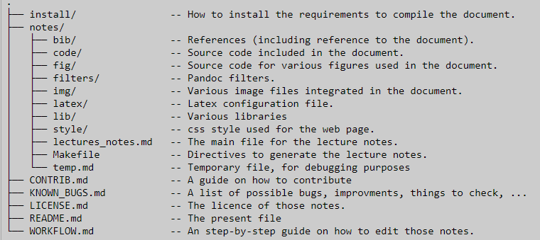

#   Naming Convention Standard/File Name Conventions

### A collection of guidelines for writing file, folder, classes, figures, and images names in the project. These guidelines should help you toward that goal of not only correct code, but understandable. 

* Our working directory is

  * [File Names](#file-name)
  * [Figures](#figure-name)
  * [Folders](#folder-name)
  * [The Tags in the Document](#tag-name)
  * [The Links in the Document](#link-name)
  * [Code Folder Naming Convention](#code-folder-naming-convention)

# Code Folder Naming Convention

### In code Folder, we have following folders

1. [JAVA](#java)
2. [SQL](#sql)
3. [XML](#xml)

#### JAVA
* JAVA Files in Code Folder.
    * Every JAVA file name will be written as UpperCamelCase.
    * Words are smashed together and the first letter of each word is capitalized. No word separator, like the underscore _, is used.

         | Example     | FileName.java |
         | ----------- | ------------- | 

    * If there is any version/number, it should be written as,
         | Example     | FileName01.java | FileName02.java |
         | ----------- | --------------- | --------------- |

    * *Classes and Interfaces Names*
        * Class and interface names are generally noun or noun phrases.
        * Class and interface must begin with a capital letter.

         |interface Example     | interface AqueousHabitat { ... } | 
         | -------------------- | -------------------------------- | 

         |Class Example         | class FishBowl implements AqueousHabitat { ... } | 
         | -------------------- | ------------------------------------------------ | 

    * *Method Names* 
  
      * Method names generally begin with a lowercase letter. 
      * A call on a procedure is a statement to do something, so a procedure name is generally a verb phrase that is a command to do something.

         | Example              | public void setTitle(String t) { ... } | 
         | -------------------- | ------------------------------------------------ | 

         
      * A function call yields a value, so a function name is generally a noun phrase that describes the value.
         | Example              | public double areaOfTriangle(int b, int c, int d) { ... } | 
         | -------------------- | ------------------------------------------------ | 

      * The name of a boolean function is often a verb phrase starting with "is", thus describing what the value means,
         | Example              | public boolean isEquilateralTriangle(int b, int c, int d) { ... } | 
         | -------------------- | ------------------------------------------------ | 

    * *Variable Names*
  
      * Variable names generally start with a lowercase letter.
      * Variable names should give the reader some hint about what the variable is used for. 
      * A well-chosen name, which gives a hint at the meaning of the variable, helps document a program, making it easier to understand. On the other hand, using the names of your friends or flowers that you like as variable names just annoys and makes the program harder to understand. Don't do that. 
      * Also, refrain from using vague names like counter or var or data; instead think about what the variable really is for and use a more concrete name.
      * There is a tension between writing long descriptive names and very short names.
      * We tend to use shorter names for parameters and local variables and longer names for fields and static variables.

    * *Parameter Names*
      * Parameter names may be short, even one letter long.
        | Example    | public boolean isEquilateralTriangle(int b, int c, int d) {return b == c && c == d;} |
        | -----------| ------------------------------------------------------------------------------------ |

      * *Local variable names* 
        * A local variable is a variable that is declared in a method body. 
        * Its declaration should be placed as close to its first use as possible.
        *  The scope of a local variable is usually short, and its meaning is often obvious either from a comment on its declaration or from the short code in which it is used. Therefore, names of local variables may be short.

       * *Fields and class (i.e. static) variables* 
         * The meaning of fields and class variables are typically given as comments by the declarations, far from where the variables are used. 
         * Therefore, the names of field and class variables should be longer and as mnemonic as possible, giving the reader a good idea what the meaning are.
     * *Package names*
  
       * Package names are usually all lowercase and consist of nouns.

#### SQL

* SQL folder has Homework Files.
    * Every Homework will be followed by HW_ and filename.

        | Example    | HW_HomeworkName |
        | -----------| --------------- |
#### XML
* XML Files in Code Folder
  * Camel case is a common naming rule in JavaScripts.
  * Uppercase first letter in each word except the first

    | Example     |  firstName |
    | ----------- | ---------- |

# File Name
*  Make file names lowercase.
*  Separate words with underscores.
*  Use only standard ASCII alphanumeric characters in  file and directory names.

    * Recommended

        Example | file_name.extension |
       ---------|---------------------|

# Folder Name
* Folder Name should be meaningful.
* Make folder names lowercase.

# Figure Name

* Figures Names should follow the Underscore Case.
*  everything is in lower case and the words are separated by underscores.
*  This convention is also popularly known as snake case.

    | Example    | figure_name.svg |
    | ---------- | --------------- |

# Tag Name

# Link Name

        
       

##### *Important* Notes: 

*   Do not use names which could misguide other developers.
*   Names should be meaningfully distinct and pronounceable.

### *Rules* are taken by:
  *  https://www.geeksforgeeks.org/.
  *  https://www.w3schools.com/xml/xml_elements.asp.
  *  https://developers.google.com/style/filenames.
  *  https://guides.lib.purdue.edu/c.php?g=353013&p=2378293
  *  https://dev.to/danialmalik/a-beginner-s-guide-to-clean-code-part1-naming-conventions-139l
  *  https://www.cs.cornell.edu/courses/JavaAndDS/JavaStyle.html
