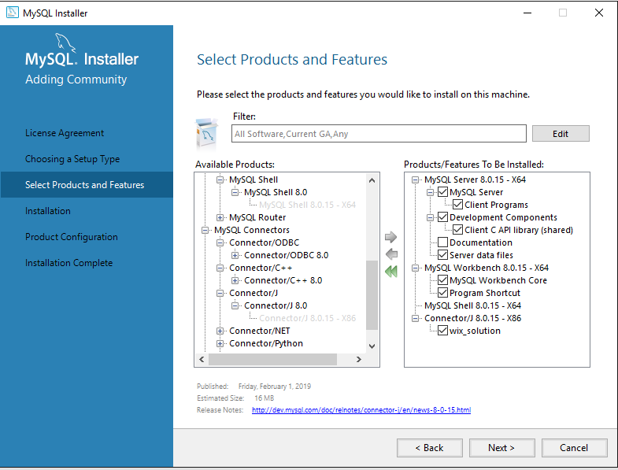
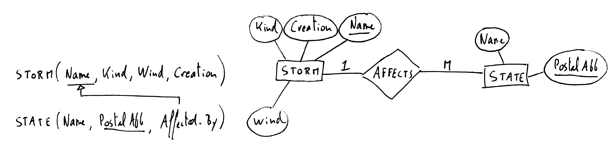
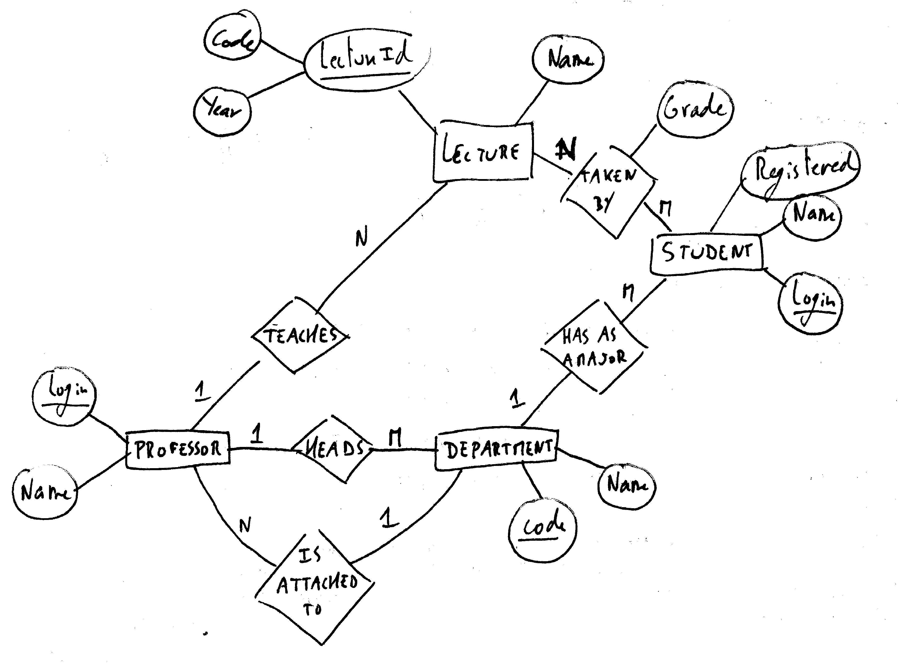
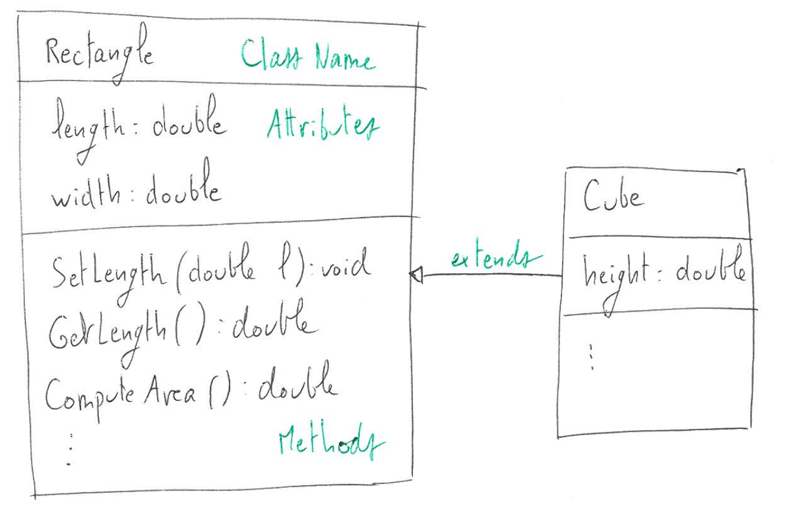
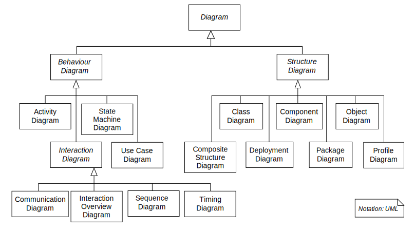
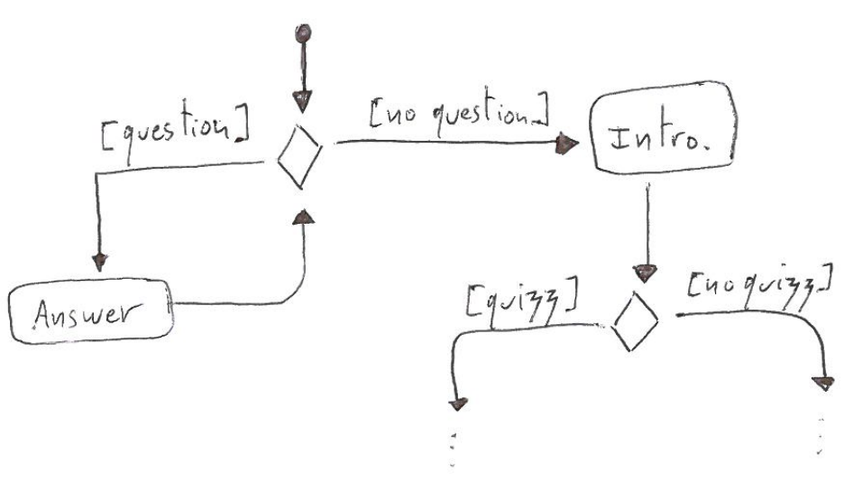
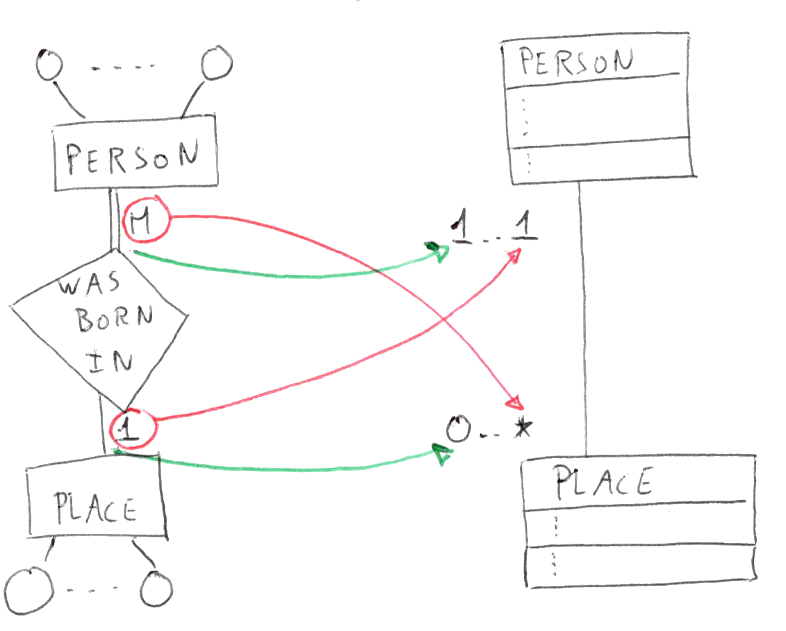
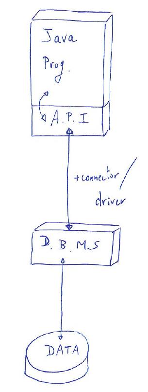

---
documentclass: scrreprt
title: CSCI 3410 - Database Systems
subtitle: Lecture Notes (Draft)
author: Clément Aubert
institute: Augusta University
papersize: letter
geometry: "vmargin=2cm"
bibliography: [ bib/bib.bib, bib/entry.bib ]
link-citations: true
lang: en
numbersections: true
mainfont: Linux Libertine O
keywords:
- Computer Science
- Database
- SQL
- Database Design
- Database Application
- NoSQL
header-includes:
 - \usepackage{latex/packages}
pandoc-numbering:
 problem:
    general:
      listing-title: List of Problems 
    standard:
        format-link-classic: 'Pb %n'
        format-link-title: 'Pb %n'
    latex:
        format-link-classic: 'Pb %n'
        format-link-title: 'Pb %n'
---

# Preamble {-} 

## How to Use This Guide {-}

These lecture notes are written in an elusive style: their are a support for the explanations I will be making at the board.
They are not designed to be self-contained: they are rather a list of topics and reminders, along with handy examples, code and drawings.
Reading them before coming to the lecture will help you getting a sense of the next topic we will be discussing, but you may sometimes have trouble deciphering their … *unique* style.

When it comes to code, you can normally copy-and-paste it from the document and use it as it is.
Or, you can browse the source code of the code snippets at <https://rocketgit.com/user/caubert/CSCI_3410/source/tree/branch/master/tree/notes/code> to download it directly.
Some portion of code starts with a path in comment, like so:


```{.sqlmysql .numberLines include=code/sql/HW_HelloWorld.sql}
```

This means that this code can be found at [https://rocketgit.com/user/caubert/CSCI_3410/source/tree/branch/master/**blob/notes/code/sql/HW_HelloWorld.sql**](https://rocketgit.com/user/caubert/CSCI_3410/source/tree/branch/master/blob/notes/code/sql/HW_HelloWorld.sql).

<!--: the colors and the ↪ `↪` ↪ ${\tiny\hookrightarrow}$,  \tiny\ensuremath{\hookrightarrow}  symbols are here to ease the reading, but you can ignore them safely.-->

To clone this source of those notes and have a local copy of it, please refer to the instructions at <http://spots.augusta.edu/caubert/db/ln/README.html>.
Instructions on how to compile those notes are available at the same place.

<!--
To clone and compile this document, refer to the `README.md` file, at <https://rocketgit.com/user/caubert/CSCI_3410/source/tree/branch/master/blob/README.md> or <http://spots.augusta.edu/caubert/db/ln/README.html>.
-->

On top of the notes, you will find in this document:

- [References, at the very end of this document](#ref)
- and for each chapter,
    - A list of additional resources,
    - A list of short exercises,
    - Solution to those exercises,
    - A list of problem,
    - Sometimes, solution to some of those problems.

Any feedback is greatly appreciated.
Please refer to <http://spots.augusta.edu/caubert/db/ln/README.html#contributing> for how to contribute to those notes.

The syllabus is at <http://spots.augusta.edu/caubert/db/>, and the webpage for this notes is at <http://spots.augusta.edu/caubert/db/ln/>.
Please, refer to those notes using this entry [@AubertCSCI3410-DatabaseSystems]:

```{.bibtex include=bib/entry.bib}
```

## Planned Schedule {-}

A typical (metting twice a week, ±17 weeks, ±30 classes) semester is divided as follows:

- Lecture 1: Presentation and [Syllabus](http://spots.augusta.edu/caubert/db/)
- Lecture 2: [Introduction](#introduction)
- Lecture 3--5: [The Relational Model](#the-relational-model)
- Lecture 6--9: [The SQL Programming Language](#the-sql-programming-language)
- Lecture 10--11: Review session and Exam #1
- Lecture 12: [Introduction to High-Level Design](#interest-for-high-level-design)
- Lecture 13--15: [Entity-Relationship Model](#entity-relationship-model)
- Lecture 16: [E.R.-to-Relational Models Mapping](#e.r.-to-relational-models-mapping)
- Lecture 17--20: [Guidelines and Normal Form](#guidelines-and-normal-form)
- Lecture 21--22: [Unified Modeling Language Diagram](#unified-modeling-language-diagrams)
- Lecture 23--24: Review session and Exam #2
- Lecture 25--18: [Database Applications](#databases-applications)
- Lecture 29--30: [Presentation of NoSQL](#presentation-of-nosql)

For information purposes, an indication like this:

---

marks the (usual) separation between two lectures.


## Previous Exams {-}

To give you a sense of what you will be asked during the exams, please find below the exams given previous semesters, in reverse chronological order:

### Fall 2019 {-}

- Exam #1:
    - [%D %n (%T)](#problem:sqlWorks)
    - Three exercises (@exercise:defaultForeign, @exercise:truthTableAnd but for the `OR` operator, and @exercise:NullMeaning)
    - [%D %n (%T)](#problem:rel_model_universities)
- Exam #2:
    - [%D %n (%T)](#problem:library_network)
    - [%D %n (%T)](#problem:route)
    - [%D %n (%T)](#problem:Guest_Java)
    - [%D %n (%T)](#problem:print)
- Final:
    - [%D %n (%T)](#problem:xmltoeraward)
    - [%D %n (%T)](#problem:simple)
    - [%D %n (%T)](#problem:isp)
    - [%D %n (%T)](#problem:certificate)
    - Three small exercises about security (@exercise:security1, @exercise:security2, @exercise:security3)

### Spring 2019 {-}

- Exam #1:
    - [%D %n (%T)](#problem:sqlBooks)
    - Five exercises (@exercise:nameDBMS, @exercise:diff_op_trans, @exercise:truthTableAnd, @exercise:dealing_with_violations, @exercise:twice_row_sql)
    - A variation on [%D %n (%T)](#problem:rel_model_bills)
- Exam #2:
    - [%D %n (%T)](#problem:job-offers)
    - [%D %n (%T)](#problem:ERtoRELRecord)
    - [%D %n (%T)](#problem:schedule)
    - [%D %n (%T)](#problem:NormalizeMessage)
- Final:
    - [%D %n (%T)](#problem:explainNosql)
    - [%D %n (%T)](#problem:book)
    - [%D %n (%T)](#problem:network)
    - [%D %n (%T)](#problem:ComputerSelectBis)
    - A variation on [%D %n (%T)](#problem:library_network)
    - Five exercises from the [Database Application](#databases-applications) chapter.

### Spring 2018 {-}

- Exam #1: 
    - [%D %n (%T)](#problem:cinema), except that I gave some of the relations and attributes, to help getting started with the problem.
    - [%D %n (%T)](#problem:designforprof)
    - [%D %n (%T)](#problem:train)
    - [%D %n (%T)](#problem:coffee)
- Exam #2: 
    - A variation on [%D %n (%T)](#problem:NormalizeContact)
    - A variation on [%D %n (%T)](#problem:consultation)
    - [%D %n (%T)](#problem:roleplaying)
    - A variation on [%D %n (%T)](#problem:BusinessToDependecies-KEYBOARD)
    - [%D %n (%T)](#problem:ERtoRELCountry)
- Final:
    - Take the relational model of the solution of [%D %n (%T)](#problem:cinema), and "reverse-engineer" it to obtain a ER diagram (this problem was probably too hard).
    - Six small exercises (@exercise:deletion, @exercise:polyglot, @exercise:schemaless, @exercise:denormalization, @exercise:mismatch)
    - [%D %n (%T)](#problem:NormalizeFlight)
    - A variation on [%D %n (%T)](#problem:BusinessToEr)
    - A variation on [%D %n (%T)](#problem:UMLtoRELDriver): students were asked to draw the ER diagram for that schema.

### Fall 2017 {-}

- Exam #1:^[This exam was probably a bit too long, but students managed it pretty well.]
    - Six small exercises (@exercise:programdataindependence, @exercise:schemastate, @exercise:entityintegrity, @exercise:sqldatatype, @exercise:explainsql and @exercise:explainfk)
    - [%D %n (%T)](#problem:candidatekeyinclass)
    - [%D %n (%T)](#problem:cinema)
    - A variation on [@Textbook6, Exercise 3.11], [@Textbook7, Exercise 5.11]
    - [%D %n (%T)](#problem:train)
- Exam #2: 
    - Six small exercises, (@exercise:recursive, @exercise:chair_relationship,  @exercise:composite_1NF, @exercise:infer_fd, @exercise:derived,  @exercise:ternary)
    - [%D %n (%T)](#problem:BusinessToEr)
    - [%D %n (%T)](#problem:bike)
    - [%D %n (%T)](#problem:NormalizeContact)
    - A variation on [%D %n (%T)](#problem:ERtoRELCountry)
- Final:
    - A variation on (@exercise:ErrorsInCode)
    - A variation on [%D %n (%T)](#problem:coffee)
    - A variation on [%D %n (%T)](#problem:UMLtoRELDriver): students were asked to draw the ER diagram for that schema.
    - [%D %n (%T)](#problem:book)
    - [%D %n (%T)](#problem:consultation)

## Typesetting and Acknowledgments {-}

The source code for those notes is hosted at [rocketgit](https://rocketgit.com/user/caubert/CSCI_3410), typeset in [markdown](https://commonmark.org/), and then compiled using [pandoc](http://pandoc.org/) and multiple filters ([pandoc-numbering](https://github.com/chdemko/pandoc-numbering), [pandoc-citeproc](https://github.com/jgm/pandoc-citeproc), [pandoc-include-code](https://github.com/owickstrom/pandoc-include-code)).
The drawings use various [LaTeX](https://www.latex-project.org/) packages, including [PGF, TikZ](https://sourceforge.net/projects/pgf/), [tikz-er2](https://bitbucket.org/pavel_calado/tikz-er2/raw/da9f9f7f169647cad6d91df7975400b1605ae67a/tikz-er2.sty) and [tikz-dependency](https://ctan.org/pkg/tikz-dependency).
The help from the [TeX - LaTeX Stack Exchange](https://tex.stackexchange.com/) community greatly improved this document.
The u͟n͟d͟e͟r͟l͟i͟n͟e͟^[For technical reasons, underlined words cannot be searched in the document.] text is obtained using [YayText](https://yaytext.com/underline/), the unicode symbols are searched in the ["Unicode characters and corresponding LaTeX math mode commands"](http://milde.users.sourceforge.net/LUCR/Math/unimathsymbols.html).
Finally, the `pdf` version of the document uses [Linux Libertine fonts](http://libertine-fonts.org/), the `html` version uses [Futura](https://en.wikipedia.org/wiki/Futura_(typeface)).
<!--
Actually, not a good formatter…
The `sql` code is formatted using the [Poor Man's T-SQL Formatter](http://architectshack.com/PoorMansTSqlFormatter.ashx).
-->

Those lecture notes were created under an [Affordable Learning Georgia](https://www.affordablelearninggeorgia.org/) [Mini-Grant for Ancillary Materials Creation and Revision](https://www.affordablelearninggeorgia.org/about/r13_grantees) ([Proposal M71](https://affordablelearninggeorgia.org/documents/M71_Augusta_Aubert.pdf)).

{width=70%}\ 


## Resources {-}

You can find at the end of this document the [list of references](#references), and some particular resources listed at the beginning of each chapter.
Let me introduce some of them:

- [@Textbook6] and [@Textbook7] are two editions of an excellent and detailled book on Databases. It is commonly used, cover almost every aspect in a fairly accessible way.
- [@Watt2014] is an open-source, cost-free textbook on Database design that can be of good support.
- [@NoSQLDistilled] and [@Sullivan2015] are two textbooks on the NoSQL approach that are short and good introductions.
- To get started on Java and how it interfaces with databases, I believe [@Gaddis2014] is a good introduction.
- [awesome-mysql](https://github.com/shlomi-noach/awesome-mysql#readme) is a "curated list of awesome MySQL free and opensource software, libraries and resources" that is definitely worth checking out. Among other ressources, note [this bank of SQL programming exercises](https://github.com/XD-DENG/SQL-exercise).

Those resources are listed as complements, but it is not require to read them to understand the content of those notes.
[@Watt2014] --being available free of charge-- is more descriptive than the current notes, and as such can constitutes a great complement.
Unfortunately, it lacks some technical aspects, and the database program aspect is not discussed in detail.

## Copyright {-}

This work is under [Creative Commons Attribution 4.0 International License](https://creativecommons.org/licenses/by/4.0/) or later.

Some figures and resources are borrowed from other sources, in which case it is indicated clearly.


<!--

## Softwares {-}

_I would like here to include some of the softwares I believe could make your semester easier, but still have to work on it._

-->

<!--
- <https://sequelpro.com/> [Open Source](https://github.com/sequelpro/sequelpro/blob/master/LICENSE) and free for macOS X.
-->

# Introduction

## Resources {-}

- [@Textbook6, ch. 1.1--1.6]
- [@Textbook7, ch. 1.1--1.6]
- [@Watt2014, ch. 2--3]

## The Need for a Specialized Tool

There is a good chance that any programming language you can think of is [Turing complete](https://en.wikipedia.org/wiki/Turing-completeness).
Actually, even some of the extremely basic tools you may be using [may be Turing complete](https://www.gwern.net/Turing-complete).
However, being complete does not mean being good at any task: it just mean that any computable problem can be solved, but does not imply anything in terms of efficiency, comfort, or usability.

In theory, pretty much any programming language can be used to 

- Store, retrieve and update data,
- Have accessible catalog describing the metadata,
- Support transactions and concurrency,
- Support authorization of access and update of data,
- Enforce constraints,

But to obtain a system that is fast in reading and writing on the disk, convenient to search in the data, and that provides as many "built-in" tools as possible, one should use a specialized tool.

In this lecture notes, we will introduce one of this tool--the `SQL` programming language-- and the theory underneath it--the relational model--.
We will also observe that a careful design is a mandatory step before implementing a catalog, and that how good a catalog is can be assessed, and introduce the tools to do so.
Finally, we will discuss how an application interacting with a database can be implemented and secured, and the alternatives to `SQL` offered by the NoSQL approach, as well as the limitations of both models.

## Database

A database (DB) is **a collection of related data**.
Data (= information, can be anything, really) + management (= logical organization of the data), through **D**ata**b**ase **M**anagement **S**ystem.

#. Represent a mini-world, a Universe of Disclosure (UoD).
#. Logically coherent, with a meaning.
#. Populated for a purpose.

A DBMS has multiple componenents, as follows:


\


Note that 

- The program can be written in any language, be a web interface, etc. It is sometimes part of the software shipped with the DBMS, but not necessarily.
- Most DBMS software include a Command-Line Interface (C.L.I.).
- The catalog (or schema, meta-data^[The term "meta-data" has numerous definition ("data about the data"): we use it here to refer to the description of the organization of the data, and not e.g. to statistical data about our data.]) contains the description of how the data is stored, i.e., the datatypes, nature of the attributes, etc.
- Sometimes, catalog and data are closer than pictured (you can have "self-describing meta-data", that is, they cannot be distinguished).

## Database Management System (DBMS)

A DBMS contains a *general purpose* software that is used to

#. Define (= datatype, constraints, structures, etc.)
#. Construct / Create the data (= store the data)
#. Manipulate / Maintain (= change the structure, query the data, update it, etc.)
#. Share / Control access (= among users, softwares)

You can think of a tool to

#. specify a storage unit,
#. fill it,
#. allow to change its content, as well as its organization,
#. allow multiple persons to access all or parts of it at the same time.

## Subtasks

Exactly like a program can have

- a client, that specify the requirements,
- designers, that define the overall architecture of a program,
- programmers, that implement the details of the program,
- testers, that make sure the program is free of bugs, and
- users, that actually use the program,

a DBMS offers multiple (sub)tasks and can be interacted with different persons with different roles.

<!--
can be used by multiple users for different reasons, and different tasks can be assigned to different members of a project.
-->

| Role | Task | 
| --- | ---------- |
| Client | Specify the business statement, the specifications |
| DB Administrator | Install, configure, secure and maintain up-to-date the DBMS |
| Designer | Lay out the global organization of the data |
| Programmer | Implement the database, work on the programs that will interface with it |
| User | Provide, search, and edit the data (usually) |

<!--
#. Maintenance (DB administrator)
#. Organization (DB designer)
#. Modification, retrieval (end-user)
#. Software engineer, web developer, programers, …
-->

In those lecture notes, the main focus will be on design, but we will have to do a little bit of everything, without forgetting which role we are currently playing.

## Life of a Project

From the business statement to the usage, a project generally follows one of this path:

\

Note that reverse-engineering can sometimes happen, i.e., if you are given a poor implementation and want to extract a relational model from it, to normalize it.


---

## An Example

Let us consider the following:

**STUDENT**

| Name | Student_number | Class | Major |
| :---: | :---: | :---: | :---: | 
| Morgan | 18 | 2 | IT |
| Bob | 17 | 1 | CS | 

**COURSE**

| Course_name | Course_number | Credit_hours | Department |
| :---: | :---: | :---: | :---: | 
| Intro. to CS | 1301 | 4 | CS |
| DB Systems | 3401 | 3 | CS | 
| Principles of Scripting and Automation | 2120 | 3 | AIST |

**SECTION**

| Section_identifier | Course_num | Semster | Year | Instructor |
| :---: | :---: | :---: | :---: |  :---: | 
| 2910 | 1301 | Fall | 2019 | Kate |
| 9230 | 2103 | Spring | 2020 | Todd | 

**GRADE_REPORT**

| Student_number | Section_identifier | Grade |
| :---: | :---: | :---: | 
| 17 | 2910 | A |
| 18 | 2910 | B |

**PREREQUISITE**

| Course_number | Prerequisite_number |
| :---: | :---: | 
| 2120 | 1301 |
| 1302 | 1301 |

You can describe the structure as a collection of relations, and a collection of columns:

**RELATIONS**

| Relation Name | Number of Columns|
| :--- | :--- | 
| STUDENT | 4 |
| COURSE | 4 |
| SECCTION | 5 |
| GRADE_REPORT | 3 |
| PREREQUISITE | 2 |

**COLUMNS**

| Column Name | Datatype | Belongs to relation|
| :---: | :--- | :--- | 
| Name | String | STUDENT |
| Student_number | Integer | STUDENT |
| Class | String | STUDENT |
| Major | String | STUDENT |
| Course_name | String | COURSE |
| Course_number | Integer | COURSE |
| Credit_hours | Integer | COURSE |
| Department | String | COURSE |
| … | … | … |
| Prerequisite_number | Integer | PREREQUISITE |


### Structure

- Database structure and records, 5 files (=collection of records), each containing data records of the same type, stored in a persistent way.
- Each record has a structure, different data elements, each has a data type.
- Records have relationships between them (for instance, you expect the Course_number of PREREQUISITE to occur as a Course_number in COURSE).

### Interactions

- This organization will allow some interactions. For instance, we can obtain the answer to questions like "What is the name of the course whose number is 1301?", "What courses is Kate teaching this semester?",  "Does Bob meets the pre-requisite for 2910?", etc. Note that this last query is a bit different, as it forces us to look up information in multiple relations.
- We should also be able to perform updates, removal, addition of records in an efficient way (using auxiliary files (indexes), optimization).
- Finally, selection (for any operation) requires care: do we want all the records, some of them, exactly one?

### Organization

Why are the files separated like that?
Why do not we store the section with the course with the students?

- **Avoiding redundancy** ("data normalization"), or having it controlled,
- **Levels of access** (multiple user interface),
- And we still have the same usability!

But need to be carefull about **consistency** / **referential integrity**.

### How Is a Database Conceived?

#. Specification and analysis. "Each student number will be unique, but they can have the same name. We want to access the letter grade, but not the numerical grade", etc. This gives the businnes statement.
#. Conceptual design
#. Logical design
#. Physical design

Gradation, from really abstract specification that is easy to modify, to more solidified description of what needs to be coded.
When we will be discussing high-level models, we will [come back to those notions](#interest-for-high-level-design).
The global idea is that it is easier to move things around early in the conception, and harder once everything is implemented.


## Characteristics of the Database Approach

#. A database is more than just data: it also contains a complete description of the structure and constraints.
We generally have a catalog (a.k.a. the meta-data, the schema) and the data (we can also have self-describing data, where meta-data and data are interleaved, but note that both are still present).
#. Data-abstraction: A DBMS provides a conceptual representation, and hides implementation details. This implies that changing the internals of the database should not require to change the application (the DBMS) or the way any of the client (program, or CLI) was interacting with the data.
<!--
    #. [Program-data independence](https://en.wikipedia.org/wiki/Data_independence): changing the internals of the database does not require to change the application or the way the CLI was interacting with the data.
    #. Program-operation independence: an operation has an interface (or signature) and an implementation (or method)
-->
#. Support of multiple views of the data: view is a subset of the database, or virtual data.
#. Sharing and multiuser transaction processing: concurrency control using transactions (= series of instructions that is supposed to execute a logically correct database access if executed in its entirety). Isolation, atomicity (all or nothing): cf. the [ACID principles](#sec:AcidVsCAP).

## Exercises {-}


Exercise +.#

: What is the difference between a database and the meta-data of the database?

Exercise +.#

: Is a pile of trash a database? Why, or why not?

Exercise +.#

: Define the word "miniworld".

Exercise +.#

: Expand the acronym "DBMS".

Exercise +.#nameDBMS

: Name two DBMS.

Exercise +.#

: Name the four different kinds of action that can be performed on data.

Exercise +.#

: Assign each of the following task to one of the "character" (administrator, client, etc.) we introduced:

<!-- Bug with table -->

| Task | Assigned to|
| :--- | :--- | 
| Install a DBMS on a server. |   | 
| Sketch the schema so that the data will not be redundant. |   |
| Write client-side application that uses the DBMS API.|   |
| Establish the purpose of the database. |   |

Exercise +.#

: List some of the tasks assigned to the Database Administrator.

Exercise +.#

: Why do DBMS include concurrency control?

Exercise +.#

: Do I have to change my DBMS if I want to change the structure of my data?

Exercise +.#programdataindependence

: What is independence between program and data? Why does it matter?

Exercise +.#

: Assume that I have a file where one record corresponds to one student. Should the information about the classes a student is taking (e.g. room, instructor, code, etc.) being stored in the same file? Why, or why not?

Exercise +.#

: Which one comes first, the physical design, the conceptual design, or the logical design?

Exercise +.#

: What is a virtual data? How can I access it?


## Solution to Exercises {-} 

Solution +.#

: The data is the information we want to store, the meta-data is its organization, how we are going to store it. Meta-data is information about the data, but of no use on its own.

Solution +.#

: No, because it lacks a logical structure.

Solution +.#

: The mini-world is the part of the universe we want to represent in the database. It is supposed to be meaningful and will serve a purpose.

Solution +.#

: Database Management System

Solution +.#

: Oracle RDBMS, IBM DB2, Microsoft SQL Server, MySQL, PostgreSQL, Microsoft Access, etc., are valid answers. Are not valid "SQL", "NoSQL", "Relational Model", or such: we are asking for the names of actual softwares!

Solution +.#

: The four actions are:

    - Add / Insert
    - Update / Modify
    - Search / Query
    - Delete / Remove

Solution +.#

: We can have something like:

<!-- Bug with table -->

| Task | Assigned to|
| :--- | :--- | 
| Install a DBMS on a server. | Administrator, IT service | 
| Sketch the schema so that the data will not be redundant. | Designer |
| Write client-side application that uses the DBMS API.| Programmer, Developer |
| Establish the purpose of the database. | Client,  business owner |


Solution +.#

: The database administrator is in charge of installating, configurating, securing and keeping up-to-date the database managment system.
They also control the accesses and the performance of the system, troubleshoot it, and create backup of the data.

Solution +.#

: Normally no, data and programs are independent. But actually, this is true only if the model does not change: shifting to a "less structured model", e.g., one of the NoSQL models, can require to change the DBMS.

Solution +.#

: DBMS have concurrency control to ensure that several users trying to update the same data will do so in a controlled manner. It is to avoid inconsistency to appear in the data.

Solution +.#

: The application should not be sensible to the "internals" of the definition and organization of the data. It matters because having this independence means that changing the data will not require to change the programs.

Solution +.#

: If we were to store all the information about the classes in the student records, then we would have to store it as many time as its number of students! It is better to store it in a different file, and then to "link" the two files, to avoid redundancy.

Solution +.#

: The conceptual design.

Solution +.#

: It is a set of information that is derived from the database but not directly stored in it. It is accessed through queries. For instance, we can infer the age of a person if their date of birth is in the database, but strictly speaking the age is not an information stored in the database.


## Problems {-}

Problem (Define a database for `CAMPUS`) +.#campus
~ 

    Define a `CAMPUS` database organized into three files as follows:

    - A `BUILDING` file storing the name and GPS coordinates of each building.
    - A `ROOM` file storing the building, number and floor of each room.
    - A `PROF` file storing the name, phone number, email and room number where the office is located for each professor.

    @problem:campus -- Question -.#
        
    : A database catalog is made of two part: a table containing the relations' name and their number of columns, and a table containing the columns' name, their data type, and the relation to which they belong.
    Refer to [the example we made previously](#an-example) or consult, e.g., [@Textbook6, Figure 1.3] or [@Textbook7, Figure 1.3].
    Write the database catalog corresponding to the `CAMPUS` database.

    @problem:campus -- Question -.#

    : Invent data for such a database, with two buildings, three rooms and two professors.

    @problem:campus -- Question -.#

    : Answer the following, assuming all the knowledge you have of the situation comes from the `CAMPUS` database, which is an up-to-date and accurate representation of its miniworld:

        #. Is it possible to list all the professors?
        #. Is it possible to tell in which department is a professor?
        #. Is it possible to get the office hours of a professor?
        #. Is it possible to list all the professors whose offices are in the same building?
        #. Is it possible to list all the rooms?
        #. If a new professor arrives, and has to share his office with another professor, do you have to revise your database catalog?
        #. Can you list which professors are at the same floor?
        #. Can you tell which professor has the highest evaluations?


## Solutions to Selected Problems {-}

Solution to [%D %n (%T)](#problem:campus)
~ 

    @problem:campus -- Solution to Q. -.#
    ~ 

        The database catalog should be similar to the following:

<!-- Bug with table -->

**RELATIONS**

| Relation name | Number of columns |
--- | ---
`BUILDING` | 3
`ROOM` | 3
`PROF` | 4

**COLUMNS**

| Column name | Datatype | Belongs to relation |
| --- | --- | --- |
Building\_Name | Character(30) | `Building` |
GPSLat | Decimal(9,6) | `Building`|
GPSLon | Decimal(9,6) | `Building` |
Building\_Name | Character(30) | `ROOM`|
Room\_Number | Integer(1) | `ROOM`|
Floor | Integer (1)  | `ROOM` |
Prof\_Name | Character (30)  | `PROF` |
Phone |  Integer (10) | `PROF` |
Email | Character (30)  | `PROF`| 
Room\_Number | Integer (1)  | `PROF`|
        
@problem:campus -- Solution to Q. -.#
~ 

    For the data, you could have:
    
    - For the `BUILDING` file, we could have:

    ```
    (Allgood Hall, 33.47520, -82.02503)
    (Institut Galilé,  48.959001, 2.339999)
    ```
    
    - For the `ROOM` file, we could have:

    ```
    (Allgood Hall, 128, 1)
    (Institut Galilé, 205, 3)
    (Allgood Hall, 228, 2)
    ```

    - For the `PROF` file, we could have:
    
    ```
    (Aubert, 839401, dae@ipn.net, 128)
    (Mazza, 938130, Dm@fai.net, 205)
    ```
    
@problem:campus -- Solution to Q. -.#
~ 

    If everything we knew about the campus came from that database, then

    #. Yes, we could list all the professors.
    #. No, we could not tell in which department is a professor.
    #. No, we could not get the office hours of a professor.
    #. Yes, we could list all the professors whose offices are in the same building.
    #. Yes, we could list all the rooms.
    #. If a new professor arrives, and has to share his office with another professor, we would not have to revise our database catalog (it is fine for two professor to have the same room number, in our model).
    #. Yes, we could list which professors are at the same floor.
    #. No, we could not tell which professor has the highest evaluations.

# The Relational Model 

## Resources {-}

- [@Textbook6, ch. 3], [@Textbook7, ch. 5], including the exercises (look at the exercises 15 and 16, for instance).
- The [wikipedia page for Relational model](https://en.wikipedia.org/wiki/Relational_model) and the [category "Relational database management systems"](https://en.wikipedia.org/wiki/Category:Relational_database_management_systems).

## Concepts


The relational data model (or relational database schema) is:

- a mathematical model (use mathematical relations, set-theory, first-order predicate logic)
- with multiple implementations ("engineering approximation") 

## Domains, Attributes, Tuples and Relations

### Definitions 

- **Domain** (or type) = set of atomic (as far as the relation is concerned) values. You can compare it to datatype and literals, and indeed it can be given in the form of a data type, but it can be named and carry a logical definition (i.e., `List_of_major` as an enumerated data type, instead of just `String`), enforce some constraints (i.e., `UNIQUE`, to force all the values to be different), or even have a default value.
- **Attribute** = Attribute name + attribute domain (but we'll just write the name).
- **Relation Schema** (or scheme) = description of a relation, often written "RELATION_NAME(Attribute$_1$, …, Attribute$_n$)", where $n$ is the degre (arity) of the relation, and the domain of Attribute$_i$ is written dom(Attribute$_i$).
- **Tuple** t of the schema R(A$_1$, …, A$_n$) is an ordered list of values <v$_1$, …, v$_n$> where v$_i$ is in dom(A$_i$) or a special `NULL`{.sqlmysql} value. 
- **Relation** (or relation state) r of the schema R(A$_1$, …, A$_n$), also written r(R), is the set of $n$-tuples t$_1$, …, t$_m$ where each t$_i$ is a tuple of the schema R(A$_1$, …, A$_n$).

### Characteristics of Relations

- In a relation, the order of tuples does not matter (a relation is *a set*). Order *in* tuple *do* matter (alternate representation where this is not true exist, cf. self-describing data).
- Value is atomic =  "flat relational model", we will always be in the first normal form (not composite, not multi-valued).
- `NULL`{.sqlmysql} is N/A, unknown, unavailable (or withheld).
- While a relation schema is to be read like an assertion (e.g., *"Every student has a name, a SSN, …"*) a tuple is a fact (e.g., *"The student Bob Taylor has SSN 12898, …"*).
- Relations represents uniformly entities (STUDENT(…)) and relations (PREREQUISITE(Course_number, Prerequisite_number)).

### Notation

<!--
- Relation Schema:  R(A$_1$, …, A_$n$)
- Relation name : R, Q, S
- Relation states: r, q, s
- Tuples : t, u, v
-->

- STUDENT = relation schema + current relation state
- STUDENT(Name, …, Major) = relation schema only
- STUDENT.Name = Attribute Name in the relation STUDENT
- t[Name], t[Name, Major], t.Name (overloading the previous notation) for the value of Name (and Major) in the tuple t.

---

## Constraints

We now study constraints *on the tuples*.
There are constraints on the scheme, for instance, "a relation cannot have two attributes with the same name", but we studied those already.
The goal of those constraints is to maintain the validity of the relations, and to enforce particular connexions between relations.

### Inherent Model-Based Constraints (implicit)

Those are part of the definition of the relational model and are independent of the particular relation we are looking at.

- You can not have two identical tuples in the same relation,
- The arity of the tuple must match the arity of the relation.

### Schema-Based Constraints (explicit)

Those constraints are parts of the schema.

- The value must match its domain ("Domain constraint"), knowing that a domain can have additional constraints (`NOT NULL`, `UNIQUE`).
- The entity integrity constraint: no primary key value can be `NULL`{.sqlmysql}.
- The referential integrity constraint: referred values must exist.

Those last two constraints will be studied in the next section.

### Application-Based Constraints (semantics)

Constraints that cannot be expressed in the schema, and hence must be enforced by

- the application program,
- or the database itself, using triggers or assertions.

Examples: "the age of an employee must be greater than 16", "this year's salary increase must be more than last year's".

## Keys

Since we can not have two identical tuples in the same relation, there must be a subset of values that distinguish them.
We study the corresponding subset of attributes.

- A **superkey** is the subset of attributes for which no two tuples have the same values.
Formally, the set of attributes SK is a superkey for the relation R, if for all relation state r of R, all tuples t$_1$, t$_2$ in r are such that t$_1$[SK] $\neq$  t$_2$[SK].
- A **key** is a minimal superkey (i.e., removing any attribute from SK would break the uniqueness property).
- A **candidate key** is a key, a **primary key** is the selected candidate key (it is u͟n͟d͟e͟r͟l͟i͟n͟e͟d͟).

Let us consider the following example:

| A | B | C | D |
| :---: | :---: | :---: | :---: | 
| Yellow | Square | 10 | (5, 3) |
| Blue | Rectangle | 10 | (3, 9) | 
| Blue | Circle | 9 | (4, 6) | 

and the following sets of attributes:

|  | \{A, B, C, D\} | \{A\} | \{B, C\} | \{D\} |
| ---: | :---: | :---: | :---: |  :---: | 
| Superkey ? | ✔ | ✘ | ✔ | ✔ | 
| Key ?|  ✘ | ✘  | ✔ |  ✔ |

Note that here we "retro-fit" those definitions, in database design, they come first (i.e., you define what attributes should always distinguish between tuples before populating your database).
We are making the assumption that the data pre-exist to the specification to make the concept clearer.

## Foreign Keys

A **foreign key** (FK) is a set of attributes whose values must match the value in a tuple in another, pre-defined relation.
Formally, the set of attributes FK in the relation schema R$_1$ is a foreign key of R$_1$ ("referencing relation") that references R$_2$ ("referenced relation") if

- FK refers to R$_2$ (i.e., the attributes in FK have the same domain(s) as the primary key PK of R$_2$)
- a value of FK in a tuple t$_1$ of r$_1$(R$_1$) either
  - occurs as a value of PK for some tuple t$_2$ of r$_2$(R$_2$), i.e., t$_1$[FK] = t$_2$[PK]
  - is `NULL`{.sqlmysql}
  
  in the first case, we say that "t$_1$ refers to t$_2$".

If there is a foreign key from R$_1$ to R$_2$, then we say that there is a referential integrity constraint from R$_1$ to R$_2$.
We draw it with an arrow from the FK to the PK.
Note that it is possible that R$_1$ = R$_2$.

---

## Example


\ 

(Yes, we do need the state *and* the licence number to uniquely identify a driver's licence, since [many states use the same licence format](https://ntsi.com/drivers-license-format/).

List all the entity integrity constraint and referential integrity constraint.
 

## Transactions and Operations

The operations you can perform on your data are of two kinds: retrievals and updates.

- Retrievals leave the relation state as it is and output a result relation. That is, retrieval: relation state → result relation
- Updates change the relation state. That is, update: relation state → relation state

They are two constraints for updates:

#. The new relation state must be "valid" (i.e., comply with the state constraints).
#. There might be transition constraints (your balance cannot become negative, for instance).

A transaction is a series of retrievals and updates performed by an application program, that leaves the database in a consistent state.

In the following, we give examples of insertion, deletion and update that could be performed, as well as how they could lead a database to become inconsistent.
The annotations (1.), (2.) and (3.) refer to the "remedies", discussed afterward.

### Insert

`Insert <109920, Honda, Accord, 2012> into CAR`

How things can go wrong:

- Inserting the values in the wrong order (meta)
- `NULL`{.sqlmysql} for any value of the attributes of the primary key (1.)
- Duplicate value for all the values in the primary key (1.)
- Wrong number of arguments (1.)
- Fail to reference an existing value for a foreign key (1.)

### Delete

`Delete the DRIVER tuple with State = GA and Licence_number = 123`

How things can go wrong:

- Deleting tuples inadvertently (meta)
- Delecing tuples that are referenced (1., 2., 3.)

### Update (a.k.a. Modify)

`Update Name of tuple in DRIVER where State = GA and Licence_number = 123 to Georges`

How things can go wrong:

- `NULL`{.sqlmysql} for the any value of the attributes of the primary key (1.)
- Duplicate value for the primary key (1.)
- Change value that are referenced (1., 2., 3.)
- Change foreign key to a non-existing value (1.)


### Dealing with Violations

When the operation leads the database to become inconsistent, you can either:

#. Reject (restrict) the operation,
#. Cascade (propagate) the modification,
#. Set default, or set `NULL`{.sqlmysql}, the corresponding value(s).

<!--
Go back to the CAR example and populate it with some data to "see" how those options affects how the database react to various operations.
-->

## Exercises {-}

Exercise +.#
~ 

    Connect the dots:

|||
|-------:|:-------------:|---|
Row • |   | •  Attribute
Column header • |   | •  Tuple
Table •  |   | •  Relation

<!-- Bug with table -->

Exercise +.#

: What do we call the number of attributes in a relation?

Exercise +.#

: At the logical level, does the order of the tuples in a relation matter?

Exercise +.#schemastate

: What is the difference between a database schema and a database state?

Exercise +.#

: What should we put as a value in an attribute if its value is unknown?

Exercise +.#

: What, if any, is the difference between a superkey, a key, and a primary key?

Exercise +.#

: Name the two kinds of integrity that must be respected by the tuples in a relation.

Exercise +.#entityintegrity

: What is entity integrity? Why is it useful?

Exercise +.#

: Are we violating an integrity constraint if we try to set the value of an attribute that is part of a primary key to `NULL`{.sqlmysql}? If yes, which one?

Exercise +.#

: If in a relation $R_1$, an attribute $A_1$ is a foreign key referencing an attribute $A_2$ in a relation $R_2$, what does this implies about $A_2$?

Exercise +.#

: Give three examples of operations.

Exercise +.#diff_op_trans

: What is the difference between an operation and a transaction?

Exercise +.#dealing_with_violations

:  Give three different ways to deal with operations whose execution in isolation would result in the violation of one of the constraint.

Exercise +.#
~ 
    Consider the following two relations:
	
	COMPUTER(Owner, RAM, Year, Brand)   
	OS(Name, Version, Architecture)
	
	For each, give a) The arity of the relation, b) A (preferably plausible) example of tuple to insert.

Exercise +.#

: Define what is the domain constraint.

Exercise +.#
~ 

    Consider the following three relations:

    
    \ 

    For each relation, answer the following:

    #. What is, presumably, the primary key?
    #. Are they, presumably, any foreign key?
    #. Using the model you defined, could we determine which author won the greatest number of awards a particular year?

Exercise +.#
~ Consider the following three relations

    
    \ 

    #. What are the foreign keys in the ASSIGNED-TO relation? What are they refering?
    #. In the ASSIGNED-TO relation, explain why the Date attribute is part of the primary key. What would happen if it was not?
    #. Assuming the database is empty, are the following instructions valid? If not, what integrity constraint are they violating?

        #. `Insert <'AM-356', 'Surfliner', 2012> into TRAIN`
        #. `Insert <NULL, 'Graham Palmer', 'Senior'> into CONDUCTOR`
        #. `Insert <'XB-124', 'GPalmer', '02/04/2018'> into ASSIGNED-TO`
        #. `Insert <'BTed, 'Bobby Ted', 'Senior'> and <'BTed', 'Bobby Ted Jr.', 'Junior'> into CONDUCTOR`


Exercise +.#
~ Consider the following relation schema and state:

<!-- Bug with table -->
**A** | **B** | **C** | **D** |
--- | --- | --- | --- |
2 | Blue | Austin | `true`|
1 | Yellow | Paris | `true` |
1 | Purple | Pisa | `false`|
2 | Yellow | Augusta | `true`|

Assuming that this is all the data we will ever have, discuss whenever $\{A, B, C, D\}$, $\{A, B\}$ and $\{B\}$ are superkeys and/or keys.

Exercise +.#
~ Consider the following relation and possible state. Assuming that this is all the data we will ever have, give two superkeys, and one key, for this relation.

<!-- Bug with table -->
**A** | **B** | **C** | **D** |
--- | --- | --- | --- |
1  |  Austin  |  `true`  |  Shelly 
1  |  Paris  |  `true`  |  Cheryl 
3  |  Pisa  |  `false`  |  Sheila 
1  |  Augusta  |  `true`  |  Ash 
1  |  Pisa  |  `true`  |  Linda

Exercise +.#
~ Consider the following relation and possible state. Assuming that this is all the data we will ever have, give three superkeys for this relation, and, for each of them, indicate if they are a key as well.

<!-- Bug with table -->
**A** | **B** | **C** | **D** |
--- | --- | --- | --- |
1 | A | Austin | `true`|
2 | B | Paris | `true` |
1 | C | Pisa | `false`|
2 | C | Augusta | `true`|
1 | B | Augusta | `true`|

Exercise +.#
~ Consider the following two relations:

    
    \ 
	
	#. Give two possible tuples for the BUILDING relation, and two possible tuples for the ROOM relation such that the state is consistent.
	#. Based on the data you gave previously, write (in pseudo-code) one `INSERT` and one `UPDATE` instruction.
	Both should violate the integrity of your database.

Exercise +.#

: Consider the following two relations:

    - A **Movie** relation, with attributes "Title" and "Year". The "Title" attribute  should be the primary key.
    - A **Character** relation, with attributes "Name", "First\_Appearance". The "Name" attribute should be the primary key, and the "First\_Appearance" attribute should be a foreign key referencing the **Movie** relation.

    #. Draw its relational model.
    #. Give an example of data that would violate the integrity of your database, and name the kind of integrity you are violating.
	
## Solution to Exercises {-} 

Solution +.#

: Row is Tuple, Column header is Attribute, Table is Relation.

Solution +.#

: The degree, or arity, of the relation.

Solution +.#

: No, it is a set.

Solution +.#

: The schema is the organization of the database (the meta-data), while the state is the state is the content of the database (the data).

Solution +.#

: `NULL`{.sqlmysql} 

Solution +.#

: A superkey is a subset of attributes such that no two tuples have the same combination of values for all those attributes.
A key is a minimal superkey, i.e., a superkey from which we cannot remove any attribute without losing the uniqueness constraint.
The primary key is one of the candidate key, i.e., the key that was chosen.

Solution +.#

: Referential integrity and entity integrity.

Solution +.#

: Entity integrity ensures that each row of a table has a unique and non-null primary key value. It allows to make sure that every tuple is different from the others, and helps to "pick" elements in the database.

Solution +.#

: Yes, the entity integrity constraint.

Solution +.#

: Then we know that $A_2$ is the primary key of $R_2$, and that $A_1$ and $A_2$ have the same domain.

Solution +.#

: Reading from the database, performing `UPDATE`{.sqlmysql} or `DELETE`{.sqlmysql} operations.

Solution +.#

: An operation is an "atomic action" that can be performed on the database (adding an element, updating a value, removing an element, etc.). A transaction is a series of such operations, and the assumption is that, even if it can be made of operations that, taken individually, could violate a constraint, the overall transaction will leave the database in a consistent state.

Solution +.#
~ 
    
    a)  COMPUTER has for arity $4$, and OS has for arity $3$.
    b) ("Linda McFather", 32, 2017, "Purism"), and ("Debian", "Stable", "amd64")

Solution +.#

: An operation whose execution in isolation would result in the violation of a constraint can either a) be "restricted" (i.e., not executed), b) result in a propagation (i.e., the tuples that would violate a constraint are updated or deleted accordingly), or c) result in some values in tuples that would violate a constraint to be set to a default value, or the `NULL`{.sqlmysql} value (this last option works only if the constraint violated is the referential entity constraint).

Solution +.#

: The requirement that each tuple must have for an attribute $A$ an atomic value from the domain dom($A$), or `NULL`{.sqlmysql}.

Solution +.#
~ 

    To answer 1 and 2, the diagram would become:
    
    
    \ 

    For the last question, the answer is yes: based on the ISSN of the book, we can retrieve the author of the book. Hence, knowing which book was awarded which year, by looking in the GAINED-AWARD table, gives us the answer to that question.

Solution +.#
~ 

    #. In ASSIGNED-TO, TrainRef is a FK to TRAIN.Ref, and ConductorID is a FK to CONDUCTOR.CompanyID.
    #. In this model, a conductor can be assigned to different trains on different days. If Date was not part of the PK of ASSIGNED-TO, then a conductor could be assigned to only one train.
    #.  #. Yes, this instruction is valid.
        #. No, it violates the entity integrity constraint: `NULL`{.sqlmysql} can be given as a value to an attribute that is part of the PK.
        #. No, it violates the referential integrity constraint: `'XB-124` and `'GPalmer'` are not values in `TRAIN.Ref` and `CONDUCTOR.CompanyID`.
        #. No, it violates the key constraint: two tuples cannot have the same value for the values of the primary key.

Solution +.#
~ 

    - $\{A, B, C, D\}$ is a superkey (the set of all the attributes is always a superkey), but not a superkey, as removing e.g. $D$ would still make it a superkey.
    - $\{A, B\}$ is a superkey **and** a key, as neither $\{A\}$ nor $\{B\}$ are keys.
    - $\{A\}$ is not a key, and not a superkey: multiple tuples have the value $1$.

Solution +.#
~ Possible superkeys are $\{A, B, C, D\}$, $\{A, B, C\}$, $\{A, C, D\}$, $\{B, C, D\}$, $\{A, B\}$, $\{B, C\}$, . The possible keys are $\{A, B\}$ $\{A, C\}$, and $\{B, C\}$. 

Solution +.#
~ For this relation, $\{A, B, C, D\}$, $\{A, B, C\}$, and $\{D\}$ are superkey. Only the latter, $\{D\}$, is a key (for $\{A, B, C\}$, removing either $A$ or $C$ still gives a superkey).

Solution +.#
~ 
    
    #. For the BUILDING relation: <"A.H", "123 Main St.">, <"U.H.", "123 Main St.">. For the ROOM relation: <12, "A.H.">, <15, "A.H.">.
    #. `INSERT <"A.H.", NULL>` would violate the requirement not to have two tuples with the same value for the attributes that constitute the primary key in the BUILDING relation. `UPDATE ROOM with CODE = 12 to Building = "G.C.C."` would create an entry referencing a name in the BUILDING relation that does not exist.

Solution +.#
~ 

    #. The relations would be drawn as follows:

    
    \ 
    
    #. Inserting <"Ash", "Evil Dead"> into the **CHARACTER** relation would cause an error if the database was empty, since no movie with the primary key "Evil Dead" has been introduced yet: this would be a referential integrity constraint violation.
    To violate the entity integrity constraint, it would suffice to insert the value <NULL, 2019> into the **MOVIE** relation.
    
    
## Problems  {-}

Problem (Find a candidate key for the CLASS relation) +.#candidatekeyinclass
~ 

    Consider the relation:
    
    CLASS(Course\_Number, Univ\_Section\_Number, Instructor\_Name, Semester, Building\_Code, Room\_Number, Time, Weekdays, Credit\_Hours)
    
    - This relation represents classes taught in a university.
    - The goal is to be able to have multiple offerings (classes) of courses over several semesters.
    - List three possible candidate keys and describe under what conditions each candidate key would be valid.
    - Each candidate key should have between one and three attributes.
    
    Here are some examples of values for the attributes:

<!-- Bug with table -->

| Attribute | Possible Value |
| --- | --- | 
| Course\_Number | CSCI3410, CSCI1302 |
| Building\_Code | AH, UH, ECC|
| Univ\_Section\_Number | 1, 2, 3 |
| Room\_Number | E127, N118 |
| Instructor\_Name | John Smith, Sophie Adams |
| Time | 1400, 1230, 0900 |
| Semester | Spring 2015, Fall 2010, Summer 2012 |
| Weekdays | M, MW, MWF, T, TH |
| Credit\_Hours | 1, 2, 3, 4 |

---

Problem (Design a relational model for a cinema company) +.#cinema
~ 

    A cinema company wants you to design a relational model for the following set-up:

    - The company has movie stars. Each star has a name, birth date, and unique ID. 
    - The company has the following information about movies: title, year, length, and genre. Each movie has a unique ID and features multiple stars.
    - The company owns movie theaters as well. Each theater has a name, address, and a unique ID.
    - Furthermore, each theater has a set of auditoriums. Each auditorium has a unique number, and seating capacity.
    - Each theater can schedule movies at show-times. Each show-time has a unique ID, a start time, is for a specific movie, and is in a specific theater auditorium.
    - The company sells tickets for scheduled show-times. Each ticket has a unique ticket ID and a price.

---

Problem (Design a relational model for bills) +.#rel_model_bills
~ 
	Propose a relational model for the following situation:

    - The database will be used to store all of the bills that are debated and voted on by the U.S. House of Representatives (HR). Each bill has a name, a unique sponsor who must be a member of the HR, and an optional date of when it was discussed.
    - It must record the name, political group, and beginning and expected end-of-term dates for each HR member.
    - It will also record the names of the main HR positions: Speaker, Majority Leader, Minority Leader, Majority Whip, and Minority Whip.
    - Finally, it will record the vote of every member of the HR for each bill.

---

Problem (Relational model for universities) +.#rel_model_universities
~ 

    Propose a relational model for the following situation:

    - You want to store information about multiple universities. A university has multiple departments, a name and a website.
	- Each department offers multiple courses. A course has a name, one (or multiple, when it is cross-listed) code, a number of credit hours.
    - A campus has a name, an address, and belong to one university.
    - A department has a contact address, a date of creation and a (unique) code.
    
## Solutions to Selected Problems {-}

Solution to [%D %n (%T)](#problem:cinema)

~ 

    A possible solution is:

    
    \ 

--- 

Solution to [%D %n (%T)](#problem:rel_model_bills)

~ 

    Be careful: saying that a bill has a unique sponsor does *not* imply that a the sponsor is a good primary key for the bills: a house member could very well be the sponsor of multiple bills! It just implies that a single attribute is enough to hold the name of the sponsor.

    
    \ 
    
    For simplicity, we added an `ID` to our `MEMBER` and `BILL` relations. Note that having a "role" in the `MEMBER` relation to store the information about speaker, etc., would be extremely inefficient, since we would add an attribute to the ~435 members that would be `NULL`{.sqlmysql} in ~430 of them.

--- 

Solution to [%D %n (%T)](#problem:rel_model_universities)

~ 

    A possible solution follows. 
    The part that is the hardest to accomodate is the fact that a course can have multiple codes.
    We are reading here "cross-listed" as "a course that is offered under more than one departmental heading and can receive different codes (e.g., CSCI XXXX and AIST YYYY)".

    
    \ 


# The SQL Programming Language

## Resources {-}

- [@Textbook6, ch. 4--5], [@Textbook7, ch. 6--7] describes `SQL`, but none of its implementation.
-  To compare DBMS, you can look at their features, at <https://en.wikipedia.org/wiki/Comparison_of_relational_database_management_systems>, and at their popularity at <https://db-engines.com/en/ranking> and <https://insights.stackoverflow.com/survey/2019/#technology-_-databases> (if you sum up MySQL and MariaDB, they are first in both).
- MySQL and MariaDB have some differences, you can look them up at <https://mariadb.com/kb/en/library/mariadb-vs-mysql-features/> and <https://mariadb.com/kb/en/library/mariadb-vs-mysql-compatibility/>.

This chapter will be "code-driven": the code will illustrate and help you understand some concepts.
You may want to have a look at the ["Setting Up Your Work Environment"](#sec:setup) Section, as early as possible in this lecture.
On top of being a step-by-step guide to install and configure a relational database managment system, it contains a list of useful links.

## Actors

### Technologies

- There are other models than relational: document-based, graph, column-based, and key-value models. Those corresponds to the "NoSQL" data-model, that are often more flexible, but only defined by opposition.
They will be studied separately, in the [Presentation of NoSQL](#presentation-of-nosql) Chapter.
- The most commons DBMS are relational database management system (RDBMS):
   - [Oracle Database](http://www.oracle.com/technetwork/database/enterprise-edition/downloads/index.html)
   - [MySQL](https://www.mysql.com/) and its fork, [MariaDB](https://mariadb.org/)
   - [Microsoft SQL Server](https://www.microsoft.com/en-us/sql-server/sql-server-2017)
   - [PostgreSQL](https://www.postgresql.org/)
   - [IBM DB2](https://www.ibm.com/analytics/us/en/db2/)
   - [Microsoft Access](https://products.office.com/en-us/access)
   - [SQLite](https://www.sqlite.org/index.html)
   
    Most of them supports semi-structured data, i.e.,  models that are not strictly speaking relational, some are "multi-model DBMS".
- The **S**tructured **Q**uery **L**anguage (SQL) is *the* language for RDBMS, it is made of 4 sublanguages:
   - **D**ata **Q**uery **L**anguage,
   - **D**ata **D**efinition **L**anguage (schema creation and modification),
   - **D**ata **C**ontrol **L**anguage (authorizations, users),
   - **D**ata **M**anipulation **L**anguage (insert, update and delete).

The three last sublanguages being dubbed "**D**ata **M**anipulation **L**anguage".

### SQL

#### Yet Another Vocabulary

| "Common" / Relational | SQL |
| :--: | :--: |
| "Set of databases" | Catalog (named collection of schema)^[For a clarification on the distinction between catalog and schemas, you can refer to e.g. <https://stackoverflow.com/q/7022755>.] |
| "Database" | Schema |
| Relation | Table |
| Tuple | Row |
| Attribute | Column, or Field |


#### Schema Elements

A schema is made of

- Tables (≈ relation)
- Type (≈ datatype)
- Domain (≈ more complex datatype)
- View (result set of a stored query on the data, ≈ saved search)
- Assertion (constraints, transition constraints)
- Triggers (tool to automate certain actions after pre-defined operations are performed)
- Stored procedures (≈ functions)

Type and domains are two different things in some implementations, cf. for instance PostgreSQL, where a domain is defined to be essentially a datatype with constraint.^[Cf. <https://www.postgresql.org/docs/9.2/static/sql-createtype.html> and <https://www.postgresql.org/docs/9.2/static/sql-createdomain.html>.]

#### Syntax

SQL _is_ a programming language: it has a strict syntax, sometimes cryptic error messages, it evolves, etc.
Some of its salient aspects are:

- SQL is "kind of" case-insensitive^[The SQL keywords are case-insensitive, but the table and schema names are sometimes case-sensitive, it depends of the actual implementation. For instance, MySQL is completely case-insensitive (reserved words, tables, attributes), MariaDB is not (the case for table names matter).], does not care about spaces and new lines
- In-line comments are what is after `--`, multi-line comments uses `/* …*/`.
- Every statement ends with a `;`.
- The exact syntax is left as an exercise in @problem:sqldoc.
- The list of reserved words can be found at <https://dev.mysql.com/doc/refman/8.0/en/keywords.html> or <https://mariadb.com/kb/en/library/reserved-words/>
- We will focus in this chapter to MariaDB and MySQL (no domain, limited data type definition).

#### Datatypes

The following is an adaptation of [w3resource.com](https://www.w3resource.com/mysql/mysql-data-types.php), the canonical source being [MySQL's documentation](https://dev.mysql.com/doc/refman/8.0/en/data-types.html):

- For integer types, you can use `INTEGER` (or its short-hand notation `INT`) or `SMALLINT`.
- For floating-point types, you can use `FLOAT` and `DOUBLE` (or its synonym, `REAL`). MySQL also allows the syntax `FLOAT(M,D)` or `REAL(M,D)`, where the values can be stored up to `M` digits in total where `D` represents the decimal point.
- For monetary amounts, [it is recommended](https://stackoverflow.com/a/4397416) to use `DECIMAL(10, 2)` (or its synonym in MySQL `NUMERIC`).
- Characters can be stored using `CHAR` and `VARCHAR`: the length (resp. maximal length) of the `CHAR` (resp. `VARCHAR`) has to be declared, and `CHAR` are right-padded with spaces to the specified length.
Historically, [255](https://stackoverflow.com/q/1217466) was the size used, because it is the largest number of characters that can be counted with an 8-bit number, but, whenever possible, the "[right size](https://dba.stackexchange.com/a/183277)" should be used.
- You can store a single bit using `BIT(1)`, and a boolean using `BOOLEAN`.
- For date and time types, you can use `DATE`, `TIME`, `DATETIME` and `TIMESTAMP`.

There are many other datatypes, but they really depends on the particular implementation, so we will not consider them too much.

## First Commands


```{.sqlmysql .numberLines include=code/sql/HW_Faculty.sql}
```

## Useful Commands

The following commands are particularly useful.
They allow you to get a sense of the current state of your databases.

### For Schemas

In the following, `<SchemaName>` should be substituted with an actual schema name.

~~~{.sqlmysql}
SHOW SCHEMAS; -- List the schemas.
SHOW TABLES; -- List the tables in a schema.
DROP SCHEMA <SchemaName>; -- "Drop" (erase) SchemaName. 
~~~

You can also use the variation

~~~{.sqlmysql}
DROP SCHEMA IF EXISTS <SchemaName>;
~~~

that will not issue an error if `<SchemaName>` does not exist.

### For Tables

In the following, `<TableName>` should be substituted with an actual table name.

~~~{.sqlmysql}
SHOW CREATE TABLE <TableName>-- Gives the command to "re-construct" TableName.
DESCRIBE <TableName>; -- Show the structure of TableName.
DROP TABLE <TableName>; -- "Drop" (erase) TableName.
~~~

You can also use the variation

~~~{.sqlmysql}
DROP TABLE IF EXISTS <TableName>;
~~~

that will not issue an error if `<TableName>` does not exist.

### See Also

~~~{.sqlmysql}
SELECT * FROM <TableName> -- List all the rows in TableName.
SHOW WARNINGS; -- Show the content of the latest warning issued.
~~~

<!--
DESCRIBE <SQL command>; -- Gives explanations as to how the SQL command is processed
-->

---

## Overview of Constraints

There are six different kind of constraints that one can add to an attribute:

#. Primary Key
#. Foreign Key
#. `NOT NULL`{.sqlmysql}
#. `UNIQUE`{.sqlmysql}
#. `DEFAULT`{.sqlmysql}
#. `CHECK`{.sqlmysql}

We already know the first two from the relational model.
The other four are new, and could not be described in this model.

We will review them below, and show how they can be specified at the time the table is declared, or added and removed later.
For more in-depth examples, you can refer to <https://www.w3resource.com/mysql/creating-table-advance/constraint.php>.

### Declaring Constraints

We will now see how to declare those constraints when we create the table (except for the foreign key, which we save for later).


```{.sqlmysql .numberLines include=code/sql/HW_ConstraintsPart1.sql}
```

If we wanted to combine multiple constraints, we would have to follow the order described at <https://dev.mysql.com/doc/refman/8.0/en/create-table.html>.

`MySQL` can output a description of those tables for us:

~~~{.sqlmysql}
MariaDB [HW_ConstraintsPart1]> DESCRIBE HURRICANE;
+-----------+-------------+------+-----+---------+-------+
| Field     | Type        | Null | Key | Default | Extra |
+-----------+-------------+------+-----+---------+-------+
| Name      | varchar(25) | NO   | PRI | NULL    |       |
| WindSpeed | int(11)     | YES  |     | 76      |       |
| Above     | varchar(25) | YES  |     | NULL    |       |
+-----------+-------------+------+-----+---------+-------+
3 rows in set (0.01 sec)

MariaDB [HW_ConstraintsPart1]> DESCRIBE STATE;
+-------------+-------------+------+-----+---------+-------+
| Field       | Type        | Null | Key | Default | Extra |
+-------------+-------------+------+-----+---------+-------+
| Name        | varchar(25) | NO   | PRI | NULL    |       |
| Postal_abbr | char(2)     | NO   | UNI | NULL    |       |
+-------------+-------------+------+-----+---------+-------+
2 rows in set (0.00 sec)
~~~

Note that more than one attribute can be the primary key, in which case the syntax needs to be something like the following:

```{.sqlmysql .numberLines include=code/sql/HW_PKtest.sql}
```

Note that in this case, a statement like

~~~{.sqlmysql}
INSERT INTO TEST VALUE (1, NULL);
~~~

would result in an error: all the values that are part of the primary key needs to be non-`NULL`{.sqlmysql}.

For the `UNIQUE`{.sqlmysql} constraint, note that `NULL`{.sqlmysql} can be inserted: the rationale is that all the values need to be different from one another or `NULL`{.sqlmysql}.

A couple of comments about the `CHECK`{.sqlmysql} constraint:

- Before MariaDB 10.2.1, `WindSpeed INT CHECK (WindSpeed > 74 AND WindSpeed < 500)`{.sqlmysql} would have been parsed but would not have any effect, cf. <https://mariadb.com/kb/en/library/constraint/#check-constraints>. Since MariaDB 10.2.1, the `CHECK`{.sqlmysql} constraint are enforced.
- If we try to violate the `CHECK`{.sqlmysql} constraint, with a command like
~~~{.sqlmysql}
INSERT INTO HURRICANE VALUES ("Test1", 12, NULL);
~~~

then the insertion would not take place, and the system would issue an error message:

~~~{.sqlmysql}
ERROR 4025 (23000): CONSTRAINT `HURRICANE.WindSpeed` failed for `HW_ConstraintsPart1]>`.`HURRICANE`
~~~

- Note that you could still insert a value of NULL for the wind, and it would not triggered the error.

To use the `DEFAULT`{.sqlmysql} value, use

~~~{.sqlmysql}
INSERT INTO HURRICANE VALUES ("Test2", DEFAULT, NULL);
~~~


### Editing Constraints

Let us know pretend that we want to edit some attributes, by either adding or removing constraints.
SQL's syntax is a bit inconsistent on this topic, because it treats the constraints as being of different natures.

#### Primary Keys

Adding a primary key:

~~~{.sqlmysql}
ALTER TABLE STATE ADD PRIMARY KEY (Name); 
~~~

Removing the primary key:

~~~{.sqlmysql}
ALTER TABLE STATE DROP PRIMARY KEY;
~~~

#### `UNIQUE` Constraint

Adding a `UNIQUE` constraint:

~~~{.sqlmysql}
ALTER TABLE STATE ADD UNIQUE (Postal_abbr);
~~~

Removing a UNIQUE constraint:

~~~{.sqlmysql}
ALTER TABLE STATE DROP INDEX Postal_abbr;
~~~

Note the difference between adding and removing the `UNIQUE` constraint: the parenthesis around `(Postal_abbr)` are mandatory when adding the constraint, but would cause an error when removing it!


#### `NOT NULL` Constraint

Adding the `NOT NULL`{.sqlmysql} constraint:

~~~{.sqlmysql}
ALTER TABLE STATE MODIFY Postal_abbr CHAR(2) NOT NULL;
~~~

Removing the `NOT NULL`{.sqlmysql} constraint:

~~~{.sqlmysql}
ALTER TABLE STATE MODIFY Postal_abbr CHAR(2);
~~~

The syntax of `NOT NULL`{.sqlmysql} comes from the fact that this constraint is taken to be part of the datatype.


#### Default value

Changing the default value:

~~~{.sqlmysql}
ALTER TABLE HURRICANE ALTER COLUMN WindSpeed SET DEFAULT 74;
~~~

Removing the default value:

~~~{.sqlmysql}
ALTER TABLE HURRICANE ALTER COLUMN  WindSpeed DROP DEFAULT;
~~~

#### Foreign key

Adding a foreign key constraint:

~~~{.sqlmysql}
ALTER TABLE HURRICANE ADD FOREIGN KEY (Above) REFERENCES STATE(Name); 
~~~

Removing a foreign key constraint is out of the scope of this lecture.
If you are curious, you can have a look at <https://www.w3schools.com/sql/sql_foreignkey.asp>: dropping a foreign key constraint requires your constraint to have a name, something we did not introduce.

Two important remarks:

- The datatype of the foreign key has to be the exactly the same as the datatype of the attribute that we are referring.
- The target of the foreign key *must be* the primary key.

Refer to [%D %n (%T)](#problem:fk) for a slightly more accurate picture of the constraints related to the creation of foreign keys.
Note that a foreign key could be declared at the time of creation of the table as well, using the syntax we will introduce below.


### Testing the Constraints

Let us test our constraints:

~~~{.sqlmysql}
INSERT INTO STATE VALUES('Georgia', 'GA');
INSERT INTO STATE VALUES('Texas', 'TX');
INSERT INTO STATE VALUES('FLORIDA', 'FL');
UPDATE STATE SET Name = 'Florida'
    WHERE Postal_abbr = 'FL';

-- There's an error with the following request. Why?
INSERT INTO HURRICANE VALUES('Irma', 150, 'FL');

/*
ERROR 1452 (23000): Cannot add or update a child row: a foreign key constraint fails (`HW_ConstraintsPart1`.`HURRICANE`, CONSTRAINT `HURRICANE_ibfk_1` FOREIGN KEY (`Above`) REFERENCES `STATE` (`Name`))
*/

INSERT INTO HURRICANE VALUES('Harvey', DEFAULT , 'Texas');
INSERT INTO HURRICANE VALUES('Irma', 150, 'Florida');
DELETE FROM HURRICANE
    WHERE Name = 'Irma';
INSERT INTO HURRICANE VALUES('Irma', 150, 'Georgia');

UPDATE HURRICANE SET Above = 'Georgia'
    WHERE Name = 'Irma';

/*
MariaDB [HW_ConstraintsPart1]> SELECT * FROM HURRICANE;
+--------+-----------+---------+
| Name   | WindSpeed | Above   |
+--------+-----------+---------+
| Harvey |        74 | Texas   |
| Irma   |       150 | Georgia |
+--------+-----------+---------+
*/

-- There's an error with the following request. Why?
UPDATE HURRICANE SET Above = 'North Carolina'
    WHERE Name = 'Irma';

-- Let's patch it, by adding North Carolina to our STATE table.
INSERT INTO STATE VALUES('North Carolina', 'NC');
UPDATE HURRICANE SET Above = 'North Carolina'
    WHERE Name = 'Irma';
~~~

## Foreign Keys

Let us come back more specifically to foreign key.

### A First Example

In the example below, we introduce the foreign key update and delete rules.
We also introduce, passing by, the enumerated data type, and how to edit it.

~~~{.sqlmysql}
CREATE TABLE STORM(
    Name VARCHAR(25) PRIMARY KEY,
    Kind ENUM('Tropical Storm', 'Hurricane'),
    WindSpeed INT,
    Creation DATE
);

-- We can change the enumerated datatype:
ALTER TABLE STORM MODIFY Kind ENUM('Tropical Storm', 'Hurricane', 'Typhoon');

CREATE TABLE STATE(
    Name VARCHAR(25) UNIQUE,
    Postal_abbr CHAR(2) PRIMARY KEY,
    Affected_by VARCHAR(25),
    FOREIGN KEY (Affected_by) REFERENCES STORM(Name)
        ON DELETE SET NULL
        ON UPDATE CASCADE
);
~~~

Note that we can not "inline" the foreign key constraint like we "inlined" the primary key constraint (cf. <https://stackoverflow.com/q/24313143/>).

Let us now illustrate this table by introducing some data in it:

~~~{.sqlmysql}
INSERT INTO STORM VALUES('Harvey', 'Hurricane', 130, '2017-08-17');

-- In the following, the entry gets created, but date is 0000-00-00!
INSERT INTO STORM VALUES('Dummy', 'Hurricane', 120, '2017-17-08');

-- In the following, there's an error, and nothing gets inserted.
INSERT INTO STORM VALUES('Dummy2', 'Hurricane', 120, DATE'2017-17-08');

-- The next one sets NULL for DATE.
INSERT INTO STORM VALUES('Irma', 'Tropical Storm', 102, DEFAULT);
~~~

MySQL will always notify you if there is an error in a date attribute when you use the `DATE`{.sqlmysql} prefix.

~~~{.sqlmysql}
INSERT INTO STATE VALUES('Georgia', 'GA', NULL);
INSERT INTO STATE VALUES('Texas', 'TX', NULL);
INSERT INTO STATE VALUES('Florida', 'FL', NULL);

-- This instruction is not using the primary key, is that a problem?
UPDATE STATE SET Affected_by = 'Harvey'
    WHERE Name = 'Georgia';

UPDATE STORM SET Name = 'Harley' WHERE Name = 'Harvey';
DELETE FROM STORM
    WHERE Name = 'Harley';
~~~

### Foreign Keys Restrictions

The following is a code-driven explanation of the foreign key update and delete rules (or "restrictions").
It is intended to make you understand the default behavior of foreig keys, and to understand how the system reacts to the possible restrictions.

~~~{.sqlmysql}
CREATE TABLE F_Key(
    Attribute VARCHAR(25) PRIMARY KEY
    );

CREATE TABLE Table_default(
    Attribute1 VARCHAR(25) PRIMARY KEY,
    Attribute2 VARCHAR(25),
    FOREIGN KEY (Attribute2) REFERENCES F_Key(Attribute)
    );

-- By default, this foreign key will restrict.

CREATE TABLE Table_restrict(
    Attribute1 VARCHAR(25) PRIMARY KEY,
    Attribute2 VARCHAR(25),
    FOREIGN KEY (Attribute2) REFERENCES F_Key(Attribute)
        ON DELETE RESTRICT
        ON UPDATE RESTRICT
    );

CREATE TABLE Table_cascade(
    Attribute1 VARCHAR(25) PRIMARY KEY,
    Attribute2 VARCHAR(25),
    FOREIGN KEY (Attribute2) REFERENCES F_Key(Attribute)
        ON DELETE CASCADE
        ON UPDATE CASCADE
    );

CREATE TABLE Table_set_null(
    Attribute1 VARCHAR(25) PRIMARY KEY,
    Attribute2 VARCHAR(25),
    FOREIGN KEY (Attribute2) REFERENCES F_Key(Attribute)
        ON DELETE SET NULL
        ON UPDATE SET NULL 
    );

/*
* You might encounter a 
* ON UPDATE SET DEFAULT
* but this reference option (cf. https://mariadb.com/kb/en/library/foreign-keys/ )
* worked only with a particular engine ( https://mariadb.com/kb/en/library/about-pbxt/ )
* and will not be treated here.
*/

INSERT INTO F_Key VALUES('First Test');
INSERT INTO Table_default VALUES('Default', 'First Test');
INSERT INTO Table_restrict VALUES('Restrict', 'First Test');
INSERT INTO Table_cascade VALUES('Cascade', 'First Test');
INSERT INTO Table_set_null VALUES('Set null', 'First Test');

SELECT * FROM Table_default;
SELECT * FROM Table_restrict;
SELECT * FROM Table_cascade;
SELECT * FROM Table_set_null;

-- The following will fail because of the Table_default table:
UPDATE F_Key SET Attribute = 'After Update'
    WHERE Attribute = 'First Test';
DELETE FROM F_Key
    WHERE Attribute = 'First Test';

-- Let us drop this table, and try again.
DROP TABLE Table_default;
~~~

---

~~~{.sqlmysql}
-- The following fails too, this time because of the Table_restrict table:
UPDATE F_Key SET Attribute = 'After Update'
    WHERE Attribute = 'First Test';
DELETE FROM F_Key
    WHERE Attribute = 'First Test';

-- Let us drop this table, and try again.
DROP TABLE Table_restrict;

-- Let's try again:
UPDATE F_Key SET Attribute = 'After Update' WHERE Attribute = 'First Test';

-- And let's print the situation after this update:
SELECT * FROM Table_cascade;
SELECT * FROM Table_set_null;

/*
MariaDB [HW_CONSTRAINTS_PART3]> SELECT * FROM Table_cascade;
+------------+--------------+
| Attribute1 | Attribute2   |
+------------+--------------+
| Cascade    | After Update |
+------------+--------------+
1 row in set (0.00 sec)

MariaDB [HW_CONSTRAINTS_PART3]> SELECT * FROM Table_set_null;
+------------+------------+
| Attribute1 | Attribute2 |
+------------+------------+
| Set null   | NULL       |
+------------+------------+
1 row in set (0.00 sec)
*/

-- Let's make a second test.
INSERT INTO F_Key VALUES('Second Test');
INSERT INTO Table_cascade VALUES('Default', 'Second Test');
INSERT INTO Table_set_null VALUES('Restrict', 'Second Test');

DELETE FROM F_Key
    WHERE Attribute = 'Second Test';

/*
MariaDB [HW_CONSTRAINTS_PART3]> SELECT * FROM Table_cascade;
+------------+--------------+
| Attribute1 | Attribute2   |
+------------+--------------+
| Cascade    | After Update |
+------------+--------------+
1 row in set (0.00 sec)

MariaDB [HW_CONSTRAINTS_PART3]> SELECT * FROM Table_set_null;
+------------+------------+
| Attribute1 | Attribute2 |
+------------+------------+
| Restrict   | NULL       |
| Set null   | NULL       |
+------------+------------+
2 rows in set (0.00 sec)
*/
~~~

---

### Constructing and Populating a New Example {#sec:profexample}

#### Construction

- Remember, we start by creating a schema and tables inside of it.
- What if foreign keys are mutually dependent? What if we have something like:


\ 

~~~{.sqlmysql}
CREATE TABLE PROF(
    Login VARCHAR(25) PRIMARY KEY,
    Name VARCHAR(25),
    Department CHAR(5)
);

CREATE TABLE DEPARTMENT(
    Code CHAR(5) PRIMARY KEY,
    Name VARCHAR(25),
    Head VARCHAR(25),
    FOREIGN KEY (Head) REFERENCES PROF(Login)
        ON UPDATE CASCADE
    );

ALTER TABLE PROF ADD FOREIGN KEY (Department)
    REFERENCES DEPARTMENT(Code);
~~~

Note the structure of the `ALTER TABLE` command:

- … `KEY Department REFERENCES Code;`⇒ error
- … `KEY (Department) REFERENCES (Code);`⇒ error
- … `KEY PROF(Department) REFERENCES DEPARTMENT(Code);` ⇒ ok

~~~{.sqlmysql}
CREATE TABLE STUDENT(
    Login VARCHAR(25) PRIMARY KEY,
    Name VARCHAR(25),
    Registered DATE,
    Major CHAR(5),
    FOREIGN KEY (Major) REFERENCES DEPARTMENT(Code)
);

CREATE TABLE GRADE(
    Login VARCHAR(25),
    Grade INT,
    PRIMARY KEY(Login, Grade),
    FOREIGN KEY (Login) REFERENCES STUDENT(Login)
);
~~~

#### Populating

We can insert multiple values at once:

~~~{.sqlmysql}
INSERT INTO DEPARTMENT VALUES
    ('MATH', 'Mathematics', NULL),
    ('CS', 'Computer Science', NULL);
~~~

We can specify which attributes we are giving:

~~~{.sqlmysql}
INSERT INTO DEPARTMENT (Code, Name) VALUES
    ('CYBR', 'Cyber Secturity');
~~~

And we can even specify the order (even the trivial one):

~~~{.sqlmysql}
INSERT INTO PROF (Login, Department, Name) VALUES
    ('caubert', 'CS', 'Clément Aubert');

INSERT INTO PROF (Login, Name, Department) VALUES
    ('aturing', 'Alan Turing', 'CS'),
    ('perdos', 'Paul Erdős', 'MATH'),
    ('bgates', 'Bill Gates', 'CYBR');

INSERT INTO STUDENT (Login, Name, Registered, Major) VALUES
    ('jrakesh', 'Jalal Rakesh', DATE'2017-12-01', 'CS'),
    ('svlatka', 'Sacnite Vlatka', '2015-03-12', 'MATH'),
    ('cjoella', 'Candice Joella', '20120212', 'CYBR'),
    ('aalyx', 'Ava Alyx', 20121011, 'CYBR'),
    ('caubert', 'Clément Aubert', NULL, 'CYBR');

INSERT INTO GRADE VALUES
    ('jrakesh', 3.8),
    ('svlatka', 2.5);
~~~

Note the date literals.

## A First Look at Conditions

Order of clauses does not matter, not even for optimization purpose.

~~~{.sqlmysql}
UPDATE <table>
SET <attribute1> = <value1>, <attribute2> = <value2>, …
WHERE <condition>; 

SELECT <attribute list, called projection attributes>
FROM <table list>
WHERE <condition>;

DELETE FROM <table list>
WHERE <condition>;
~~~

Conditions can

- be compounded
    - `condition1 AND condition2`
    - `condition1 OR condition2`
    - `NOT condition`
    - Usage of parenthesis is possible
- be trivial / empty
- use regular expressions
    - uses the expression `LIKE`,
    - escape character is `\`,
    - `_` will match one character (any character), `%` will match any number of character,
    - advanced regular expression possible using the `REGEXP` keyword.

~~~{.sqlmysql}
SELECT Login FROM STUDENT;

UPDATE DEPARTMENT SET Head = 'aturing'
    WHERE Code = 'MATH';

UPDATE DEPARTMENT SET Head = 'bgates'
    WHERE Code = 'CS' OR Code = 'CYBR';

SELECT Login FROM STUDENT
    WHERE NOT Major = 'CYBR';

SELECT Login, Name FROM PROF
    WHERE Department = 'CS';

SELECT Login FROM STUDENT
    WHERE Major = 'CYBR'
    AND Registered > DATE'20121001';

SELECT Login FROM STUDENT
    WHERE Name LIKE 'Ava%';

SELECT Name FROM PROF
    WHERE Login LIKE '_aubert';
~~~

Note that `LIKE` is by default case-insensitive, both in [MariaDB](https://mariadb.com/kb/en/library/like/) and in [MySQL](https://dev.mysql.com/doc/refman/8.0/en/case-sensitivity.html).
The `COLLATE` operator can be used to force the search to be case-sensitive, as well as `LIKE BINARY`.

---


## Three-Valued Logic

Cf. [@Textbook6, 5.1.1], [@Textbook7, 7.1.1]

### Meaning of `NULL`{.sqlmysql}

`NULL`{.sqlmysql} is

#. Unknown value ("Nobody knows")

    > What is the date of birth of [Jack the Ripper](https://en.wikipedia.org/wiki/Jack_the_Ripper)?
    
    > [Does P equal NP?](https://en.wikipedia.org/wiki/List_of_unsolved_problems_in_computer_science)
    
#. Unavailable / Withheld ("I do not have that information with me at the moment")

    > What is the number of english spies in France?
    
    > What is the VIN of your car?
    
    > What is the identity of the Tiananmen Square person?
    
#. Not Applicable ("Your question does not make sense")

    > What is the US SSN of a french person?
    
    > What is the email address of an author of the XIXth century?

### Comparison with Unknown Values {#truth-tables}

If `NULL`{.sqlmysql} is involved in a comparison, the result evaluates to "**U**nknown".

||||
:--: | :--: | :--: | :--: 
**AND** | T | F | U 
T | T | F | U
F | F | F | F
U | U | F | U

||||
:--: | :--: | :--: | :--: 
**OR** | T | F | U 
T | T | T | T
F | T | F | U
U | T | U | U


||
:--: | :--: 
**NOT** |  
T | F 
F | T 
U | U 

You can test if a value is `NULL`{.sqlmysql} with `IS NULL`.

~~~{.sqlmysql}
INSERT INTO DEPARTMENT Values ('Hist', 'History', NULL);
SELECT * FROM DEPARTMENT WHERE Head IS NULL;
SELECT * FROM DEPARTMENT WHERE Head IS NOT NULL;
SELECT COUNT(*) FROM GRADE WHERE Grade IS NULL;
~~~

Note that you can not use `IS`{.sqlmysql} to compare values: this key word is reserved to test if a value is (not) `NULL`{.sqlmysql}, and nothing else.

There are no `if…then…else` statements in `SQL`, but you can do something similar with `CASE` (cf. <https://dev.mysql.com/doc/refman/8.0/en/case.html>).
However, note that `SQL` is probably _not_ the right place to try to control the flow of execution.

This probably depends on the system a lot, but one could wonder if MySQL uses some form of short-cut evaluation when comparing with `NULL`{.sqlmysql}.
Unfortunately, even with three times (!) the verbose option, MySQL does not give more insight as to whenever it drops comparing values once a NULL was encountered (cf. <https://dev.mysql.com/doc/refman/8.0/en/mysql-command-options.html#option_mysql_verbose>, you can log-in using `mysql -u testuser -p --password=password -v -v -v` to activate the most verbose mode).
Normally, `EXPLAIN` (<https://dev.mysql.com/doc/refman/8.0/en/explain.html>) should be useful in answering this question, but failed to answer it as well.

## Various Tools

For `DISTINCT`, `ALL` and `UNION`, cf. [@Textbook6, 4.3.4] or  [@Textbook7, 6.3.4].
For `ORDER BY` , cf. [@Textbook6, 4.3.6] or [@Textbook7, 6.3.6].
For aggregate functions, cf. [@Textbook6, 5.1.7] or [@Textbook7, 7.1.7].

### `AUTO_INCREMENT`

Something that is not exactly a constraint, but that can be used to "qualify" domains, is the `AUTO_INCREMENT`{.sqlmysql} feature of MySQL.
Cf. <https://dev.mysql.com/doc/refman/8.0/en/example-auto-increment.html>, you can have MySQL increment a particular attribute (most probably intended to be your primary key) for you.

### Transactions

We can save the current state, and start a series of transactions, with the command

~~~{.sqlmysql}
START TRANSACTION;
~~~

All the commands that follows are "virtually" executed: you can undo them all using

~~~{.sqlmysql}
ROLLBACK;
~~~

This puts you back in the state you were in before starting the transaction.
If you want all the commands you typed in-between to be actually enforced, you can use the command

~~~{.sqlmysql}
COMMIT;
~~~

Nested transactions are technically possible, but they are counter-intuitive and should be avoided, cf. <https://www.sqlskills.com/blogs/paul/a-sql-server-dba-myth-a-day-2630-nested-transactions-are-real/>.

### `DISTINCT` / `ALL`

The result of a `SELECT` query, for instance, is a table, and SQL treats tables as multi-set, hence there can be repetitions in the result of a query, but we can remove them:

~~~{.sqlmysql}
SELECT DISTINCT Major FROM STUDENT;
~~~

The default behaviour is equivalent to specifying `ALL`, and it display the duplicates.
In this case, it would be

~~~{.sqlmysql}
> SELECT Major FROM STUDENT;
+-------+
| Major |
+-------+
| CS    |
| CYBR  |
| CYBR  |
| CYBR  |
| MATH  |
+-------+
~~~


### `UNION` 

Set-theoretic operations are available as well.
For instance, one can use:

~~~{.sqlmysql}
(SELECT Login FROM STUDENT) UNION (SELECT Login FROM PROF);
~~~

to collect all the logins from both tables.

There is also `INTERSECT` and `EXCEPT` in the specification, but MySQL does not implement them (cf. <https://en.wikipedia.org/wiki/Comparison_of_relational_database_management_systems#Database_capabilities>).

### `ORDER BY`

You can have `ORDER BY` specifications:

~~~{.sqlmysql}
SELECT Login FROM GRADE
    WHERE Grade > 2.0
    ORDER BY Grade;

SELECT Login FROM GRADE
    WHERE Grade > 2.0
    ORDER BY Grade DESC;

SELECT Login, Major FROM STUDENT
    ORDER BY Major, Name;
~~~

`ORDER BY` order by ascending order by default.

### Aggregate Functions

You can use `MAX`, `SUM`, `MIN`, `AVG`, `COUNT`:

~~~{.sqlmysql}
SELECT MAX(Registered) FROM STUDENT;
~~~

returns the "greatest" date of registration of a student, i.e., the date of the latest registration.

~~~{.sqlmysql}
SELECT COUNT(Name) FROM STUDENT;
~~~

returns the number of names, i.e., the number of students.

~~~{.sqlmysql}
SELECT COUNT(DISTINCT Name) FROM STUDENT;
~~~

returns the number of _different names_ (which in this case is the same as the number of names, since we have no homonyms).

Note that `AVG`{.sqlmysql} returns the average of all **non-`NULL`{.sqlmysql}** values, as we can see on the following example:

```{.sqlmysql .numberLines include=code/sql/HW_Avg.sql}
```


### Aliases for Columns

~~~{.sqlmysql}
SELECT Login FROM PROF;
+---------+
| Login   |
+---------+
| aturing |
| caubert |
| bgates  |
| perdos  |
+---------+

SELECT Login AS Username FROM PROF;
+----------+
| Username |
+----------+
| aturing  |
| caubert  |
| bgates   |
| perdos   |
+----------+
~~~

The purpose of aliases will be clearer as we study select-project-join queries.


## More Select Queries

For select-project-join, cf. [@Textbook6, 4.3.1] or [@Textbook7, 6.3.1].
For aliases, cf. [@Textbook6, 4.3.2] or  [@Textbook7, 6.3.2], 
For nested queries, cf. [@Textbook6, 5.1.2] or  [@Textbook7, 7.1.2].

### Select-Project-Join

~~~{.sqlmysql}
SELECT Login FROM PROF, DEPARTMENT
    WHERE DEPARTMENT.Name = 'Mathematics'
    AND Department = Code;
~~~

- `Department.Name = 'Mathematics'` is the selection condition
- `Department = Code` is the join condition, because it combines two tuples.
- Why do we use the fully qualified name attribute for `Name`?
- We have to list all the tables we want to consult, even if we use fully qualified names.

~~~{.sqlmysql}
SELECT Name FROM STUDENT, GRADE
    WHERE Grade > 3.0
    AND STUDENT.Login = GRADE.Login;
~~~

- `Grade > 3.0` is the selection condition
- `STUDENT.Login = GRADE.Login` is the join condition

We can have two join conditions!

~~~{.sqlmysql}
SELECT PROF.Name FROM PROF, DEPARTMENT, STUDENT
    WHERE STUDENT.Name = 'Ava Alyx'
    AND STUDENT.Major = DEPARTMENT.Code
    AND DEPARTMENT.Head = PROF.Login;
~~~

Note that for the kind of join we are studiying (called "inner joints"), the [order does not matter](https://stackoverflow.com/q/9614922).

### Aliasing Tuples

We can use aliases to shorten the previous query:

~~~{.sqlmysql}
SELECT PROF.Name FROM PROF, DEPARTMENT, STUDENT AS B
    WHERE B.Name = 'Ava Alyx
    AND B.Major = DEPARTMENT.Code
    AND DEPARTMENT.Head = PROF.Login;
~~~

We can use multiple aliases:

~~~{.sqlmysql}
SELECT A.Name FROM PROF AS A, DEPARTMENT, STUDENT AS B
    WHERE B.Name = 'Ava Alyx'
    AND B.Major = DEPARTMENT.Code
    AND DEPARTMENT.Head = A.Login;
~~~

For those two, aliases were convenient, but not required to write the query.
In some cases, we cannot do without aliases, for instance if we want to compare two rows in the same table:

~~~{.sqlmysql}
SELECT Others.Login FROM GRADE AS Mine, GRADE AS Others
    WHERE Mine.Login = 'aalyx'
    AND Mine.Grade < Others.Grade;
~~~

---

~~~{.sqlmysql}
SELECT Fellow.Name AS 'Fellow of Ava'
FROM STUDENT AS Me, STUDENT AS Fellow
WHERE Me.Name = 'Ava Alyx'
    AND Fellow.Major = Me.Major
    AND NOT Fellow.Name = Me.Name;
~~~

`AND NOT Me = Fellow` would *not* work.
Note that `AS 'Fellow of Ava'` is *another* kind of aliasing, mentioned in a previous section.

### Nested Queries

~~~{.sqlmysql}
SELECT Login FROM GRADE
    WHERE Grade >
    (SELECT AVG(Grade) FROM GRADE);
~~~

A nested query is made of an outer query (`SELECT Login`…) and an inner query (`SELECT AVG(Grade)`…).

~~~{.sqlmysql}
SELECT Login FROM GRADE
    WHERE Grade >= 
    ALL (SELECT Grade FROM GRADE WHERE Grade IS NOT NULL);
~~~

Note that this query could be simplified, using `MAX`:

~~~{.sqlmysql}
SELECT Login FROM GRADE
WHERE Grade >=
    (SELECT MAX(Grade) FROM GRADE);
~~~

~~~{.sqlmysql}
SELECT Login 
FROM PROF
WHERE DEPARTMENT IN (   SELECT Major
                        FROM STUDENT
                        WHERE Login LIKE '%a');
~~~

For this query, we could not use `=`, since more than one major could be returned.
Furthermore, nested query that uses `=` can often be rewritten without being nested.
For instance,

~~~{.sqlmysql}
SELECT Login 
FROM PROF
WHERE DEPARTMENT = (    SELECT Major
                        FROM STUDENT
                        WHERE Login = "cjoella");
~~~

becomes

~~~{.sqlmysql}
SELECT PROF.Login 
FROM PROF, STUDENT
WHERE DEPARTMENT = Major AND STUDENT.Login = "cjoella";
~~~

Conversly, you can sometimes write select-project-join as nested queries
For instance, 

~~~{.sqlmysql}
SELECT Name FROM STUDENT, GRADE
    WHERE Grade > 3.0
    AND STUDENT.Login = GRADE.Login;
~~~

becomes

~~~{.sqlmysql}
SELECT Name FROM STUDENT
    WHERE Login IN (SELECT Login FROM GRADE WHERE Grade > 3.0);
~~~


## Procedures

A "stored" procedure is a series of SQL statements that can be "called" from another part of your program.
It is pretty much like defining a function, and, exactly like a function, it can takes arguments.
In MariaDB, you could have the following program.


```{.sqlmysql .numberLines include=code/sql/HW_ProcedureExamples.sql}
```

## Triggers

A trigger is a series of statements stored in a schema that can be automatically executed whenever a particular event in the schema occurs. 
Triggers are extremely powerfull, and are a way of automating part of the work in your database.
In MariaDB, you could have the following program.


```{.sqlmysql .numberLines include=code/sql/HW_TriggerExample.sql}
```


## Setting Up Your Work Environment {#sec:setup}

This part is a short tutorial to install and configure a working relational DBMS.
We will proceed in 5 steps:

#. [Install](#dbms:install) the required software,
#. [Create a user](#dbms:creating-an-user),
#. [Log-in as this user](#dbms:testuserlogin),
#. [Create and populate our first database](#dbms:create),
#. [Discuss the security holes](#dbms:security) in our set-up.


### Installation {#dbms:install}

You will install the [MySQL](https://www.mysql.com/) DataBase Managment System, or its community-developed fork, [MariaDB](https://mariadb.org/).
Below are the instruction to install MySQL Community Edition on Windows 10 and macOS, and MariaDB on Linux-based distribution, but both are developped for every major operating system (macOS, Windows, Debian, Ubuntu, etc.): feel free to pick one or the other, it will not make a difference in this course (up to some minor aspects). MySQL is more common, MariaDB is growing, both are released under [GNU General Public License](https://www.gnu.org/licenses/licenses.html#GPL), well-documented and free of charge for their "community" versions. 

It is perfectly acceptable, and actually encouraged, to install MySQL or MariaDB on a virtual machine for this class.
You can use the [Windows Subsystem for Linux](https://docs.microsoft.com/en-us/windows/wsl/install-win10), [VMware](https://www.vmware.com/) or [Virtual Box](https://www.virtualbox.org/wiki/Downloads) to run a ["sandboxed" environment](https://en.wikipedia.org/wiki/Sandbox_(software_development)) that should keep your data isolated from our experimentations.
<!--
Once this step is completed, or if MySQL or MariaDB is already installed on your computer, go to the next step.
-->

Below are precise and up-to-date instructions, follow them carefully, read the messages displayed on your screen, make sure a step was correctly executed before moving to the next one, and everything should be all right.
Also, remember:

#. Do not wait, set your system early. 
#. To look for help, be detailed and clear about what you think went wrong.

The following links could be useful:

- <https://mariadb.com/kb/en/library/getting-installing-and-upgrading-mariadb/>
- <https://dev.mysql.com/doc/refman/8.0/en/mysql-installer-workflow.html>, and particularly [the page on windows installation](https://dev.mysql.com/doc/refman/8.0/en/windows-installation.html) and [the page on Linux installation using package-managers](https://dev.mysql.com/doc/refman/8.0/en/linux-installation-native.html),
- <https://dev.mysql.com/doc/refman/8.0/en/connecting-disconnecting.html>
- <https://www.linode.com/docs/databases/mysql/how-to-install-mysql-on-debian-8>

#### Installing MySQL on Windows 10 {#sec:install_win}

#. Visit <https://dev.mysql.com/downloads/installer/>, click on "Download" next to 

    > Windows (x86, 32-bit), MSI Installer XXX YYY (mysql-installer-web-community-XXX.msi)

    where XXX is a number version (e.g., 8.0.13.0.), and YYY is the size of the file (e.g., 16.3M). On the next page, click on the (somewhat hidden) "No thanks, just start my download." button.
#. Save the "mysql-installer-web-community-XXX.msi" file, and open it. If there is an updated version of the installer available, agree to download it. Accept the license term.
#.  We will now install the various components needed for this class, leaving all the choices by defaults. This means that you need to do the following:
    #. Leave the first option on "Developer Default" and click on "Next", or click on "Custom", and select the following:

        {width=90%}

    #. Click on "Next" even if you do not meet all the requirements
    #. Click on "Execute". The system will download and install several softwares (this may take some time).
    #. Click on "Next" twice, leave "Type and Networking" on "Standalone MySQL Server / Classic MySQL Replication" and click "Next", and leave the next options as they are (unless you know what you do and want to change the port, for instance) and click on "Next".
    #. You now need to choose a password for the MySQL root account.
    It can be anything, just make sure to memorize it.
    Click on "Next".
    #. On the "Windows Service" page, leave everything as it is and click on "Next".
    #. On the "Plugins and Extensions" page, leave everything as it is and click on "Next".
    #. Finally, click "Execute" on the "Apply Configuration" page, and then on "Finish".
    #. Click on "Cancel" on the "Product Configuration" page and confirm that you do not want to add products: we only need to have MySQL Server XXX configured.

#. We now want to make sure that MySQL is running: launch Windows' "Control Panel", then click on "Administrative Tools", and on "Services". Look for "MySQLXX", its status should be "Running". If it is not, right-click on it and click on "Start".
#. Open a command prompt (search for `cmd`, or use [PowerShell](https://docs.microsoft.com/en-us/powershell/scripting/getting-started/getting-started-with-windows-powershell?view=powershell-6)) and type

    ~~~{.powershell}
    cd "C:\Program Files\MySQL\MySQL Server 8.0\bin"
    ~~~
    
    If this command fails, it is probably because the version number changed: open the file explorer, go to `C:\Program Files\MySQL\`, look for the right version number, and update the command accordingly.

    Then, enter
    
    ~~~{.powershell}
    mysql -u root -p
    ~~~

	and enter the password you picked previously for the root account.
    You are now logged as root in your database management system, you should see a brief message, followed by a prompt 
    
    ~~~{.powershell}
    mysql >
    ~~~

#. Now, move on to ["Creating a User"](#creating-an-user).

#### Installing MySQL on macOS

The instructions are almost the same as for Windows.
Read <https://dev.mysql.com/doc/refman/8.0/en/osx-installation-pkg.html> and download the file from <https://dev.mysql.com/downloads/mysql/> once you selected "macOS" as your operating system.
Install it, leaving everything by default but adding a password (refer to the instructions for windows).
Then, open a command-line interface (the terminal),  enter

~~~{.powershell}
mysql -u root -p
~~~

and enter the password you picked previously for the root account.
You are now logged as root in your database management system, you should see a brief message, followed by a prompt 

~~~{.powershell}
mysql >
~~~

Now, move on to ["Creating a User"](#creating-a-user).


#### Installing MariaDB on Linux

#. Install, through your standard package management system (`apt` or `aptitude` for debian-based systems, `pacman` for Arch Linux, etc.), the packages `mysql-client` and `mysql-server` (or `default-mysql-client` and `default-mysql-server`) as well as their dependencies^[Yes, the package is called `mysql-server`, but it actually install the package `mariadb-server-10.3` or higher… So do not be confused: *we are, indeed, installing MariaDB*!].
#. Open a terminal and type 

    ~~~{.bash}
    /etc/init.d/mysql status
    ~~~
    
    or, as root,
    
    ~~~{.bash}
    service mysql status
    ~~~

    to see if MySQL is running: if you read something containing

    ~~~{.bash}
    Active: active (running)
    ~~~

    then you can move on to the next step, otherwise run (as root) 
 
     ~~~{.bash}
     service mysqld start
     ~~~
     
     and try again.

#. As root, type in your terminal 

    ~~~{.bash}
    mysql_secure_installation
    ~~~

    You will be asked to provide the current password for the root MySQL user: this password has not be defined yet, so just hit "Enter".
    You will be asked if you want to set a new password (that you can freely chose, just make sure to memorize it).
    Then, answer "n" to the question "Remove anonymous users?", "Y" to "Disallow root login remotely?", "n" to "Remove test database and access to it?" and finally "Y" to "Reload privilege tables now?".

#. Still as root, type in your terminal 
    
    ~~~{.bash}
    mysql -u root -p
    ~~~
    
	and enter the password you picked previously for the root account.
    You are now logged as root in your database management system: you should see a brief message, followed by a prompt
    
    ~~~{.bash}
    MariaDB [(none)]>
    ~~~

#. Now, move on to ["Creating a User"](#creating-a-user).


### Creating a User {#creating-a-user}

This step will create a non-root user^[By default, MySQL and MariaDB only create a root user with all privileges and no password, but we added a password at the previous step.] and grant it some rights. Copy-and-paste or type the following three commands, one by one (that is, enter the first one, hit "enter", enter the second, hit "enter", etc.).

We first create a new user called `testuser` on our local installation, and give it the password `password`:

~~~{.sqlmysql}
CREATE USER 'testuser'@'localhost' IDENTIFIED BY 'password';
~~~

Then, we grant the user all the privileges on the databases whose name starts with `HW_`:

~~~{.sqlmysql}
GRANT ALL PRIVILEGES ON  `HW\_%` . * TO 'testuser'@'localhost';
~~~

Be careful:  backticks (`` ` ``) are surrounding `HW\_%` whereas single quotes (`'`) are surrounding `testuser` and `localhost`.

And then we quit the DBMS, using

~~~{.sqlmysql}
EXIT;
~~~

The message displayed after the two first commands should be 

~~~{.sqlmysql}
Query OK, 0 rows affected (0.00 sec)
~~~

and the message displayed after the last command should be

~~~{.sqlmysql}
Bye
~~~

### Logging-In as testuser {#dbms:testuserlogin}

We now log in as the normal user called "testuser".

Linux users should type *as a normal user, i.e., not as root*, in their terminal the following, and Windows users should type in their command prompt the following^[Provided the working directory is still `C:\Program Files\MySQL\MySQL Server 8.0\bin` or similar. Cf. <https://dev.mysql.com/doc/mysql-windows-excerpt/8.0/en/mysql-installation-windows-path.html> to add the MySQL bin directory to your Windows system `PATH` environment variable.]: 

~~~{.bash}
mysql -u testuser -p
~~~

Enter `password` as your password.
If you are prompted with a message

~~~{.bash}
ERROR 1045 (28000): Access denied for user 'testuser'@'localhost' (using password: YES)
~~~

then you probably typed the wrong password. 
Otherwise, you should see a welcoming message from MySQL or MariaDB and a prompt. 

To save yourself the hassle of typing the password, you can use

~~~{.bash}
mysql -u testuser -ppassword
~~~

or

~~~{.bash}
mysql -u testuser -p --password=password
~~~

to log-in as testuser immediately.

If at some point you want to know if you are logged as root or testuser, simply enter

~~~{.sqlmysql}
\s;
~~~

### Creating Our First Database {#dbms:create}

Now, let us create our first schema, our first table, populate it with data, and display various information.

We first create the schema (or database) `HW_FirstTest`:

~~~{.sqlmysql}
CREATE DATABASE HW_FirstTest; -- Or CREATE SCHEMA HW_FirstTest;
~~~

Let us make sure that we created it:

~~~{.sqlmysql}
SHOW DATABASES;
~~~

Let us use it:

~~~{.sqlmysql}
USE HW_FirstTest;
~~~

And see what it contains now:

~~~{.sqlmysql}
SHOW TABLES;
~~~

We now create a table called `TableTest`, wtih two integer attributes called `Attribute1` and `Attribute2`:

~~~{.sqlmysql}
CREATE TABLE TableTest (Attribute1 INT, Attribute2 INT);
~~~

And can make sure that the table was indeed created:

~~~{.sqlmysql}
SHOW TABLES;
~~~

We can further ask our DBMS to display the structure of the table we just created:

~~~{.sqlmysql}
DESCRIBE TableTest; -- Can be abbreviated as DESC TableTest;
~~~

And even ask to get back the code that would create the exact same structure (but without the data!):

~~~{.sqlmysql}
SHOW CREATE TABLE TableTest;
~~~

Now, let us populate it with some data:

~~~{.sqlmysql}
INSERT INTO TableTest
    VALUES (1,2),
           (3,4),
           (5,6);
~~~

Note that the `SQL` syntax and your DBMS are completely fine with your statement spreading over multiple lines.
Let us now display the data stored in the table:

~~~{.sqlmysql}
SELECT * FROM TableTest;
~~~

After that last command, you should see

~~~{.sqlmysql}
+------------+------------+
| Attribute1 | Attribute2 |
+------------+------------+
|          1 |          2 |
|          3 |          4 |
|          5 |          6 |
+------------+------------+
~~~


Finally, we can erase the content of the table, then erase ("drop") the table, and finally the schema:

~~~{.sqlmysql}
DELETE FROM TableTest; -- Delete the rows
DROP TABLE TableTest; -- Delete the table
DROP DATABASE HW_FirstTest; -- Delete the schema
~~~

You're all set!
All you have to do is to quit, using the command 

~~~{.sqlmysql}
EXIT;
~~~

### Security Concerns {#dbms:security}

Note that we were quite careless when we set-up our installation:

- We installed a software without checking its signature. MySQL has [a short tutorial](https://dev.mysql.com/doc/refman/8.0/en/verifying-package-integrity.html) on how to check the signature of their packages.
- We did not impose any requirement on the root password of our installation. Using a good, secure, and unique password, should have been required / advised.
- We left all the options on default, whereas a good, secure, installation, always fine-tune what is enabled and what is not.
- We chosed a very weak password for `testuser` that is common to all of our installation.

All of those are obvious security risks, and **make this installation unsafe to be a production environment**.
We will only use it as a testing / learning environment, but it is strongly recommended to:

- Install it on a virtual machine, so that your personal files would not be impacted by any mis-use of your DBMS,
- Perform a fresh, secured installation if you want to use a DBMS for anything but testing / learning purposes.

## Exercises {-}

Exercise +.# 
~ 

    For each of the following, fill in the blanks:

    - In `SQL`, a relation is called a  ͟ ͟ ͟ ͟ ͟ ͟ ͟ ͟ ͟ ͟ ͟ ͟ ͟ ͟ ͟ ͟ ͟ ͟ ͟ ͟ ͟ ͟ ͟ ͟ ͟ ͟ ͟ ͟ ͟ ͟ ͟ ͟ ͟ ͟ ͟ ͟ ͟ ͟ ͟ ͟ ͟ ͟ ͟ ͟ ͟ ͟ ͟ ͟ .
	- In `SQL`, every statement ends with  ͟ ͟ ͟ ͟ ͟ ͟ ͟ ͟ ͟ ͟ ͟ ͟ ͟ ͟, and in-line comments start with a  ͟ ͟ ͟ ͟ ͟ ͟ ͟ ͟ ͟ ͟ ͟ ͟ ͟ ͟ ͟ ͟ .
	- In `SQL`, there is no `string` datatype, so we have to use  ͟ ͟ ͟ ͟ ͟ ͟ ͟ ͟ ͟ ͟ ͟ ͟ ͟ ͟ ͟ ͟ ͟ ͟ ͟ ͟ ͟ ͟ ͟.
	- The Data Control Language of `SQL`'s role is to  ͟ ͟ ͟ ͟ ͟ ͟ ͟ ͟ ͟ ͟ ͟ ͟ ͟ ͟ ͟ ͟ ͟ ͟ ͟ ͟ ͟ ͟ ͟ ͟ ͟ ͟ ͟ ͟ ͟ ͟ ͟ ͟ ͟ ͟ ͟ ͟ ͟ ͟ ͟ ͟ ͟ ͟ ͟ ͟ ͟ ͟ ͟ ͟ .

Exercise +.# 

: What does it mean to say that `SQL` is at the same time a "data definition language" and a "data manipulation language"?

Exercise +.# 

: Name three kind of objects (for lack of a better word) a `CREATE` statement can create.
 
Exercise +.# 

: Write a `SQL` statement that adds a primary key constraint to an attribute named `ID` in an already existing table named `STAFF`.
 
Exercise +.# 

: Complete each row of the following table with either a datatype or two different examples:
 
<!-- bug with table -->

Data type | Examples |
--- | --- |
  | `4`, `-32`
Char(4) |  
VarChar(10) | `'Train'`, `'Michelle'`
Bit(4) |  
  | `TRUE`, `UNKNOWN`
 
Exercise +.#sqldatatype

: In the datatype `CHAR(3)`, what does the `3` indicate?

Exercise +.#

:  Explain this query: `CREATE SCHEMA FACULTY;`{.sqlmysql}.

Exercise +.#explainsql
~ 

    Write code to

    - declare a first table with two attributes, one of which is the primary key,
    - declare a second table with two attributes, one of which is the primary key, and the other references the primary key of the first table,
    - insert one tuple in the first table,
    - insert one tuple in the second table, referencing the only tuple of the first table,

    You are free to come up with an example (even very simple or cryptic) or to re-use an example from class.


Exercise +.#explainsql
~ 

    Explain this query:

    ~~~{.sqlmysql}
    ALTER TABLE TABLEA
        DROP INDEX Attribute1;
    ~~~

Exercise +.#

: If I want to enter January 21, 2016, as a value for an attribute with the `DATE` datatype, what value should I enter?
 
Exercise +.# 

: Write a statement that inserts the values `"Thomas"` and `4` into the table `TRAINS`.
 
Exercise +.#explainfk
~ 

    If `PkgName` is the primary key in the table `MYTABLE`, what can you tell about the number of rows returned by the following statement? 
    
    `SELECT * FROM MYTABLE WHERE PkgName = 'MySQL';`{.sqlmysql}.

Exercise +.# 

: If you want that every time a referenced row is delted, all the refering rows are deleted as well, what mechanism should you use?

Exercise +.#defaultForeign

: By default, does the foreign key restrict, cascade, or set null on update? Can you justify this choice?

Exercise +.# 

: If a database designer is using the `ON UPDATE SET NULL` for a foreign key, what mechanism is (s)he implementing (i.e., describe how the database will react a certain operation)?

Exercise +.# 
~ 

    If the following is part of the design of a table:

    ~~~{.sqlmysql}
    FOREIGN KEY (DptNumber) REFERENCES DEPARTMENT(Number)
        ON DELETE SET DEFAULT
        ON UPDATE CASCADE;
    ~~~

    What happen to the rows whose foreign key `DptNumber` are set to `3` if the row in the `DEPARTEMENT` table with primary key `Number` set to `3` is…

    #.  … deleted?
    #.  …updated to `5`?

Exercise +.# 
~ 

    If the following is part of the design of a `WORKER` table:

    ~~~{.sqlmysql}
    FOREIGN KEY WORKER(DptNumber) REFERENCES DEPARTMENT(DptNumber)
        ON UPDATE CASCADE;
~~~

    What happen to the rows whose foreign key `DptNumber` are set to `3` if the row in the `DEPARTMENT` table with primary key `Number` set to `3` is…

    #.  … deleted?
    #.  … updated to `5`?

Exercise +.# 

: Given a relation `TOURIST(Name, EntryDate, Address)`, write a `SQL` statement printing the name and address of all the tourists who entered the territory after the 15 September, 2012.

Exercise +.# 
~ 
    Describe what the star do in the statement

    ~~~{.sqlmysql}
SELECT ALL * FROM MYTABLE;
~~~

Exercise +.# 

: What is the fully qualified name of an attribute? Give an example.

Exercise +.# 

: If `DEPARTMENT` is a database, what is `DEPARTMENT.*`?

Exercise +.# 

: What is a multi-set? What does it mean to say that MySQL treats tables as multisets?
 
Exercise +.# 
~ 

    What is the difference between 

    ~~~{.sqlmysql}
SELECT ALL * FROM MYTABLE;
~~~

    and

    ~~~{.sqlmysql}
SELECT DISTINCT * FROM MYTABLE;
~~~

    How are the results the same? How are they different?

Exercise +.# 
~ 

    What is wrong with the statement

    ~~~{.sqlmysql}
    SELECT * WHERE Name = 'CS' FROM DEPARTMENT;
    ~~~

Exercise +.# 

: Write a query that returns the number of row (i.e., of entries, of tuples) in a table named `BOOK`.

Exercise +.# 

: When is it useful to use a select-project-join query?

Exercise +.# 

: When is a tuple variable useful?

Exercise +.# 

: Write a query that changes the name of the professor whose `Login` is `'caubert'` to `'Hugo Pernot'` in the table `PROF`.

Exercise +.# 

: Can an `UPDATE` statement have a `WHERE` condition using an attribute that is not the primary key? If no, justify, if yes, tell what could happen.

Exercise +.#NullMeaning 

: Give the three possible meaning of the `NULL`{.sqlmysql} value, and an example for each of them.

Exercise +.# 
~ 
    What are the values of the following expressions (i.e., do they evaluate to `TRUE`, `FALSE`, or `UNKNOWN`)?

    - `TRUE AND FALSE`
    - `TRUE AND UNKNOWN`
    - `NOT UNKNOWN`
    - `FALSE OR UNKNOWN` 

Exercise +.#truthTableAnd

:  Write the truth table for `AND`{.sqlmysql} for the three-valued logic of `SQL`.

Exercise +.# 

: What comparison expression should you use to test if a value is different from `NULL`{.sqlmysql}?

Exercise +.# 
~ 

    Explain this query:

    ~~~{.sqlmysql}
    SELECT Login 
        FROM PROF
        WHERE Department IN ( SELECT Major
                            FROM STUDENT
                            WHERE Login = 'jrakesh');
    ~~~

    Can you rewrite it without nesting queries?

Exercise +.#
~ 

    What is wrong with this query?

    ~~~{.sqlmysql}
    SELECT Name FROM STUDENT
        WHERE Login IN
        ( SELECT Code FROM Department WHERE head = 'aturing');
    ~~~

Exercise +.#

: Write a query that returns the sum of all the values stored in the `Pages` attribute of a `BOOK` table.

Exercise +.#

: Write a query that adds a `Pages` attribute of type `INT` into a (already existing) `BOOK` table.

Exercise +.# 

: Write a query that removes the default value for a `Pages` attribute in a `BOOK` table.

Exercise +.#twice_row_sql

: Under which conditions does `SQL` allow you to enter the same row in a table twice? 

## Solution to Exercises {-} 


Solution +.#
~ 
    The blanks can be filled as follow:
    
    - In `SQL`, a relation is called a  ͟ ͟ ͟ ͟table ͟ ͟ ͟ ͟ ͟ ͟ ͟ .
	- In `SQL`, every statement ends with  ͟ ͟a semi-colon (`;`) ͟ ͟, and in-line comments start with a  ͟ ͟ ͟two minus signs (`--`) ͟ ͟ .
	- In `SQL`, there is no `string` datatype, so we have to use  ͟ ͟ ͟VARCHAR(x) or CHAR(x) where x is an integer reflecting the maximum (or fixed) size of the string ͟ ͟ ͟ ͟ ͟ .
	- The Data Control Language of `SQL`'s role is to  ͟ ͟ control access to the data stored, by creating users and granting them rights ͟ ͟ .

Solution +.#

: It can specify the conceptual and internal schema, **and** it can manipulate the data. 

Solution +.#

: Database (schema), table, view, assertion, trigger, etc.

Solution +.#

: `ALTER TABLE STAFF ADD PRIMARY KEY(ID);`{.sqlmysql}

Solution +.#

<!-- bug with table -->

Data type | Examples
--- | ---
Int | `4`, `-32`
Char(4) | `'trai'`, `'plol'`
VarChar(10) | `'Train'`, `'Michelle'`
Bit(4) |  `B'1010'`, `B'0101'`
Boolean | `TRUE`, `UNKNOWN`

Solution +.#

: That we can store exactly three characters.

Solution +.#

: It creates a schema, i.e., a database, named `Faculty`{.sqlmysql}.

Solution +.#
~ 
    A simple and compact code could be:
    
    ~~~{.sqlmysql}
    -- You can ignore the first three lines.
    DROP SCHEMA IF EXISTS HW_SHORT;
    CREATE SCHEMA HW_SHORT;
    USE HW_SHORT;
    CREATE TABLE A(Att1 INT PRIMARY KEY, Att2 INT);
    CREATE TABLE B(Att3 INT PRIMARY KEY, Att4 INT, FOREIGN KEY (Att4) REFERENCES A(Att1));
    INSERT INTO A VALUES (1, 2);
    INSERT INTO B VALUES (3, 1);
    ~~~~

Solution +.#

: It removes the `UNIQUE`{.sqlmysql} constraint on the `Attribute1`{.sqlmysql} in the `TABLEA`{.sqlmysql} table.
 
Solution +.#

: `DATE'2016-01-21'`{.sqlmysql}, `'2016-01-21'`{.sqlmysql}, `'2016/01/21'`{.sqlmysql}, `'20160121'`{.sqlmysql}.
 
Solution +.#

: `INSERT INTO TRAINS VALUES('Thomas', 4);`{.sqlmysql}

Solution +.#

: Yes.

Solution +.#

: We should use a referential triggered action clause, : `ON DELETE CASCADE`{.sqlmysql}.

Solution +.#

: By default, the foreign key restricts updates. This prevents unwanted update of information: if an update needs to be propagated, then it needs to be "acknowledged" and done explicitely.

Solution +.#

: If the referenced row is updated, then the attribute of the referencing rows are set to `NULL`{.sqlmysql}.
 
Solution +.#
~ 
    In the referencing rows,

    #. the department number is set to the default value.
    #. the department number is updated accordingly.

Solution +.#
~ 
    #. This operation is rejected: the row in the `DEPARTMENT`{.sqlmysql} table with primary key `Number`{.sqlmysql} set to `3`{.sqlmysql} cannot be deleted if a row in the `WORKER`{.sqlmysql} table references it.
    #. In the referencing rows, the department number is updated accordingly.

Solution +.#
~ 
    We could use the following:
    
    ~~~{.sqlmysql}
    SELECT Name, Address
        FROM TOURIST
        WHERE EntryDate > DATE'2012-09-15';
    ~~~

Solution +.#

: It selects all the attributes, it is a wildcard.

Solution +.#

: The name of the relation with the name of its schema and a period beforehand. An example would be `EMPLOYEE.Name`{.sqlmysql}.

Solution +.#

: All the tables in that database.

Solution +.#

: A multiset is a set where the same value can occur twice. In MySQL, the same row can occur twice in a table.
 
Solution +.#

: They both select all the rows in the `MYTABLE`{.sqlmysql} table, but `ALL`{.sqlmysql} will print the duplicate values, whereas `DISTINCT`{.sqlmysql} will print them only once.

Solution +.#

: You cannot have the `WHERE`{.sqlmysql} before `FROM`{.sqlmysql}.

Solution +.#

: `SELECT COUNT(*) FROM BOOK;`{.sqlmysql}

Solution +.#

: We use those query that projects on attributes using a selection and join conditions when we need to construct for information based on pieces of data spread in multiple tables.

Solution +.#
~ 
    It makes the distinction between two different rows of the same table, it is useful when we want to select a tuple in a relation that is in a particular relation with a tuple in the same relation. Quoting <https://stackoverflow.com/a/7698796/>:

    > They are useful for saving typing, but there are other reasons to use them:
    >
    > - If you join a table to itself you must give it two different names otherwise referencing the table would be ambiguous.
    > - It can be useful to give names to derived tables, and in some database systems it is required… even if you never refer to the name.

Solution +.#
~ 
    We could use the following:
    
    ~~~{.sqlmysql}
    UPDATE PROF SET Name = 'Hugo Pernot'
        WHERE Login = 'caubert';
    ~~~

Solution +.#

: Yes, we can have select condition that does not use primary key. In that case, it could be the case that we update more than one tuple with such a command (which is not necessarily a bad thing).

Solution +.#

: Unknown value ("Will it rain tomorrow?"), unavailable / withheld ("What is the phone number of Harry Belafonte?"),  N/A ("What is the email address of Abraham Lincoln?").

Solution +.#
~ 

    - `TRUE AND FALSE`{.sqlmysql} → `FALSE`{.sqlmysql}
    - `TRUE AND UNKNOWN`{.sqlmysql} →  `UNKNOWN`{.sqlmysql}
    - `NOT UNKNOWN`{.sqlmysql} → `UNKNOWN`{.sqlmysql}
    - `FALSE OR UNKNOWN`{.sqlmysql} → `FALSE`{.sqlmysql}


Solution +.#
~ 

    - `TRUE AND TRUE`{.sqlmysql} → `TRUE`{.sqlmysql}
    - `TRUE AND FALSE`{.sqlmysql} → `FALSE`{.sqlmysql}
    - `TRUE AND UNKNOWN`{.sqlmysql} → `UNKNOWN`{.sqlmysql}
    - `FALSE AND FALSE`{.sqlmysql} → `FALSE`{.sqlmysql}
    - `UNKNOWN AND UNKNOWN`{.sqlmysql} → `UNKNOWN`{.sqlmysql}
    - `FALSE AND UNKNOWN`{.sqlmysql} → `FALSE`{.sqlmysql}
    - The other cases can be deduced by symmetry.
    
    For a more compact presentation, refer to [the three-valued truth table](#truth-tables).
    
Solution +.#

: `IS NOT`{.sqlmysql}

Solution +.#
~ 

    It list the login of the professors teaching in the department where the student whose login is "jrakesh" is majoring. It can be rewritten as

    ~~~{.sqlmysql}
    SELECT PROF.Login 
        FROM PROF, STUDENT
        WHERE Department = Major
        AND STUDENT.Login = 'jrakesh';
    ~~~

Solution +.#

: It tries to find a `Login`{.sqlmysql} in a `Code`{.sqlmysql}.

Solution +.#

: `SELECT SUM(Pages) FROM BOOK;`{.sqlmysql}

Solution +.#

: `ALTER TABLE BOOK ADD COLUMN Pages INT;`{.sqlmysql}

Solution +.#

: `ALTER TABLE BOOK ALTER COLUMN Pages DROP DEFAULT;`{.sqlmysql}

Solution +.#

: Essentially, if there are no primary key in the relation, and if no attribute has the `UNIQUE`{.sqlmysql} constraint. Cf. also [this previous problem](#problem:repetition).
<!--
Bug.
Link to Duplicate rows in SQL 
For some reason, 
[%D %n (%T)](#problem:repetition).
does not work as intended.
--> 

## Problems {-}

Problem (Discovering the documentation) +.#sqldoc
~ 

    The goal of this problem is to learn where to find the documentation for your DBMS, and to understand how to read the syntax of SQL commands.
 
    You can consult [@Textbook6, Table 5.2, p. 140] or [@Textbook7, Table 7.2, p. 235], for a very quick summary of the most common commands.
    Make sure you are familiar with the Backus–Naur form (BNF) notation commonly used:

    - non-terminal symbols (i.e., variables, parameters) are enclosed in angled brackets, 

    ~~~{.text}
    <…>
    ~~~

    - optional parts are shown in square brackets, 

    ~~~{.text}
    […]
    ~~~

    - repetitons are shown in braces 

    ~~~{.text}
    {…}
    ~~~

    - alternatives are shown in parenthesis and separated by vertical bars, 
 
    ~~~{.text}
    (…|…|…)
    ~~~

    The most complete lists of commands are probably at 

    - <https://mariadb.com/kb/en/library/sql-statements/> and 
    - <https://dev.mysql.com/doc/refman/8.0/en/sql-statements.html>
    
    Those are the commands implemented in the DBMS you are actually using.
    Since there are small variations from one implementation to the other, it is better to take one of this link as a reference in the future.
    
    As a starting point, looking at the syntax for `CREATE TABLE`{.sqlmysql} commands is probably a good start, cf. <https://mariadb.com/kb/en/create-table/> or <https://dev.mysql.com/doc/refman/8.0/en/create-table.html>.

---

Problem (Creating and using a simple table in SQL) +.#address
~ 

    This problem will guide you in manipulating a very simple table in SQL.

    @problem:address -- Question -.#
    ~ 
      
        Log in as `testuser`, create a database named `HW_Address`, use it, and create two tables:

        ~~~{.sqlmysql}
        CREATE TABLE NAME(
            FName VARCHAR(15),
            LName VARCHAR(15),
            ID INT,
            PRIMARY KEY(ID)
        );
        
        CREATE TABLE ADDRESS(
            StreetName VARCHAR(15),
            Number INT,
            Habitants INT,
            PRIMARY KEY(StreetName, Number)
        );
        ~~~

    @problem:address -- Question -.#
    
    : Observe the output produced by the command `DESC ADDRESS;`{.sqlmysql}.

    @problem:address -- Question -.#
    ~ 
    
        Add a foreign key to the `ADDRESS` table, using
 
        ~~~{.sqlmysql}
        ALTER TABLE ADDRESS 
            ADD FOREIGN KEY (Habitants)
            REFERENCES NAME(ID);
        ~~~

        And observe the new output produced by the command `DESC ADDRESS;`{.sqlmysql}.
    
        Is it what you would have expected? How informative is it? Can you think of a command that would output more detailled information, including a reference to the existence of the foreign key?

    @problem:address -- Question -.#

    : Draw the relational model corresponding to that database, including the primary, as well as foreign, keys.

    @problem:address -- Question -.#
    ~ 
    
        Add some data in the `NAME` table:

        ~~~{.sqlmysql}
        INSERT INTO NAME VALUES ('Barbara', 'Liskov', 003);
        INSERT INTO NAME VALUES ('Tuong Lu', 'Kim', 004);
        INSERT INTO NAME VALUES ('Samantha', NULL, 080);
        ~~~

        What command can you use to display this infomation back?
        Do you notice anything regarding the values we entered for the `ID` attribute?
 
    @problem:address -- Question -.#
    ~ 
    
        Add some data into the `ADDRESS` table:

        ~~~{.sqlmysql}
        INSERT INTO ADDRESS
            VALUES
            ('Armstrong Drive', 10019, 003),
            ('North Broad St.', 23, 004),
            ('Robert Lane', 120, NULL);
        ~~~
    
        What difference do you note with the insertions we made in the `NAME` table. Which syntax seem more easy to you?

    @problem:address -- Question -.#
    
    : Write a `SELECT` statement that returns the `ID` number of the person whose first name is "Samantha".

    @problem:address -- Question -.#

    : Write a statement that violate the entity integrity constraint. What is the error message returned?

    @problem:address -- Question -.#

    :  Execute an `UPDATE` statement that violate the referential integrity constraint. What is the error message returned?
    
    @problem:address -- Question -.#

    :  Write a statement that violate another kind of constraint. Explain what constraint you are violating, and explain the error message.

---

Problem (Duplicate rows in SQL) +.#repetition
~ 

    Log in as `testuser` and create a database `HW_REPETITION`.
    Create in that database a table (I will assume you named it `EXAMPLE` in the following, but you are free to name it the way you want) with at least two attributes that have different data types. Do not declare a primary key yet. Answer the following:

    @problem:repetition -- Question -.#
    ~ 
    
        Add a tuple to your table using

        ~~~{.sqlmysql}
        INSERT INTO EXAMPLE VALUES(X, Y);
        ~~~

        where `X` and `Y` are values with the right datatype.
        Try to add this tuple again. What do you observe? (You can use `SELECT * FROM EXAMPLE;`{.sqlmysql} to observe what is stored in this table.)

    @problem:repetition -- Question -.#
    ~ 
        Alter your table to add a primary key, using

        ~~~{.sqlmysql}
        ALTER TABLE EXAMPLE ADD PRIMARY KEY (Attribute);
        ~~~

        where `Attribute` is the name of the attribute you want to be a primary key. What do you observe?

    @problem:repetition -- Question -.#
    ~ 

        Empty your table using

        ~~~{.sqlmysql}
        DELETE FROM EXAMPLE;
        ~~~
    
        and alter your table to add a primary key, using the command we gave at the previous step. What do you observe?

    @problem:repetition -- Question -.#
    
    : Try to add the same tuple twice. What do you observe?

---

Problem (Constraints on Foreign Keys) +.#fk
~ 

    It was written:
    
    > Two important remarks:
    >
    > - The datatype of the foreign key has to be the exactly the same as the datatype of the attribute that we are referring.
    > - The target of the foreign key *must be* the primary key.

    But the situation is slightly more complex.
    Test for yourself by editing the following code as indicated:
    
    ```{.sqlmysql .numberLines include=code/sql/HW_FKtest.sql}
    ```
    
    #. Remove the `PRIMARY KEY`{.sqlmysql} constraint.
    #. Replace `PRIMARY KEY`{.sqlmysql} with `UNIQUE`{.sqlmysql}.
    #. Replace one of the `VARCHAR(25)`{.sqlmysql} with `CHAR(25)`{.sqlmysql}.
    #. Replace one of the `VARCHAR(25)`{.sqlmysql} with `INT`{.sqlmysql}.
    #. Replace one of the `VARCHAR(25)`{.sqlmysql} with `VARCHAR(15)`{.sqlmysql}
    #. Adjust the remarks to better reflects the reality of the implementation we are using.
    

---

Problem (Revisiting the PROF table) +.#profrevisited
~ 

    Create the `PROF`, `STUDENT`, `DEPARTMENT` and `GRADE` tables as in the ["Constructing and populating a new example"](#sec:profexample) section.
    Populate them with some data (copy it from the notes or invent it, it will not matter).

    @problem:profrevisited -- Question -.#
    
    : Draw the *complete* relational model for this database (i.e., for the `PROF`, `DEPARTMENT`, `STUDENT` and `GRADE` relations).

    @problem:profrevisited -- Question -.#
    ~ 
    
        Create and populate a `LECTURE` table as follows:

        - It should have four attributes, `Name`, `Instructor`, `Code`, and `Year`, of type `VARCHAR(25)` for the two first, `CHAR(5)`, and `YEAR(4)`.
        - The `Year` and `Code` attributes should be the primary key (yes, have *two* attributes be the primary key).
        - The `Instructor` attribute should be a foreign key referencing the `Login` attribute in `PROF`.
        - Populate the `LECTURE` table with some made-up data.

        Try to think about some of the weakenesses of this representation (for instance, can it accomodate two instructors for the same class?), and write down two possibles scenario where this schema would not be appropriate.

    @problem:profrevisited -- Question -.#
    ~ 
        The `GRADE` table had some limitations, too, since every student could have only one grade.  Add two columns to the `GRADE` table, using

        ~~~{.sqlmysql}
        ALTER TABLE GRADE
            ADD COLUMN LectureCode CHAR(5),
            ADD COLUMN LectureYear YEAR(4);
        ~~~
    
        and add a foreign key:
    
        ~~~{.sqlmysql}
        ALTER TABLE GRADE
            ADD FOREIGN KEY (LectureYear, LectureCode)
            REFERENCES LECTURE(Year, Code);
        ~~~
    
        Use `DESCRIBE` and `SELECT` to observe the schema of the `GRADE` table and its rows. Is that what you would have expected?

    @problem:profrevisited -- Question -.#
    
    : Update the tuples in `GRADE` with some made-up data: now, every row should contain, on top of a login and a grade, a lecture year and a lecture code.

    @problem:profrevisited -- Question -.#
    :  Update the relational model you previously drawn to reflect the new situation of your tables.

    @problem:profrevisited -- Question -.#
    ~ 
      
      Write `SELECT` statements answering the following questions (where `PROF.Name`, `LECTURE.Name`, `YYYY`,  `LECTURE.Code` and `STUDENT.Login` should be relevant values considering your data):
      
      #. "Could you give me the logins and grades of the students who took `LECTURE.Name` in `YYYY?"
      #. "Could you list the instructors who taught in year `YYYY`?" (and, please, avoid duplicates)
      #. "Could your list the name and grade of all the student who took class `LECTURE.Code` (no matter the year)?" 
      #. "Could you tell me which years was the class `LECTURE.Code` taught?"
      #. "Could you list the classes taught the same year as class `LECTURE.Code`?"
      #. "Could you print the name of the students who registered after `STUDENT.Login`?"
      #. "How many departments' heads are teaching this year?"

---

Problem (HW_Traintable and more advanced SQL coding) +.#train
~ 

    Look at the SQL code below, and then answer the following questions.

    ~~~{.sqlmysql}
    CREATE TABLE TRAIN(
        ID VARCHAR(30),
        Model VARCHAR(30),
        ConstructionYear YEAR(4)
    );

    CREATE TABLE CONDUCTOR(
        ID VARCHAR(20),
        Name VARCHAR(20),
        ExperienceLevel VARCHAR(20)
    );

    CREATE TABLE ASSIGNED_TO(
        TrainId VARCHAR(20),
        ConductorId VARCHAR(20),
        Day DATE,
        PRIMARY KEY(TrainId, ConductorId)
    );
    ~~~

    @problem:train -- Question -.#

    : Modify the `CREATE` statement that creates the `TRAIN` table (l. 1--5), so that `ID` would be declared as the primary key.  You can write only the line(s) that need to change.

    @problem:train -- Question -.#

    : Write an `ALTER` statement that makes `ID` become the primary key of the `CONDUCTOR` table.

    @problem:train -- Question -.#

    : Modify the `CREATE` statement that creates the `ASSIGNED_TO` table (l. 13--18), so that it has two foreign keys: `ConductorId` would be referencing the `ID` attribute in `CONDUCTOR` and `TrainId` would be referencing the `ID` attribute in `TRAIN`. You can write only the line(s) that need to change.

    @problem:train -- Question -.#

    : Write `INSERT` statements that insert one tuple of your invention in each relation (without `NULL`{.sqlmysql} values).
    Your statements should respect all the constraints (including the ones we added at the previous questions) and result in actual insertions. (Remember that four digits is a valid value for an attribute with the `YEAR(4)` datatype.)

    @problem:train -- Question -.#
    
    : Write a statement that sets the value of the `ExperienceLevel` attribute to "Senior" in all the tuples where the `ID` attribute is "GP1029" in the `CONDUCTOR` relation.

    @problem:train -- Question -.#
    ~ 
        For each of the following questions, write a `SELECT` statement that would answer it:
      
        #. "What are the identification numbers of the trains?"
        #. "What are the names of the conductors with a "Senior" experience level?"
        #. "What are the construction years of the "Surfliner" and "Regina" models that we have?"
        #. "What is the ID of the conductor that was responsible of the train referenced "K-13" on 2015/12/14?"
        #. "What are the models that were ever conducted by the conductor whose ID is "GP1029"?"
 
---

Problem (Insert, Select and Project in the COFFEE database) +.#coffee
~ 

    Suppose we have the relational model depicted below, with the indicated data in it:

<!-- Bug with table -->
    
**COFFEE**

Ref | Origin | TypeOfRoast | PricePerPound
:---: | :---: | :---: | :---: |
$001$ | Brazil | Light | 8.90
$121$ | Bolivia | Dark| 7.50
$311$ | Brazil | Medium | 9.00
$221$ | Sumatra | Dark | 10.25

**CUSTOMER**

CardNo | Name | Email | FavCoffee
:---: | :---: | :---: | 
$001$ | Bob Hill | b.hill@isp.net | 221
$002$ | Ana Swamp | swampa@nca.edu | 311
$003$ | Mary Sea | brig@gsu.gov | 121
$004$ | Pat Mount | pmount@fai.fr | 121 

**SUPPLY**

Provider | Coffee
:---: | :---: |
Coffee Unl. | $001$ 
Coffee Unl. | $121$ 
Coffee Exp. | $311$ 
Johns & Co. | $221$ 

**PROVIDER**

Name | Email 
:---: | :---: |
Coffee Unl. | bob@cofunl.com 
Coffee Exp. | pat@coffeex.dk 
Johns & Co. | NULL  

In the following, we will assume that this model was implemented in a DBMS (MySQL or MariaDB), the primary keys being `COFEE.Ref`, `CURTOMER.CardNo`, `SUPPLY.Provider` and `SUPPLY.Coffee`, and `PROVIDER.Name`, and the foreign keys being as follow: 

|||
--- | :---: | ---:|
**FavCoffee** in the **CUSTOMER** relation | refers to | **Ref** in the **COFFEE** relation
**Provider** in the **SUPPLY** | refers to | **Name** in the **PROVIDER** relation
**Coffee** in the **SUPPLY** | refers to | **Ref** in the **COFFEE** relation

You will be asked to read and write SQL commands.
You should assume that

#. Datatype does not matter: we use only strings and appropriate numerical datatypes.
#. Every statement respects SQL's syntax (there's no "a semi-colon is missing" trap).
#. None of those commands are actually executed: the data is always in the state depicted above, you are asked to answer "what if" questions.

You can use **COFFEE**.1 to denote the first tuple (or row) in **COFFEE**, and similarly for other relations and tuples (so that, for instance **SUPPLY**.$4$ corresponds to `"Johns & Co"., 221`).

@problem:coffee -- Question -.#

: Draw the relational model of this table.

@problem:coffee -- Question -.#
~ 
    Determine if the following insertion statements would violate the the entity integrity constraint, ("primary key cannot be `NULL`{.sqlmysql} and should be unique"), the referential integrity constraint ("the foreign key must refer to something that exists"), if there would be some other kind of error (ignoring the plausability / revelance of inserting that tuple), or if it would result in successful insertion.

    ~~~{.sqlmysql}
    INSERT INTO CUSTOMER VALUES(005, 'Bob Hill', NULL, 001);
    INSERT INTO COFFEE VALUES(002, "Peru", "Decaf", 3.00);
    INSERT INTO PROVIDER VALUES(NULL, "contact@localcof.com");
    INSERT INTO SUPPLY VALUES("Johns  Co.", 121);
    INSERT INTO SUPPLY VALUES("Coffee Unl.", 311, 221);
    ~~~

@problem:coffee -- Question -.#
~ 

    Assuming that the referential triggered action clause `ON UPDATE CASCADE`{.sglmysql} is used for every foreign keys in this database, list the tuples modified by the following statements: 

    ~~~{.sqlmysql}
    UPDATE CUSTOMER SET FavCoffee = 001
        WHERE CardNo = 001;
        
    UPDATE COFFEE SET TypeOfRoast = 'Decaf'
        WHERE Origin = 'Brazil';
        
    UPDATE PROVIDER SET Name = 'Coffee Unlimited'
        WHERE Name = 'Coffee Unl.';
        
    UPDATE COFFEE SET PricePerPound = 10.00
        WHERE PricePerPound > 10.00;
    ~~~

@problem:coffee -- Question -.#
~ 
    Assuming that the referential triggered action clause `ON DELETE CASCADE` is used for every foreign keys in this database, list the tuples modified by the following statements: 

    ~~~{.sqlmysql}
    DELETE FROM CUSTOMER
        WHERE Name LIKE '%S%';
        
    DELETE FROM COFFEE
        WHERE Ref = 001;
        
    DELETE FROM SUPPLY
        WHERE Provider = 'Coffee Unl.'
            AND Coffee = 001;
        
    DELETE FROM PROVIDER
        WHERE Name = 'Johns & Co.';
    ~~~

@problem:coffee -- Question -.#
~ 
    Starting here, assume that there is more data in our table than what was given at the beginning of the problem.
    Write queries that answer the following questions:
    
    #.  "What are the origins of your dark coffees?"
    #.  "What is the reference of Bob's favorite coffee?" (nota: it does not matter if you return the favorite coffee of all the Bobs in the database.)
    #.  "What are the names of the providers who did not give their email?"
    #.  "How many coffees does Johns \& co. provide us with?"
    #.  "What are the names of the providers of my dark coffees?"

---

Problem (Select Queries for the DEPARTMENT Table) +.#DepartmentSelect
~ 

    Consider the following `SQL` code:
    
    ~~~{.sqlmysql}
    CREATE TABLE DEPARTMENT(
        ID INT PRIMARY KEY,
        Name VARCHAR(30)
    );

    CREATE TABLE EMPLOYEE(
        ID INT PRIMARY KEY,
        Name VARCHAR(30),
        Hired DATE,
        Department INT,
        FOREIGN KEY (Department)
            REFERENCES DEPARTMENT(ID)
    );
  
    INSERT INTO DEPARTMENT VALUES
        (1, "Storage"),
        (2, "Hardware");
  
    INSERT INTO EMPLOYEE VALUES
        (1, "Bob", 20100101, 1),
        (2, "Samantha", 20150101, 1),
        (3, "Mark", 20050101, 2),
        (4, "Karen", NULL, 1),
        (5, "Jocelyn", 20100101, 1);
   ~~~
   
   
    Write a query that returns … (in parenthesis, the values returned *in this set-up*, but you have to be general)

    #. … the name of the employees working in the department whose name is "Storage" (Bob, Samantha, Karen and Jocelyn),
    #. … the name of the employee that has been hired for the longest period of time (Mark),
    #. … the name of the employee(s) from the department whose name is "Storage" that has been hired for the longest period of time among the employees of the department whose name is "Storage". Phrased differently, the oldest employees of the "Storage" department (Bob, Jocelyn).

---


Problem (Select Queries for the COMPUTER Table) +.#ComputerSelect
~ 

    Consider the following `SQL` code:

    ```{.sqlmysql .numberLines include=code/sql/HW_Computer.sql}
    ```
    
    Write a query that returns … (in parenthesis, the values returned *in this set-up*, but you have to be general)

    #. … the number of computers connected to the printer whose `ID` is `13` (i.e., 2 ).
    #. … the number of different models of printers (i.e., 2). 
    #. … the model(s) of the printer connected to the computer whose `ID` is 'A' (i.e., `'HP-140'` and `'HP-139'`).
    #. … the ID of the computer(s) not connected to any printer (i.e., `'D'`).

---


Problem (Variation on Select Queries for the COMPUTER Table) +.#ComputerSelectBis
~ 

    Consider the following `SQL` code:

    ```{.sqlmysql .numberLines include=code/sql/HW_ComputerVariation.sql}
    ```
    
    Write a query that returns … (in parenthesis, the values returned *in this set-up*, but you have to be general)

    #. …  the model of the computer whose ID is A (Apple IIc Plus).
	#. …  the type of the peripheral whose ID is 14 (printer).
	#. …  the model of the printers (Trendcom Model, TP-10 Thermal Matrix).
	#. …  the model of the peripherals whose name starts with IBM (IBM Selectric).
	#. …  the model of the peripherals connected to the computer whose ID is A (Trendcom Model, IBM Selectric).
	#. …  the number of peripheral connected to the computer whose model is Apple IIc Plus (2).

---

Problem (Improving a role-playing game) +.#roleplaying
~ 

    A friend of yours want you to review and improve the code for a role-playing game.

    The original idea was that each character should have a name, a class (e.g., Bard, Assassin, Druid), a certain amount of experience, a level, one or more weapons (providing bonuses) and can complete quests.
    A quest have a name, and rewards the characters that completed it with a certain amount of experience, and sometimes (but rarely) with a special item.

    Your friend came up with the following code: 

    ~~~{.sqlmysql}
    CREATE TABLE CHARACTER(
        Name VARCHAR(30) PRIMARY KEY,
        Class VARCHAR(30),
        XP INT,
        LVL INT,
        Weapon_Name VARCHAR(30),
        Weapon_Bonus INT,
        Quest_Completed VARCHAR(30)
    );
    
    CREATE TABLE QUEST(
        ID VARCHAR(20) PRIMARY KEY,
        Completed_By VARCHAR(30),
        XP_Gained INT,
        Special_Item VARCHAR(20),
        FOREIGN KEY (Completed_By) REFERENCES CHARACTER(Name)
    );
    
    ALTER TABLE CHARACTER
        ADD FOREIGN KEY (Quest_Completed) REFERENCES QUEST(ID);
    ~~~

    But there are several problems.

    -  As of now, a character can have only one weapon.
    All the attempts to "hack" the `CHARACTER` table to add an arbitrary number of weapons ended up creating horrible messes.
    -  Every time a character completes a quest, a copy of the quest must be created.
    Your friend is not so sure why, but nothing else works.
    Also it seems that a character can complete only one quest, but your friend is not so sure about that.
    -  It would be nice to be able to store features that are tied to the class, and not to the character, like the bonus they provide and the associated element (e.g., all bards use fire, all assassins use wind, etc.). 
    But you friend simply cannot figure out how to do that.
    
    Can you provide a *relational model* (no need to write the `SQL` code, but remember to indicate the primary and foreign keys) that would solve all of your friend's troubles?


Problem (A simple database for books) +.#sqlBooks
~ 

    Consider the following code:

    ```{.sqlmysql .numberLines include=code/sql/HW_SimpleBook.sql}
    ```
    
    The values inserted in the database will guide some examples, but you should assume there is more data than what we inserted.
    In this long problem, you will be asked to write commands to select, update, delete, insert data, and to enhance the model.
	
	#. Write a command that selects…

        #. the title of all the books.
		#. the (distinct) name of the publishers.
		#. the title and publication date of the books published since January 31, 2012.
		#. the first and last names of the authors published by Gallimard (no matter the city).
		#. the first and last names of the authors who were not published by an editor in New-York.
		#. the ID of the authors who published a book whose name starts with "Where".
		#. the total number of pages in the database.
		#. the number of pages in the longest book written by the author whose last name is "Wolve".
		#. the title of the books published in the XIXth century. 

    #.  Write a command that updates the title of all the books written by the author whose ID is $1$ to "BANNED". Is there any reason for this command to be rejected by the system? If yes, explain which one. 
	#.  Write one or multiple commands that would delete the author whose ID is $3$, and all the book written by that author. Make sure you do not violate any foreign key constraint.
	#.  Write a command that would create a table used to record the awards granted to authors for particular books. You should assume that each award has its own name, is awarded every year, and that it is awarded to an author for a particular book. Pick appropriate attributes, datatypes^[You can use the `DATE`{.sqlmysql} datatype to store a year.], primary as well as foreign keys, and avoid above all redundancy. 
	#.  Draw the relational model of the database you created (i.e., including all the relations given in the code and the one you added).
    #.  Discuss two limitations of the model and how to improve it.


---

Problem (A database for websites certificates) +.#certificate
~ 

    A certificate for a website has a serial number (SN) and a common name (CN), it must belong to an organization and be signed by a certificate authority (CA), both having a SN and a CN.
    A CA can be trusted, not trusted, or not having been evaluated yet.
    The code below tries to represent this situation, and populate it with examples.
    
    ~~~{.sqlmysql}
    CREATE TABLE ORGANIZATION(
        SN VARCHAR(30) PRIMARY KEY,
        CN VARCHAR(30)
        );

    CREATE TABLE CA(
        SN VARCHAR(30) PRIMARY KEY,
        CN VARCHAR(30),
        Trusted BOOL
        );
        
    CREATE TABLE CERTIFICATE(
        SN VARCHAR(30) PRIMARY KEY,
        CN Varchar(30),
        Org VARCHAR(30) NOT NULL,
        Issuer VARCHAR(30) NOT NULL,
        Valid_Since DATE,
        Valid_Until DATE,
        FOREIGN KEY (Org) 
            REFERENCES ORGANIZATION(SN)
            ON DELETE CASCADE,
        FOREIGN KEY (Issuer) REFERENCES CA(SN)
        );

    INSERT INTO ORGANIZATION VALUES
        ('01', 'Wikimedia Foundation'),
        ('02', 'Free Software Foundation');
    
    INSERT INTO CA VALUES
        ('A', "Let's Encrypt", true),
        ('B', 'Shady Corp.', false),
        ('C', 'NewComer Ltd.', NULL);
    
    INSERT INTO CERTIFICATE VALUES
        ('a', '*.wikimedia.org', '01', 'A', 
                20180101, 20200101),
        ('b', '*.fsf.org', '02', 'A',
                20180101, 20191010),
        ('c', '*.shadytest.org', '02', 'B',
                20190101, 20200101),
        ('d', '*.wikipedia.org', '01', 'C',
                20200101, 20220101);
    ~~~
		
    #.  Write a query that selects … (in parenthesis, the values returned in _this set-up_, but you have to be general)
        #. … the CN of all certificates (*.wikimedia.org | \*.fsf.org | \*.shadytest.org | \*.wikipedia.org),
        #. … the SN of the organizations whose CN contains "Foundation" (01 | 02),
        #. … the CN and expiration date of all the certificates that expired, assuming we are the 6th of December 2019 (\*.fsf.org,  2019-10-10),
        #. … the CN of the CA that are not trusted (Shady Corp. |  NewComer Ltd.),\clearpage
        #. … the CN of the certificates that are signed by a CA that is not trusted (\*.shadytest.org | \*.wikipedia.org),
        #. … the number of certificates signed by the CA whose CN is "Let's encrypt" (2),
        #. … a table listing the CN of the organizations along with the CN of their certificates ( Wikimedia Foundation,  \*.wikimedia.org | Free Software Foundation, \*.fsf.org | Free Software Foundation , \*.shadytest.org | Wikimedia Foundation , \*.wikipedia.org ).

    #. _In this set-up_, what happens if the following commands are issued? (List all the entries that are modified or deleted, or specify if the command would not change anything why).
        #. `DELETE FROM CA WHERE SN = 'A';`{.sqlmysql}
        #. `UPDATE ORGANIZATION SET CN = "FSF" WHERE SN = '02';`{.sqlmysql}
        #. `UPDATE ORGANIZATION SET SN = "01" WHERE SN = '02';`{.sqlmysql}
        #. `DELETE FROM ORGANIZATION;`{.sqlmysql}

---

Problem (A simple database for published pieces of work) +.#sqlWorks
~ 

    Consider the following code:

    ```{.sqlmysql .numberLines include=code/sql/HW_Work.sql}
    ```
    
    You should assume that
        
    #. Every statement respects SQL's syntax (there's no "a semi-colon is missing" trap).
    #. None of the commands in the rest of this problem are actually executed, you are asked to answer "what if" questions.
        
    Also, note that each row inserted between line 39 and 50 is given a name in comment (`A.1`, `A.2`, `A.3`, `W.1`, etc.).

    - Draw the relational model corresponding to this series of commands.
    - Determine if the following insertion statements would violate the the Entity integrity constraint, the Referential integrity constraint, if there would be some Other kind of error, or if it would result in \textbf{S}uccessful insertion.
    
        ~~~{.sqlmysql}
        INSERT INTO EBOOK VALUES (0, NULL, 20180101, 0);
		INSERT INTO AUTHOR VALUES("Mary B.", "mb@fai.fr", NULL);
		INSERT INTO WORK VALUES("My Life", "Claude A.");
		INSERT INTO BOOK VALUES(00000000, NULL, DATE'20001225', 90.9);
		INSERT INTO AUTHOR VALUES("Virginia W.", "alt@isp.net");
        ~~~
    
    - List the rows (i.e., A.2, W.1, etc.) modified by the following statements (be careful about the conditions on foreign keys!):
		
        ~~~{.sqlmysql}
        UPDATE AUTHOR SET Email = 'Deprecated' WHERE Email LIKE '%isp.net';
		UPDATE WORK SET Title = "How to eat" WHERE Title = "What to eat";
		DELETE FROM WORK;
		DELETE FROM AUTHOR WHERE Name = "Virginia W.";
        ~~~
        
    - You can now assume that there is more data than what we inserted, if that helps you. Write a command that selects …
		- …  the price of all the ebooks.
		- …  the (distinct) names of the authors who have authored a piece of work.
		- …  the name of the authors using fai.fr for their email.
		- …  the price of the ebooks published after 2018.
		- …  the price of the most expensive book.
		- …  the number of pieces of work written by the author whose name is "Virginia W.".
		- …  the email of the author who wrote the piece of work called "My Life".
		- …  the isbn(s) of the book containing a work written by the author whose email is "vw@isp.net".

    - Write a command that updates the title of all the pieces of work written by the author whose name is "Virginia W. to "BANNED".
		Is there any reason for this command to be rejected by the system?
		If yes, explain which one. 
	-  Write one or multiple commands that would delete the work whose title is "My Life", as well as all of the books and ebooks versions of it.
    -   Discuss two limitations of the model and how to improve it.

## Solutions to Selected Problems {-}


Solution to [%D %n (%T)](#problem:address)
~ 

    This problem is supposed to be a straightforward application of what we studied in class.
    Look back at [Setting Up Your Work Environment](#sec:setup) if you feel like you are stuck before rushing to this solution.

    @problem:address -- Solution to Q. -.#
    ~ 
        
        We simply log-in as indicated in the ["Logging-in as testuser"](#dbms:testuserlogin) Section.
        Then, we enter

        ~~~{.sqlmysql}
        CREATE DATABASE HW_Address;
        USE HW_Address;
        ~~~

        We then create the tables as in the problem.

    @problem:address -- Solution to Q. -.#
    ~ 

        Ommiting the `Extra` column, we have:

        ~~~{.bash}
        MariaDB [HW_Address]>     DESC ADDRESS;
        +------------+-------------+------+-----+---------+
        | Field      | Type        | Null | Key | Default |
        +------------+-------------+------+-----+---------+
        | StreetName | varchar(15) | NO   | PRI | NULL    |
        | Number     | int(11)     | NO   | PRI | NULL    |
        | Habitants  | int(11)     | YES  |     | NULL    |
        +------------+-------------+------+-----+---------+
        ~~~

    @problem:address -- Solution to Q. -.#
    ~ 

        We add the foreign key, then (still omitting the `Extra` column):

        ~~~{.bash}
        MariaDB [HW_Address]> DESC ADDRESS;
        +------------+-------------+------+-----+---------+
        | Field      | Type        | Null | Key | Default |
        +------------+-------------+------+-----+---------+
        | StreetName | varchar(15) | NO   | PRI | NULL    |
        | Number     | int(11)     | NO   | PRI | NULL    |
        | Habitants  | int(11)     | YES  | MUL | NULL    |
        +------------+-------------+------+-----+---------+
        ~~~

        The only difference is the `MUL` value, which is a bit surprising: quoting <https://dev.mysql.com/doc/refman/8.0/en/show-columns.html>,

        > If Key is MUL, the column is the first column of a nonunique index in which multiple occurrences of a given value are permitted within the column. 

        In other word, this does not really carry any information about the fact that `ADDRESS.Habitants`{.sqlmysql} is now a foreign key referencing `NAME.ID`{.sqlmysql}.
        A way of displaying information about that foreign key is using `SHOW CREATE TABLE`{.sqlmysql}:

        ~~~{.bash}
        MariaDB [HW_Address]> SHOW CREATE TABLE ADDRESS;
        +---------+----------------------+
        | Table   | Create Table  
        +---------+----------------------+
        | ADDRESS | CREATE TABLE `ADDRESS` (
        `StreetName` varchar(15) NOT NULL,
        `Number` int(11) NOT NULL,
        `Habitants` int(11) DEFAULT NULL,
        PRIMARY KEY (`StreetName`,`Number`),
        KEY `Habitants` (`Habitants`),
        CONSTRAINT `ADDRESS_ibfk_1` FOREIGN KEY (`Habitants`) REFERENCES `NAME` (`ID`)
        ) ENGINE=InnoDB DEFAULT CHARSET=utf8mb4 |
        +---------+----------------------+
        1 row in set (0.01 sec)
        ~~~

    @problem:address -- Solution to Q. -.#
    ~ We have.

        
        \ 

    @problem:address -- Solution to Q. -.#
    ~  
        To display the information back, we can use

        ~~~{.sqlmysql}
        SELECT * FROM NAME;
        ~~~

        We can remark that the `ID` attributes lost their [leading zeros](https://en.wikipedia.org/wiki/Leading_zero).

    @problem:address -- Solution to Q. -.#
    
    : This syntax is better for "bulk insertion", since it allows to write less command, and to focus on the data to insert. However, if an error occurs, then nothing gets inserted.

    @problem:address -- Solution to Q. -.#
    
    : `SELECT ID FROM NAME WHERE FName = 'Samantha';`{.sqlmysql}

    @problem:address -- Solution to Q. -.#
    ~  
        The command

        ~~~
        INSERT INTO NAME VALUES ('Maria', 'Kashi', NULL);
        ~~~

        returns
    
        ~~~{.bash}
        ERROR 1048 (23000): Column 'ID' cannot be null
        ~~~

        Another way of violating the entity integrity constraint is 

        ~~~{.sqlmysql}
        INSERT INTO NAME VALUES ('Maria', 'Kashi', 80);
        ~~~
    
        which returns
    
        ~~~{.bash}
        ERROR 1062 (23000): Duplicate entry '80' for key 'PRIMARY'
        ~~~
    
    @problem:address -- Solution to Q. -.#
    ~  
        The command

        ~~~{.sqlmysql}
        UPDATE ADDRESS SET Habitants = 340 WHERE Number = 120;
        ~~~

        returns

        ~~~{.bash}
        ERROR 1452 (23000): Cannot add or update a child row: a foreign key constraint fails (`HW_Address`.`ADDRESS`, CONSTRAINT `ADDRESS_ibfk_1` FOREIGN KEY (`Habitants`) REFERENCES `NAME` (`ID`))
        ~~~
    
    @problem:address -- Solution to Q. -.#
    ~  

        The query

        ~~~{.sqlmysql}
        INSERT INTO NAME VALUE ('Hi');
        ~~~

        returns
    
        ~~~{.bash}
        ERROR 1136 (21S01): Column count does not match value count at row 1
        ~~~
        
        I was violating an implicit constraint, trying to insert a row with fewer values than there are attributes in the table. Note that
    
        ~~~{.sqlmysql}
        INSERT INTO ADDRESS VALUES ('Maria', 'Random', 98);
        ~~~
    
        is a violation of explicit constraint, which is that the value must match the domain (i.e., datatype) of the attribute where they are inserted. However, MySQL or MariaDB does not return an error, and simply replace `'Random'` with `0`.

---

Solution to [%D %n (%T)](#problem:repetition)
~ 
    As a preamble, we create our own table:

    ~~~{.sqlmysql}
    CREATE SCHEMA HW_REPETITION;
    USE HW_REPETITION;
    
    CREATE TABLE EXAMPLE(
        X VARCHAR(15),
        Y INT
    );
    ~~~

    @problem:repetition -- Solution to Q. -.#
    ~ 
        The command is
        
        ~~~{.sqlmysql}
        INSERT INTO EXAMPLE VALUES('Train', 4);
        ~~~
    
        If we execute this command twice, then SQL is OK with it, and insert the same tuple twice.
        
        ~~~{.sqlmysql}
        SELECT * FROM EXAMPLE;
        ~~~
        
        displays
        
        ~~~{.bash}
        +-------+------+
        | X     | Y    |
        +-------+------+
        | Train |    4 |
        | Train |    4 |
        +-------+------+
        ~~~
    
        This is an illustration of the fact that a table in sql is *not* a set, as opposed to a relation in the relational model.

    @problem:repetition -- Solution to Q. -.#
    ~ 
        The command 

        ~~~{.sqlmysql}
        ALTER TABLE EXAMPLE ADD PRIMARY KEY (X);
        ~~~

        returns

        ~~~{.bash}
        ERROR 1062 (23000): Duplicate entry 'Train' for key 'PRIMARY'
        ~~~

        We tried to declare that `X` was a primary key, but SQL disagreed, since two rows have the same value for that attribute.

    @problem:repetition -- Solution to Q. -.#
    : Once the table is empty, `X` indeed is a primary key, so SQL stops complaining and let us make it a primary key.
    
    @problem:repetition -- Solution to Q. -.#
    ~ 
    
        We cannot introduce the same value twice:
    
        ~~~{.sqlmysql}
        INSERT INTO EXAMPLE VALUES('Train', 4);
        ~~~
        
        returns, the second time:
        
        ~~~{.bash}
        ERROR 1062 (23000): Duplicate entry 'Train' for key 'PRIMARY'
        ~~~    
        
        which is, by the way, exactly the same error message as when we tried to add the primary key in the first place!

---

Solution to [%D %n (%T)](#problem:fk)
~ 
    
    We have the following:
    
    #. Without the `PRIMARY KEY`{.sqlmysql} constraint, we obtain:
    
        ~~~{.sqlmysql}
        ERROR 1005 (HY000): Can't create table `HW_FKtest`.`SOURCE` (errno: 150 "Foreign key constraint is incorrectly formed")
        ~~~
        
    #. Replacing `PRIMARY KEY`{.sqlmysql} with `UNIQUE`{.sqlmysql} does not create any issue.
    #. Replacing one of the `VARCHAR(25)`{.sqlmysql} with `CHAR(25)`{.sqlmysql} does not create any issue.
    #. Replacing `VARCHAR(25)`{.sqlmysql} with `INT`{.sqlmysql} gives an error:
    
        ~~~{.sqlmysql}
        ERROR 1005 (HY000): Can't create table `HW_FKtest`.`SOURCE` (errno: 150 "Foreign key constraint is incorrectly formed")
        ~~~
        
    #. Replacing one of the `VARCHAR(25)`{.sqlmysql} with `VARCHAR(15)`{.sqlmysql} does not create any issue.
    #. The remarks become:
    
        > - The datatype of the foreign key has to **be "compatible"** with the datatype of the attribute that we are referring.
        > - The target of the foreign key *must be* the primary key **or have the `UNIQUE`{.sqlmysql} constraint**.

---

Solution to [%D %n (%T)](#problem:profrevisited)
~ 
    
    For Question 1 and 5, we obtain:

    
    \ 

    For the other questions, refer to this code.
    
    ```{.sqlmysql .numberLines include=code/sql/HW_Lecture.sql}
    ```

---

Solution to [%D %n (%T)](#problem:train)
~ 

    Here is some code, commented.
    
    ```{.sqlmysql .numberLines include=code/sql/HW_Train.sql}
    ```

---

Solution to [%D %n (%T)](#problem:coffee)
~ 

    For question 1, we have:
    
    
    \ 


    The answer to the other questions can be read from the following code:
    
    ```{.sqlmysql .numberLines include=code/sql/HW_DBCoffee.sql}
    ```

---

Solution to [%D %n (%T)](#problem:DepartmentSelect)

~ 

    The full code can be found in code/sql/HW_Department.sql.
    The queries are:
    
    ~~~{.sqlmysql}
    SELECT EMPLOYEE.Name
    FROM EMPLOYEE, DEPARTMENT
    WHERE DEPARTMENT.Name = "Storage"
        AND EMPLOYEE.Department = DEPARTMENT.ID;  
    ~~~
    
    ~~~{.sqlmysql}
    SELECT Name
    FROM EMPLOYEE
    WHERE Hired <= ALL (
        SELECT Hired
        FROM EMPLOYEE
        WHERE Hired IS NOT NULL
    );
    ~~~
    
    ~~~{.sqlmysql}
    SELECT EMPLOYEE.Name
    FROM EMPLOYEE, DEPARTMENT
    WHERE Hired <= ALL (
        SELECT Hired
        FROM EMPLOYEE
        WHERE Hired IS NOT NULL
        AND DEPARTMENT.Name = "Storage"
        AND EMPLOYEE.Department = DEPARTMENT.ID
    )
    AND DEPARTMENT.Name = "Storage"
    AND EMPLOYEE.Department = DEPARTMENT.ID;
    ~~~
---

Solution to [%D %n (%T)](#problem:ComputerSelectBis)

~ 

    ~~~{.sqlmysql}
    SELECT Model FROM COMPUTER WHERE ID = 'A';
    SELECT Type FROM PERIPHERAL WHERE ID = '14';
    SELECT Model FROM PERIPHERAL WHERE Type = 'printer';
    SELECT Model FROM PERIPHERAL WHERE Model LIKE 'IBM%';
    SELECT Model FROM PERIPHERAL, CONNEXION WHERE Computer = 'A' AND Peripheral = PERIPHERAL.ID;
    SELECT COUNT(Computer) FROM CONNEXION, COMPUTER WHERE Model = 'Apple IIc Plus' AND Computer = COMPUTER.ID; 
    ~~~

---

Solution to [%D %n (%T)](#problem:roleplaying)
~ 

    The following solves all the mentionned issues.
    As quests only rarely provides a special item, we added a relation to avoid having a `Special-item` in the `QUEST` table that would be too often `NULL`{.sqlmysql}.

    
    \ 

---

Solution to [%D %n (%T)](#problem:sqlBooks)
~ 

    @problem:sqlBooks -- Solution to Q. -.#
    ~ Here are possible ways of getting the required information:
    
        - The title of all the books:
        
            ~~~{.sqlmysql}
            SELECT Title FROM BOOK;
            ~~~
        - The (distinct) name of the publishers.
        
            ~~~{.sqlmysql}
            SELECT DISTINCT Name FROM PUBLISHER;
            ~~~

        - The title and publication date of the books published since January 31, 2012.
                
            ~~~{.sqlmysql}
            SELECT Title, Published FROM BOOK
            WHERE Published > DATE'20120131';
            ~~~
        
        - The first and last names of the authors published by Gallimard (no matter the city).
                        
            ~~~{.sqlmysql}
            SELECT FName, LName FROM AUTHOR, BOOK
            WHERE PublisherName = "Gallimard"
                AND Author = ID;
            ~~~
            
        - The first and last names of the authors who were not published by an editor in New-York.
                                
            ~~~{.sqlmysql}
            SELECT FName, LName FROM AUTHOR, BOOK
            WHERE NOT PublisherCity= "New-York"
                AND Author = ID;
            ~~~
            
        - The ID of the authors who published a book whose name starts with "Where".
                                        
            ~~~{.sqlmysql}
            SELECT Author FROM BOOK
            WHERE Title LIKE 'Where%';
            ~~~
            
        - The total number of pages in the database.
                                                
            ~~~{.sqlmysql}
            SELECT SUM(Pages) FROM BOOK;
            ~~~
            
        - The number of pages in the longest book written by the author whose last name is "Wolve".
                                                        
            ~~~{.sqlmysql}
            SELECT MAX(PAGES) FROM BOOK, AUTHOR
            WHERE LName = "Wolve"
                AND Author = ID;            
            ~~~
            
        - The title of the books published in the XIXth century.
                                                                
            ~~~{.sqlmysql}
            SELECT Title FROM BOOK
            WHERE Published >= DATE'18010101' 
                AND Published <= DATE'19001231';
            ~~~

    @problem:sqlBooks -- Solution to Q. -.#
    ~ We can use the following command:
    
    ~~~{.sqlmysql}
    UPDATE BOOK SET Title = "BANNED"
    WHERE Author = 3;
    ~~~
    
    But, as the pair (title, publication date) is the primary key in the `BOOK` table, if the author whose ID is $3$ has published more than one book at a particular date, then our update will be rejected, as applying it would result in violating the entity integrity constraint.
    
    @problem:sqlBooks -- Solution to Q. -.#
    ~ To delete the required rows, we can use:
    
    ~~~{.sqlmysql}
    DELETE FROM BOOK WHERE Author = 3;
    DELETE FROM AUTHOR WHERE ID = 3;
    ~~~
    
    Note that trying to delete the rows in the `AUTHOR` table before deleting the rows in the `BOOK` table could cause a referential integrity violation, since some of the books would be "authorless".
    
    @problem:sqlBooks -- Solution to Q. -.#
    ~ We could design that table as follows:
    
    ~~~{.sqlmysql}
    CREATE TABLE AWARD(
        Name VARCHAR(30),
        Year DATE,
        BookTitle VARCHAR(30),
        BookPubDate DATE,
        FOREIGN KEY (BookTitle, BookPubDate)
            REFERENCES BOOK(Title, Published),
        PRIMARY KEY (Name, Year)
    );
    ~~~
    
    Note that there is no need to store the name of the author in that relation: this information can be recovered by looking in the `BOOK` table for the name of the author of the awarded book.

    @problem:sqlBooks -- Solution to Q. -.#
    ~ Drawing added soon.
 
    @problem:sqlBooks -- Solution to Q. -.#
    ~ Two of the flaws that come to mind are:
    
        - The choice of the primary key for the `BOOK` relation: two books with the same title cannot be published on the same day, and that is a serious limitation. Using a primary key like ISBN would be much more appropriate.
        - The impossibility to deal with books written by multiple authors or published by multiple publishers. We could address this by having two separate tables, `IS_THE_AUTHOR_OF` and `PUBLISHED_BY`, that "maps" book's ISBN with author's or editor's primary key.

---

Solution to [%D %n (%T)](#problem:certificate)
~  

    The solution can be read from the following code:
    
    ```{.sqlmysql .numberLines include=code/sql/HW_Certificate.sql}
    ```


---

Solution to [%D %n (%T)](#problem:sqlWorks)
~ The relational model for this code is:

    
    \ 

    The solution to the next questions can be read from the following code:

    
    ```{.sqlmysql .numberLines include=code/sql/HW_WorkSol.sql}
    ```
    
    Finally, to answer the last question, we could list, among the possible limitations:
    
    - Having the name or the title as a primary key (in the AUTHOR and WORK tables) is not a good idea: we cannot have two authors with the same name, or two pieces of work with the same title!
    - If all the attributes in the BOOK and the EBOOK tables are going to be the same, then we should probably have only one table, called e.g. PUBLICATION, with a boolean to indicate whenever the publication is numeric or on paper.
    - Having a mix of "ON DELETE CASCADE" and "ON DELETE RESTRICT" is not really justified, and makes the tables harder to use. We should have the same update policy on both tables.
    

# Designing a Good Database

## Resources {-}

This part of the HW_Lecture covers significantly more material than the other, hence we give the details of the references below:

- E.R. models: [@Textbook6, ch. 7] or [@Textbook7, ch. 3]
- The E.R. to Relational model: [@Textbook6, ch. 9.1] or [@Textbook7, ch. 9.1]
- Normalization: [@Textbook6, ch. 7] or [@Textbook7, ch. 3]
- UML: not so much in the textbook, but you can look at [@Textbook6, ch. 7.8, 10.3] or [@Textbook7, ch. 3.8].

## Interest for High-Level Design

Previous relational models have mistakes and limitations:

- What if a hurricane is over more than one state?
- What if an insurance covers more than one car, more than one driver?
- Changing the code "on the fly", as we did for the `HW_Lecture` and `Grade` tables, is difficult and error-prone.

We could go back and forth between relational models (~ logical level) and SQL implementations (~ physical level), but we will use even more high-level tools (~ conceptual level):

- Entity Relationship Models (ER, static: DB)
- Unified Modelling Diagrams (UML, dynamic: DB + software)
- Enhanced Entity Relationship Models (EER, adds operations to ER)


  Feature                    | Conceptual   | Logical   |  Physical
  ----------------------     | ------------ | --------- | ----------
  (Main) Audience            | Business     | Designer  | Programmer
  Entity Names               | ✔            | ✔         |  
  Entity Relationships       | ✔            | ✔         |  
  Attributes                 | (✔)          | ✔         |  
  Cardinalities              |              | ✔         | ✔
  Primary Keys               |              | ✔         | ✔
  Foreign Keys               |              | ✔         | ✔
  Column Data types (Domain) |              | (✔)       | ✔
  Table Names                |              |           | ✔
  Column Names               |              |           | ✔

The conceptual data model is (in theory at least) independent of the choice of database technology.

Remember that in relational models, relations were representing entities (`Student`) and relationships (`Majors_In`).
At the conceptual level, and more particularly in ER diagram, the distinction is made between entities and relationship.

---


## Entity-Relationship Model

Data is organized into **entities** (with **attributes**), **relationships** between entities (with **attributes** as well).

### Entities

- Entity = Thing, object, with independent existence.
- Each entity has attributes (properties)

Entity A :

- Name = Clément Aubert
- Address = HCOB, HA, E. 128 ; Invented St., Auguta, GA
- Diploma = Ph.D in CS; BS in Math
- Highest Diploma = Ph.D in CS
- Favorite Class = CSCI 1301
- Favorite Sport = NULL

Some vocabulary:

- Entity = actual thing (individual)
- Entity type = collection of entities with the same attributes
- Entity set (or collection) = collection of all entities of a particular entity type.

#### Attributes

Attributes can be

- Composite (divided in smaller parts) or simple (atomic)
- Single-valued or multi-valued
- Stored vs derived
- Nested!

\{…\} = multi-valued

(…) = complex

For instance, one could

- store the name using a composite attribute (First Name, \{Middle Name\}, Last Name),
- store multiple addresses using the "schema" `{Address(Street, Number, Apt, City, State, ZIP)}`,
- derive the value of "Highest Diploma" using the value(s) stored in "Diploma".


#### Key Attributes

A key attribute is an attribute whose value is distinct for each entity in the entity set.

- Serve to identify an entity,
- Can be more than one such attribute (and we leave the options open),
- Cannot be multiple attributes: if more than one attribute is needed to make a key attribute, combine them into a composite attribute and make it the key.
- A composite attribute that is a key attribute should not still be a key attribute if we were to remove one of the attribute (similar to the minimality requirement).
- An entity with no key is called a weak entity type: it is an entity that will be identified thanks to its relation to other entities, and thanks to its partial key (we will discuss this later).

#### Drawing Entity Types

- Entity = squared box (name in upper case)
- Attribute = rounded box connected to square box (name in lower case)

| If the attribute is …, | then… |
| --- | --- |
composite | other attributes are connected to it |
multivalued | the box have double lines |
derived | the box have dotted lines |
a key | the name of the attribute is underlined |


\ 


\ 

In the following, we'll focus on the relationship between the entities more than on the attributes of particular entities, so we'll sometimes simply draw


\ 

leaving the attributes un-specified (but that does not mean that they all have to be atomic) or even just


\ 

but that does not mean that the entity type have no attribute!

---

### Relationships

#### Vocabulary

- Relationship = actual relation (or action) between entities ("teaches", "loves", "possesses",  etc.).
- Relationship instance = $r_1$ associates $n$ entities $e_1$, …, $e_n$ ("Pr. X teaches CSCI YYY", "There is love between Mary and Paul", etc.)
- Relationship set = collection of instances
- Relationship type = abstraction ("Every course belong to one instructor", "Love is a relation between two persons", etc).

$E_1$, … $E_n$ *participate* in R,  $e_1$, …, $e_n$ *participate* in $r_1$, $n$ is the degree.


\ 

Note that we can have Entity Set 1 = Entity Set 2, in which case we say the relation is recursive.

Naming convention:

- Use a singular name for entity types.
- Use a verb for relationship.
- Relationship types are drawn in losanges. 
- Drawing usually reads right to left, and up to down.


\ 


#### Role Names and Recursive Relations

Convenient, and sometimes mandatory, to give role names.

If we want to stress that we are considering only one aspect of an entity (that is, a person is not only an employee, a company is not only an employer, but this aspect is crucial for the "EMPLOYS" relation):


We can also use it to make the "right-side" and the "left-side" of a recursive relationship explicit:


Finally, we will sometimes use "Role Name of Entity 1 : Role Name of Entity 2" as a notation for the relation between them.
For instance, we can write "Employer:Employee" to denote the "EMPLOYS" relation, and we will also use this notation when the relationship is between different entities, and write e.g. "PERSON:POSITION" for the "OCCUPIES" relation.

#### Constraints

Two constraints, called "structural constraints", applies to relationship types: cardinality ratio and participation constraint.
They both concerns the number of relationship instances an entity can participate in (which is different from the cardinality of a relationship type).

##### Cardinality Ratio

**Maximum** number of relationships instances that an entity can participat it.

For binary relations, can be $1:1$, $N:1$, $1:N$, or $M:N$.
The $1$ stands for "at most $1$", and the $M$, $N$, and $P$ stand for "possibly more than $1$", or "no maximum".
In E.R. diagram, we do not count, and do not make the distinction between "at most $5$" and "at most $10$", for instance^[An alternative notation, [detailled later on](#sec:alternative-notation), will address this shortcoming.].

Possible examples include:

Relation | Possible Ratio | Explanation
--- | --- | -----------
MENTOR : MENTEE | $1:N$ | "A mentor can have multiple mentees, a mentee has at most one mentor."
PERSON : SSN | $1:1$ | "A person has one SSN, a SSN belongs to one person."
COURSE : DEPARTMENT | $N:1$ | "A course is offered by one department, a department can offer any number of courses".
STUDENT : TEAM | $M:N$ | "A student can participate in multiple team, a team can have multiple students."

We indicate the ratio on the edges:


Note that reflexive relations can have any ratio as well.
An example of $M:N$ recursive relation could be:


##### Participation Constraint

**Minimum** number of relationships instances that an entity can participat it, a.k.a. "minimum cardinality constraint".

The participation can be total (a.k.a. existence dependency, the entity **must** be in that relationship at least once) or partial (the entity may or may not be in that relationship).

Total is drawn with a double line, partial is drawn with a single line:


This reads "a course **must** be offered by a department, but a department may or may not offer courses".

#### Attributes

Relationships can have attributes too!
The typical example is a date attribute.

- TEACHING relation between PROF and CLASS ($N:M$) could have a "Quarter" attribute.
- MENTORING relation between MENTOR and MENTEE ($1:N$) could have a "Since" attribute.
- EMITED_DRIVING_LICENCE between DMV and PERSON ($N:1$) could have a "Date" attribute.

We are dealing with moving aspects here: atributes on $1:1$, $1:N$, $N:1$ relationships can be migrated (to the $N$ side when there is one, or to either side where there is none).

For instance, imagine that every phone uses exactly (= "at most and at least") one carrier, that a carrier can provide network to multiple phones, and that the average quality of the network is an attribute in this relationship:


Then each instance of the relation would be of the form ("Phone X", "Carrier Y", "$9/10$") for some way of ranking the average quality from $0$ to $10$.
Note that, from the fact that the relationship is $N:1$, this means that there is only one tuple involving "Phone X": this means that the average quality could actually be seen as a property of _the phone_, and hence be migrated as an attribute to the phone side:


Note that we could *not* migrate the "average phone quality" to the "Carrier" side: imagine if we had the instances ("Phone X", "Carrier Y", "$9/10$")  and  ("Phone Z", "Carrier Y", "$3/10$"), then should the attribute of "Carrier Y" be "$9/10$" or  "$3/10$": we have no way of deciding based on this model.

As an exercise, you can look at the relationships TEACHING, MENTORING and EMITED_DRIVING_LICENCE that are listed above, and see if the attributes can be migrated or not, and if yes, on which side.


#### Relationships of Degree Higher than Two

Of course, relationships can have a degree higher than two.
An example of a ternary relation could be:


To determine cardinality ratio, one should fix all but one parameters, and wonder how many values of the remaining parameter can be in that relationship.

Four our example, Customer Y and Bank Z could be in relationship with more than $1$ account (hence the "N").
On the oppsite, Customer Y and Account K would be in relationship with only $1$ bank (hence the "1" on the bottom), and Bank Z and Account K would belong to only $1$ customer (hence the $1$ on the left).

It is sometimes impossible to do without relations with arity greater than $2$.
For instance, consider the following two diagrams:


You should realize that they convey different information.
For instance, you can know for a fact that a person visit a library only if they bought something in it, while the second diagram de-correlate the act of buying with the visit to a library.
Similarly, the second diagram could give you a hint that a person that owns a copy of a book Z and visits a library X that sells it could also visit it, but you will not know that for sure.

An example of recursive ternary relation could be:


An example of relation of degree $4$ could be:


---


### Weak Entity Types

There are actually two sorts of entity types:

- Strong (a.k.a. regular, the ones we studied so far), with a key attribute,
- Weak, without key attribute.

**Weak** (or **child**) entity types are identified by **identifying / owner** type that is related to it, in conjunction with one attribute (**the partial key**).
That relation is called **identifiying** (or **supporting**) **relationship**, and weak entities have a total participation constraint.
The **partial key** is an attribute, that, _when paired with an entity with which they are in relation through their identifying relationship_, allows to identify a particular entity.

Weak entities and identifying relationships have a double border, and partial key have a dotted underline, as follows:


The idea here is that we do not need to gather data about all the dependent in the world, or in isolation, but are interrested in dependent only if they are related to en employee in our database.
Just having the name of a dependent is not enough to identify them, but having their name _and_ the SSN of the employee they are related to is enough.
The identifying relation always have ratio $1:M$ or $1:1$: a weak entity cannot be related to more than one entity of the owner type, so that $M:N$ ratio are not possible (cf. e.g. <https://dba.stackexchange.com/q/17207>).
If you need to have, for instance, a dependant connected to multiple employees, then that means that your dependent entity should be strong, because it has an existence "of its own".

You may wonder why we do not represent weak entities simply as (composite, multi-valued) attributes of their owner type.
For instance, why would we use


instead of 


? 
The answer depends whenever we need to have the ability to represent our weak entities (here, PET) as being in relationship with other entities (that can themselves be weak!), as follows:


This would be impossible if PET was an attribute of FRIEND!
Whenever the pet entity type is involved in other relationships or not should help you in deciding which representation to chose.

- Weak entities types can sometimes be replaced by complex (composite, multi-valued) attributes, unless they are involved in other relationships.
- Owner can itself be weak!
- The degree of the identifying relationship can be more than 2 (cf. e.g., <https://stackoverflow.com/q/15393587/>).

Another example of weak entity whose owner is weak as well could be:


The idea being that the Health care provider cares about an insuree  only if they are covered by them, and that they care about the doula only if they are currently helping one of their insuree.

### Alternative Notations {#sec:alternative-notation}

Multiple notations have been used to represent the ratio and constraint on relationship.

)](img/ERD_representation.svg)

In the following, we introduce two of them: the Min/Max and the Crow's foot notations.

#### Notation with Explicit Maximal (Min/Max Notation)

The two constraints can be written on the same side, and the $N$, $M$, $P$ ratio can be replaced by actual number, providing more information.

For instance,


could be drawn as


meaning that 

- A car can be used to carpool between $1$ and $5$ persons (and that _it must_ be used for at least $1$ person),
- A person can be registered for $0$, $1$, $2$ or $3$ carpool at the same time.

More generally, we have the following:


#### Crow's Foot Notation {#sec:Crow_foot}


### Enhanced Entity–Relationship Model {#sec:EER}

Extended (or Enhanced) E.R. Models (E.E.R.) have additionaly:

- Subtype / Subclass: "every professor is an employee". There is a class / subclass relationship (you can proceed by specialization or generalization).
- Category (to represent UNION): an OWNER entity that can be either a PERSON, a BANK, or a COMPANY entity type.

Closer to object-oriented programming.

<!--
Resources:
- https://www.ibm.com/developerworks/library/ws-mapping-to-rdb/
- https://stackoverflow.com/questions/1567935/how-to-do-inheritance-modeling-in-relational-databases

I would love to have an exercise based on that:

- https://dba.stackexchange.com/questions/120176/representing-a-superclass-subclass-or-supertype-subtype-relationship-in-a-mysq

to show how close we can get to having a "generalization/specialization" "superclass/subclass" .

Will not be able to represent it, because of https://stackoverflow.com/a/21260267/

-->

### Reverse Engineering

From relational models to E.R. models (sometimes needed)

{width=90%}

{width=90%}

---

## E.R.-to-Relational Models Mapping

### Intro

We have to map all of the following:

| | 
--- | --- 
Entity | Strong, Weak | 
Attributes | Composite, Key, Atomic, Multi-valued, Partial Key | 
Relationships | Binary ($1:1$, $N:1$, $1:N$, $N:M$), $n$-ary

 
Using four tools: Relations, Attributes, Primary Keys, Foreign Keys.

### Algorithm

We will use three techniques to represent some of the relationships, the foreign key approach, the merged relations approach and the cross-reference approach.
They are detailled and illustrated after the algorithm, which goes as follows:

\# |  | is mapped to |
-- | ---------- | ----------------
1 | Strong Entity | Relation with all the simple attributes. Decompose complex (composite) attributes. Pick a key to be the PK, if it is composite, take its elements.
2 | Weak Entity | Relation with all the simple attributes. Decompose complex attributes. Add as a foreign key the primary key of the relation corresponding to the owner entity type, and make it a primary key, in addition to the partial key of the weak entity. If the owner entity type is itself weak, start with it.
3 | Binary $1:1$ Relationship Types | Foreign Key, Merge Relations or Cross-Reference approach
4 | Binary $1:N$ Relationship Types | Foreign Key or Cross-Reference approach
5 | Binary $M:N$ Relationship Types | Cross-Reference approach
6 | $n$-ary Relationship Types | Cross-Reference approach
7 | Multivalued Attributes | Create a new relation, add as a foreign key the primary key of the relation corresponding to the original strong entity type. Make all the attributes be the primary key.


whose primary key is the foreign key to the relation corresponding to the entity.

#. Foreign Key Approach: Chose one of the relation (preferably with total participation constraint, or on the N side), add a foreign key and all the attributes of the relationship.
#. Merged Relation Approach: If both participations are total, just merge them. Primary key = just pick one (or take both). If we were working on the implementation, we would add a `NOT NULL` constraint on the attribute that is not part of the primary key anymore.
#. Cross-Reference or Relationship Relation Approach: Create a lookup table with an appropriate number of foreign keys, pick some of them (the one on the $N$ side, both if the ratio is $M:N$, for $n$-ary it is a bit more complex, cf. example below) as the primary key.

Every time a relationships have attributes, they are mapped to the resulting relation.

Let us look in more details at some of those steps.
For strong entities, using steps 1 and 7, the following:


would give:


\ 


And note that if Serial was a complex attribute, we would just "unfold" it, or decompose it, and make all the resulting attributes the primary key of the relation.
If one of the attribute was at the same time multi-valued and composite, as follows:


Then we would obtain:


\ 

For relationships, things are a bit more complicated.
Consider the following:


Since it is a $1:1$ relationship where one of the side has a partial constraint, we have the choice between two approaches.
The foreign key approach would give:


\ 

Note that we could also have added the foreign key on the side of ENT.B, referencing the key of ENT.A.
But since ENT.A has a total participation constraint, we know that the value of FK will always exist, whereas some entities in ENT.B may not be in relationship with an entity from ENT.A, creating the (nefast) need for `NULL`{.sqlmysql} values.

For the same diagram, the cross-reference approach would give:


\ 

Similarly, note that, in MAPPING, KeyB, or KeyA and KeyB, would also be valid primary keys, but that it makes more sense to have KeyA being the primary key, since we know that ENT.A has a total participation constraint, but ENT.B does not.

If both participation constraints were total, as follows:


Then we could use the merged relations approach, and get:


\ 

We picked KeyA to be the primary key for the same reason as before.
Note that merging the two entities into one relation also means that you have eventually to do some work on the relations that were referring to them.

Of course, if ENT.A and ENT.B are the same entity (that is, REL is recursive), we would get:


\ 

or


\ 

depending on the approach we chose.

Binary $1:N$ and binary $M:N$ relationships are dealt with in a similar way, using foreign key or cross-reference approaches.
The most difficult part of the mapping is with $n$-ary relationships: we have to use cross-reference approaches, but determining the primary key is not an easy task.
Consider the following^[This developement was actually asked at <https://dba.stackexchange.com/q/232068/>.]:


The arity constraints here can be rephrased as:

- A member can reserve a particular equipment at multiple time slots (the $N$),
- An equipment can be reserved at a particular time slot by only one member (the $1$ on the left),
- A member can reserve only one equipment per time slot (the $1$ on the right).

And note that there is no total participation constraint.

To reprent the RESERVES relationship, we need to create a relation with attributes referencing the primary key of MEMBER, the primary key of TIME\_SLOT, and the primary key of EQUIPMENT.
Making them all the primary key does not represent the fact that the same equipment cannot be booked twice during the same slot, nor that a member can book only one equipment per slot, but allows members to reserve a particular equipment at multiple time slots.
To improve this situation, we can either

#. take the foreign key to MEMBER and the foreign key to TIME\_SLOT to be the primary key of this relation,
#. or take the foreign key to EQUIPMENT and the foreign key to TIME\_SLOT to be the primary key of this relation.

Both solutions enforce only _some_ of the requirement expressed by the E.R. diagram.


### Outro

E.R. Model | Relational Model |
--- | ---
Entity type | Entity relation
$1:1$ or $1:N$ relationship type | Foreign key (or relationship relation)
$M:N$ relationship type | Relationship relation and two foreign keys
$n$-ary relationship type | Relationship relation and n foreign keys
Simple attribute | Attribute
Composite attribute | Set of simple component attributes
Multivalued attribute | Relation and foreign key
Value set | Domain
Key attribute | Primary key

You can have a look at e.g. <http://holowczak.com/converting-e-r-models-to-relational-models/> to get a slightly different explanation of this conversion, and additional pointers.


## Guidelines and Normal Form

What makes a good database?
At the logical (conceptual) and physical (implementation) levels.

Goals: 

#. Information preservation (and avoid loss of information)
#. Minimum redundancy
#. Make queries easy (avoid redundant work, make `select` / `join` easy)

For E.R. diagrams, some of the usual techniques^[Cf. for instance <http://infolab.stanford.edu/~ullman/fcdb/aut07/slides/er.pdf>.] are:

- Limit the use of weak entity sets.
- Do not use an entity when an attribute will do.

### General Rules

#### Semantics

1 relation corresponds to 1 entity or 1 relationship type

#### No Anomalies

#. Insertion Anomalies
: Having to invent values or to put `NULL`{.sqlmysql} to insert tuples, especially on a key attribute!

#. Deletion Anomalies
: Loosing information inadvertently

#. Modification Anomalies
: Updates have to be consistent.

(Bad!) Example:

~~~
---------- (Login, Name, AdvisoryName, AdvisorOffice, Major, MajorHead)

-----------(Office, PhoneNumber, Building)
~~~

#. Advisor without student
#. Delete last student of advisor
#. Advisor change name.

#### `NULL`{.sqlmysql} Should Be Rare

`NULL`{.sqlmysql} has 3 meanings, wastes space, and makes join / nested projections harder.

Example:

~~~

STUDENT(Login, …, siblingEnrolled)
~~~

Transform into "Emergency Contact in University" relation (bonus: allow multiple contacts).

#### Identical Attributes in Different Tables Should Be (Primary, Forgein) Key Pairs

Example with advisorOffice and Office: if we try to write a join to obtain the phone number of a student's advisor, we will obtain all the phone.
<!-- (Not clear example, find a better one). -->

### Example

~~~

MARKER(Owner, Color, OwnerOffice, Brand, BrandEmail)

TEACHER(Office, Name, Phone)
~~~

Corrected to:

~~~

MARKER(Owner, Color, B͟r͟a͟n͟d͟)

TEACHER(Office, N͟a͟m͟e͟, Phone)

BRAND(N͟a͟m͟e͟, Email)
~~~


### Functional Dependencies

Functional dependencies (FD) is a formal tool used to assess how "good" a database is, a property of the relation schema.
Functional dependencies list the constraints between two sets of attributes from the database.
For instance, if $X$ and $Y$ are (sets of) attributes, $X → Y$ reads "$X$ fixes $Y$", and implies that the value(s) of $Y$ is fixed by the value(s) of $X$.


#### Using Semantics of Attributes

"What *should* be."

Let us list all the attributes of our previous example:

~~~
MARKER.Owner, MARKER.Color, MAKER.Brand, TEACHER.Office, TEACHER.Name,
TEACHER.Phone, BRAND.Name, BRAND.Email
~~~

Think about their dependencies, and list them:

- `TEACHER.Name` → `TEACHER.Office`
- `BRAND.Name` → `BRAND.Email`
- `TEACHER.Office` → `TEACHER.Name`
- `TEACHER.Office` → `TEACHER.Phone`
- `MAKER.Owner` and `MARKER.Color` → `MARKER.Brand` ?

#### Using Relation States

"What *is*.", can disprove some of the assumptions made previously, but should not add new dependencies based on it (they may be by chance!).

- Maybe `TEACHER.Office` → `TEACHER.Name` does not hold, because teachers share offices?
- Maybe `TEACHER.Name` → `MARKER.Brand` and `MARKER.Color` seemed to be enforced by the state, but we should not add a functional dependency based on that: there are no "requirement" that a Teacher must always buy the same brand and color, this could simply true be by chance so far and should not be imposed to the teachers.

A particular state cannot enforce a FD, but it can negate one.

Example:

Att. 1 | Att. 2 | Att. 3 |
--- | --- | --- 
Bob | 15 | Boston
Bob | 13 | Boston
Jane | 12 | Augusta
Emily | 12 | Augusta

May hold | Will not hold |
--- | ---
Att. 2 → Att. 3 | Att1 → Att2
Att. 3 → Att. 2 | Att. 3 → Att. 2
Att. 1 → Att. 3 | Att. 2 → Att. 1
{Att. 1, Att. 2} → Att. 3 | {Att. 3, Att. 2} → Att. 1

#### Notations


Or, more conveniently:


If an attribute is a foreign key to another, we will draw an arrow between relations:


Note that:

- $X$ and $Y$ are sets, we will write $A$ instead of $\{A\}$, but keep writing $\{A, B\}$ for $\{A, B\}$.
- $\{A_1, …, A_n\} → \{B_1, …, B_m\}$ means that $A_1$ and … and $A_n$ fix $B_1$, and that $A_1$ and … and $A_n$ fix $B_n$, etc.
- FD$_1$, FD$_2$, …, FD$_n$ for the list of functional dependencies, F for all of them.
- $A → B$ does not imply nor refute $B → A$.
- We will not write the FD that are implied by (this variation of) [Armstrong's axioms](https://en.wikipedia.org/wiki/Armstrong%27s_axioms):
    - **Reflexivity**: If $Y$ is a subset of $X$, then $X → Y$
    - **Augmentation**: If $X → Y$, then $\{X, Z\} → Y$
    - **Transitivity**: If $X → Y$ and $Y → Z$, then $X → Z$ 

We will assume that the consequence of those axioms always hold ("closure under those rules"), but will generaly not write them explicitely, since they do not carry any new or additional information.

#### Definitions

Remember superkey (not minimal key), key, candidate key, secondary key?
We now have a formal definition.

In one particular relation $R(A_1, …, A_n)$,

- If $\{A_1, …, A_n\} → Y$ for all attribute $Y$, then $\{A_1, …, A_n\}$ is a superkey.
- If $\{A_1, …, A_n\} / A_i$ is not a superkey anymore for all $A_i$, then $\{A_1, …, A_n\}$ is a key.
- We will often discard candidate keys and focus on one primary key. <!-- try to list all the candidates key, keep all the options open. -->
- If $A_i$ is a member of some candidate key of $R$, it is a **prime attribute** of $R$.
It is a **non-prime attribute** otherwise.

Given a FD $\{A_1, …, A_n\} → Y$,

- It is a **full functional dependency** if for all $A_i$, $\{A_1, …, A_n\} / A_i → Y$, does not hold.
- It is a **partial dependency** otherwise.

A FD : $X → Y$ is a **transivive dependency** if there exist a set of attribute $B$ s.t.

- $B ≠ X$, $B ≠ Y$
- $B$ is not a candidate key,
- $B$ is not a subset of any candidate key,
- $X → B$ and $B → Y$ hold

<!--
**Examples on HW_Lecture 17's note to incorporate?**
-->

---


### Normal Forms and Keys

First, Second, Third, Fourth, Fifth normal form ("X"NF).
Stronger than the Third, there is the Boyce-Codd NF (BCNF)

If you satisfy $N$, you satisfy $N-1$, $N-2$, etc.
The *normal form* of a relation is the highest normal form condition that it meets.

#### Fist Normal Form

##### Definition

The domain of all attributes must be atomic (simple, indivisible): exclude multi-valued and composite attributes.

Sometimes, additional requirement that every relation has a primary key.
We will take this requirement to be part of the definition of 1NF, but some authors take a relation to be in 1NF if it has at least candidate keys (i.e., multiple possible keys, but no primary key, which makes their definition more general, cf. [@Textbook7, 14.4.1]).
Hence, we will always assume that a primary key is given, and it will be underlined.

##### Normalization

**To be written**

#### Second Normal Form

##### Definition

1NF + Every non-prime attribute is fully functionnaly dependent on the primary key.

##### Normalization

For each attribute $A$ of the relation whose primary key is $A_1, …, A_n$:

- Is it prime (i.e., is $A \in \{A_1, …, A_n\}$)?
    - Yes → Done.
    - No → Is it partially dependent on the primary key ?
        - No, it is fully dependent on the primary key → Done
        - Yes, it depends only of $\{A'_1, …, A'_k\}$ → Do the following:
            - Create a new relation with $A$ and $\{A'_1, …, A'_k\}$, make $\{A'_1, …, A'_k\}$ the primary key, and "import" all the functional dependencies,
            - Remove $A$ from the original relation, and all the functional dependencies that implied it,
            - Add a foreign key from $\{A'_1, …, A'_k\}$ to their original counterparts in the original relation.


becomes 


                                                        
Refinment: note that if more than one attribute depends of the same subset $\{A'_1, …, A'_k\}$, we will create two relations: that is useless, we could have created just one.
For instance, considering


applying the algorithm would give


whereas a more subtle algorithm would give


Note that in both cases, all the relations are in Second Normal Form, though.

Note also that, sometimes, removing the "original" relation may be preferable: cf. an example in [%D %n (%T)](#problem:coffeeNF).

Note also that if our primary key is a singleton, then there is nothing to do, we are in 2NF as soon as we are in 1NF.

#### Third Normal Form

##### Definition

2NF + no non-prime attribute is transitively dependent on the primary key.

##### Normalization

For each attribute $A$ of the relation whose primary key is $A_1, …, A_n$:

- Is it prime (i.e., is $A \in \{A_1, …, A_n\}$)?
    - Yes → Done.
    - No → Is it transitively dependent on the primary key ?
        - No, there is no $\{A'_1, …, A'_k\}$ such that $\{A_1, …, A_n\} → \{A'_1, …, A'_k\} → A$ and $\{A'_1, …, A'_k\} ⊈ \{A_1, …, A_n\}$ and $A ∉ \{A'_1, …, A'_k\}$  → Done
        - Yes, there is such a $\{A'_1, …, A'_m\}$ → Do the following:
            - Create a new relation with $A$ and $\{A'_1, …, A'_k\}$, make $\{A'_1, …, A'_k\}$ the primary key, and import all the functional dependencies,
            - Remove $A$ from the original relation, as well as all the functional dependencies involving it,
            - Add a foreign key from $\{A'_1, …, A'_k\}$ to their original counterparts in the original relation.

#### Examples

We can have a look at another example:


Note that \{State, Driver\_Licence\_Num\}, would be a valid primary key for this relation, and that adding it would make it a relation in 1NF.

As we can see, the name "Driver" is somehow counter-intuitive, since the relation also carries information about Governors.
This relation is actually not in 2NF, because the FD \{State, Driver\_Licence\_Num\} → Governor is not fully functional.
A possible way to fix it is to get:


As you can see, the 2NF helped us in separating properly the entities.

An example of a relation that is in 2NF but not in 3NF could be:


As we can see, all the non-prime attributes are fully functionaly dependent from Login, which is our primary key.
But, obviously, one of this dependecy is transitive, and breaks the 3NF.
A way to fix it is:


As we can see, 3NF also helped us in separating properly the entities, in a slightly different way.

In conclusion, we can observe that every FD $X → Y$ s.t. $X$ is a proper subset of the primary key, or a non-prime attribute, is problematic.
2NF is a guarantee that every entity has its own relation, 3NF is a way to avoid data inconsistency.

---

## Unified Modeling Language Diagrams

### Overview

One approach for analysis, design, implementation and deployment of databases and their applications.
Databases interact with multiple softwares and users, we need a common language.

[**U**nified **M**odeling **L**anguage](http://uml.org) is *a standard*:

- Generic
- Language-independent
- Platform-independent

Wide, powerful, but also intimidating.

You know UML from object-oriented programming language:

{width=90%}

That's a class diagram, there are other types of diagrams, they are not unrelated!
For instance, using communication diagrams, deployment diagrams, and state chart diagrams, you can collect the requirements needed to draw a class diagram!
They each offer a viewpoint on a software that will help you in making sure the various pieces will fit together: it is a tool commonly used in software engineering, and useful in database design.

### Types of Diagrams

There are 14 different types of diagrams, divided between two categories: structural and behavioral.



(Source: <https://commons.wikimedia.org/wiki/File:UML_diagrams_overview.svg>)

#### Structural UML Diagrams

They describe structural, or static, relationships between objects, softwares.

- **Class diagram** describes static structures: classes, interfaces, collaborations, dependencies, generalizations, etc.
We can represent conceptual data base schema with them!
- **Object diagram**, a.k.a. instance diagram, represents the static view of a system at a particular time.
You can think of a "freeze" of a program, to be able to observe the value of the variables and the objects (or instances) created.
- **Component diagram** describes the organization and the dependencies among software components (e.g., executables, files, libraries, etc.), to describe how an arbitrary large software system is split into pieces.
- **Deployment diagram** is the description of the physical deployment of artifacts (i.e., software components) on nodes (i.e., hardware).
If your program runs on a local computer, fetching data from the Internet, and storing output on a server, you may describe this situation using this sort of diagram.

In this category also exist **Composite structure diagram**, **Package diagram** and **Profile diagram**.

#### Behavioral UML diagrams

They describe the behavioral, or dynamic, relationship, between components.

- **Use case diagram** describes the interaction between the user and the system. Supposedly, it is the privileged tool to communicate with end-users.
- **State machine diagram**, a.k.a., state chart diagram, describes how a system react to external events. You can picture yourself a complex form of finite state automata diagram.
- **Activity diagram** is a flow of control between activities. You may have seen them already, they are supposedly easy to follow: 



Then there is the sub-category of "Interaction diagrams":

- **Sequence diagram** describes the interactions between objects over time, the flow of information or messages between objects. It is helpful to grasp the time ordering of the interactions.
- **Communication diagram**, a.k.a., collaboration diagram, describes the interactions between objects as a serie of sequenced messages. It is helpful to grasp the structure of the objects, who is interacting with who.

This sub-category also comprise **Timing diagram** and **Interaction overview diagram**.


### Zoom on Classes Diagrams

Looking at the "COMPANY conceptual schema in UML class diagram notation", and comparing it with the "ER schema diagram for the COMPANY database" from the textbook, can help you in writing your own "Rosetta Stone" between ER and UML diagram.
Let us introduce some UML terminology for the class diagrams.

UML | ER |
--- | ---
Class | Entity Type
Class Name | Entity Name
Attributes | Attributes
Operations (or Method) | *Sometimes* Derived Attributes
Association | Relationship Type
Link | Relationship Instance
Multiplicities | Structural Constraint

As well as for ER diagram, the domain (or data type) of the attributes is optional.
A composite attribute in a ER diagram can be interpreted as a structured domain in a UML diagram (think of a `struct`), and a multi-valued attribute requires to create a new class.

Associations are, to some extend, more expressive than relationship types:

- **As for relationship types**, they can be recursive (or reflexive), and uses role names to clarify the roles of both parties.
- **As for relationship types** they can have attributes: actually, a whole class can be connected to an association.
- **As for relationship types**, they can express a cardinality constraint on the relation between classes. They are written as `min .. max`, with `*` for "no maximum", and the following shorthands: `*` stands for `0..*` and `1` stands for `1..1`. An association with `1` on one side and `*` on the other (resp. `1` and `1`, `*` and `1`, `*` and `*`) is sometimes called "one-to-many" (resp., "one-to-one", "many-to-one", "many-to-many"). The notation in partially inverted w.r.t. ER diagrams:



Additionaly, associations can be "extended", and they are not the only kind of relationship that can be expressed between two classes.

- **As opposed to the relationship types**, they can be given a direction, indicating that the user should be able to navigate them only in one direction, or in two (which is the default). This is used for security or privacy purposes.
- **As opposed to the relationship types**, they can be *qualified*, implying that a class is not connected to the other class as a whole, but to one particular attribute, called *the qualifier*, or *discriminator*.
- **As opposed to the relationship types**, they are part of a bigger collection of relationships. Other relationships include:
    - *Aggregation*, a.k.a. "is part of" relationship, between a whole object and its component (that have their own existence).
    - *Composition*, which is the particular case of aggregation where the component does not have an existence of their own.
    - *Generalization*, a.k.a. inheritance, that eliminates redundancy and makes a class a *specialization* of another one.
    - A full list can be consulted, e.g., at <https://www.ibm.com/support/knowledgecenter/SS8PJ7_9.5.0/com.ibm.xtools.modeler.doc/topics/rreltyp.html>.

<!--

-  Aggregation (the empty diamond shaped arrows)  can have any multiplicity. So, an engine could belong to multiple cars, to go back to our example.
- A qualified association helps to discriminate between multiple objects A in relationship with the same object B. Look at the example at https://www.ibm.com/support/knowledgecenter/SS5JSH_9.1.0/com.ibm.xtools.modeler.doc/topics/cqualassocend.html
or at the picture at
http://ptgmedia.pearsoncmg.com/images/ch16_9780131489066/elementLinks/16fig15.jpg
For the first example, the idea is that the same person could have multiple bank account, and that a bank could have the same customer multiple times (hence having an association with  0..* on both ends). But what "really" connect the person to a bank, is his / her bank account: hence, if you add "account number" in the picture, on the bank side of the association, you get a qualified association: now, a (person, account number) couple will be in relation with at most one bank.
The second picture explains how you can go from a 1..1 / 1..* association to a 1..1 / 1..1 qualified association.

Do not take it from me: cf. the official specification ( https://www.omg.org/spec/UML/2.5.1/PDF ) , Figure 11.33 (where aggregation is drawn with a full diamond shaped arrow… sigh), and  Figure 11.37 (for another example of qualified association).

Pictures in the img/ folder.

-->

Qualified associations can be used for weak entities, but not only.


Some of those subtleties depend on your need, and are subjective, but are important tool to design properly a database, and relieving the programmer from the burden of figuring out many details.

<!--
### Missing?

On Generalization

and

Example of Use Case

**Example: cf. review session.**
-->

## Exercises {-}

Exercise +.# 

: Name the three high-level models we will be looking at in this class (expanding the acronyms).

Exercise +.# 

: What could be the decomposition of an attribute used to store an email address? When could that be useful?

Exercise +.# 

: Draw the ER diagram for a "COMPUTER" entity that has one multivalued attribute "Operating\_System", a composite attribute "Devices" (decomposed into "Keyboard" and "Mouse") and an "ID" key attribute.

Exercise +.# 

: Draw the ER diagram for a "CELLPHONE" entity that has a composite attribute "Plan" (decomposed into "Carrier" and "Price"), a "Mobile\_identification\_number" key attribute, and a multi-valued "App\_Installed" attribute.

Exercise +.# 

: Name one difference between a primary key in the relational model, and a key attribute in the ER model.

Exercise +.# 

: Invent an entity type with at least one composite attribute and one atomic attribute, but no multi-valued attribute, identify a possible key attribute, and draw the entity type you obtained using the conventions we used in class.

Exercise +.# 

: What is the degree of a relationship type?

Exercise +.#recursive

: What is a self-referencing, or recursive, relationship type? Give two examples.

Exercise +.# 

: What does it mean for a binary relationship type "Owner" between entity types "Person" and "Computer" to have a cardinality ration $M:N$?

Exercise +.# 

: What are the two possible structural constraints on a relationship type?

Exercise +.# 

: Express the constraints represented in the following diagram in plain English.


Exercise +.#chair_relationship

: What does it mean for a binary relationship type "Chair" between entity types "Professor" and "Department" to have a cardinality ratio 1:N?
Would it make sense to be have a total participation constraint on one side, and if yes, on which one?

Exercise +.# 

: Express the constraints represented in the following diagram in plain English.


Exercise +.# 

: For the following binary relationships, suggest cardinality ratios based on the common-sense meaning of the entity types.

<!-- Bug with table -->
Entity 1 | Cardinality Ratio | Entity 2 |
| --- | :---: | --- |
STUDENT | : | MAJOR
CAR | : | TAG 
INSTRUCTOR | :  | LECTURE
INSTRUCTOR | :  | OFFICE
COMPUTER | : | OPERATING\_SYSTEM

Exercise +.# 

: Give an example of a binary relationship type of cardinality $1:N$.

Exercise +.# 

: Give an example of a binary relationship type of cardinality $N:1$, and draw the corresponding diagram (you do not have to include details on the participating entity types).

Exercise +.#derived

:  What is a derived attribute? Give two examples and justify them.

Exercise +.# 

: Draw an ER diagram with a single entity type, with two stored attributes and one derived attribute. In your answer, it should be clear that the value for the derived attribute can always be obtained from the value(s) for the other attribute(s).

Exercise +.# 

: Draw an ER diagram expressing the total participation of an entity type "BURGER" in a binary relation "CONTAINS" between "BURGER" and "INGREDIENT".
What would be the ratio of such a relation?

Exercise +.# 

: Under what condition(s) can an attribute of a binary relationship type be migrated to become an attribute of one of the participating entity type?

Exercise +.# 

: Suppose a "PRODUCES" relationship with an attribute "Amount" exists between a "PRODUCER" entity type and a "MOVIE" entity type, with ratio $1:M$.
Migrate the "Amount" attribute to one of the entity type and draw the resulting diagram.

Exercise +.# 

: Suppose a "MEMBERSHIP relationship with an attribute "Level" (e.g., "silver", "platinium", etc.) exists between a "PERSON" entity type and a "CLUB" entity type, with ratio $M:1$.
Migrate the "Level" attribute to one of the entity type and draw the resulting diagram.

Exercise +.#ternary

: Can we always replace a ternary relationship with three binary relationships? Give an example.

Exercise +.# 

: What is the difference between an entity type and a weak entity type?

Exercise +.# 

: What is a partial key?

Exercise +.# 

: Why do weak entity type have a total participation constraint?

Exercise +.# 

: 	Invent a weak entity type, its identifying (owner) entity type and the identifiying (or supporting) relationship.
Both entities should have (partial) key, and each should have at least one composite attribute.

Exercise +.# 
~ 
    Convert the following ER diagram into a relational model:

    

Exercise +.# 

: What is insertion anomaly? Give an example.

Exercise +.#deletion

: What is deletion anomaly? Is it a desirable feature?

Exercise +.# 

: Why should we avoid attributes whose value will often be `NULL`{.sqlmysql}? Can the usage of `NULL`{.sqlmysql} be completely avoided?

Exercise +.# 
~ 
    
    Consider the following relation:

    PROF(S͟S͟N͟, Name, Department, Bike\_brand)

    Why is it a poor design to have a "Bike\_brand" attribute in such a relation?
    How should we store this information?

Exercise +.# 
~ 
    Consider the following relation:

    STUDENT(S͟S͟N͟, Name, $…$, Sibling\_On\_Campus)

    Why is it a poor design to have a "Sibling\_On\_Campus" attribute in such a relation?
    How should we store this information?

Exercise +.# 
~ 
    Consider the following relational database schema:

    STUDENT(L͟o͟g͟i͟n͟, Name, $…$, Major, Major\_Head)  
    DEPARTMENT(C͟o͟d͟e͟, Name, Major\_Head)

    Assuming that "Major" is a foreign key referencing "DEPARTMENT.Code", what is the problem with that schema? How could you address it?

Exercise +.#infer_fd

: Why can we not infer a functional dependency automatically from a particular relation state?

Exercise +.# 
~ 
    Consider the relation $R(A , B, C, D, E, F)$ and the following functional dependencies:

    #.  $F →\{D, C\}, D →\{B, E\}, \{B, E\} →A$
    #.  $\{A, B\} →\{C, D\}, \{B, E\} →F$
    #.  $A →\{C, D\}, E →F, D →B$

    For each set of functional dependency, give a key for $R$. We want a key, so it has to be minimal.

Exercise +.# 
~ 
    Consider the relation $R(A, B, C, D, E, F)$ and the following functional dependencies: 
    
    $A →\{D, E\}, D →\{B, F\}, \{B, E\} →A, \{A,C\} →\{B, D, F\}, A →F$

    Answer the following:

    #.  How many candidate keys is there? List them.
    #.  How many transitive dependencies can you find? Give them and justify them.
    
Exercise +.#composite_1NF

:  What is a composite attribute in a E.R. diagram? Can a relational schema with composite attribute be in Second Normal Form?

Exercise +.# 
~ 
    Consider the relation $R(A, B, C, D)$ and answer the following:

    #.  If $\{A, B\}$ is the only key, is $\{A, B\} →\{C,D\}, \{B, C\} →D$ a 2NF? List the nonprime attributes and justify.
    #.  If $\{A, B, C\}$ is the only key, is $A →\{B, D\}, \{A, B, C\} →D$ a 2NF? List the nonprime attributes and justify.

Exercise +.# 
~ 
    Consider the relation $R(A, B, C, D, E, F)$ with candidate keys $\{A, B\}$ and $C$.
    Remember that, in all generality, to be a prime attribute, you just need to be part of _a possible_ candidate key.
    Answer the following:

    #.  What are the prime attributes in $R$?
    #.  Is $\{C,D\} →E$ a fully functional dependency?
    #.  Write a set of functional dependencies containing at least one transitive depency, and justify your answer.

Exercise +.# 
~ 
    Consider the relation $R(A , B, C, D, E)$ and the following functional dependencies:

    #.  $C →D, \{C, B\} →A, A →\{B, C, D\}, B →E$
    #.  $\ A →\{C, D\}, C →B, D →E, \{E, C\} →A$
    #.  $\{A, B\} →D, D →\{B, C\}, E →C$

    For each one, give one candidate key for $R$.

Exercise +.# 
~ 
    Consider the relation $R(A, B, C, D, E)$ and answer the following:

    #. If $\{A, B\}$ is the primary key, is $B →E, C →D$ a 2NF? List the nonprime attributes and justify.
    #. If $\{A\}$ is the primary key, is $B →C, B →D$ a 2NF? List the nonprime attributes and justify.

Exercise +.# 

: Consider the relation $R(A, B, C, D, E, F)$, and let $\{B, D\}$ be the primary key, and have additionnaly the functional dependencies $\{A, D\} →E, C →F$.
This relation is not in 3NF, can you tell why?

Exercise +.# 
~ 
    Consider the relation $R(A, B, C, D)$ and answer the following:

    #. If $A$ is the only key, is $A →\{B,C,D\}, \{A, B\} →C, \{B, C\} →D$ a 3NF? List the nonprime attributes and justify.
    #. If $B$ is the only key, is $B →\{A, C, D\}, A →\{C, D\}, \{A, C\} →D$ a 3NF? List the nonprime attributes and justify.

Exercise +.# 
~ 
    Consider the relation $R(A, B, C, D, E)$ and the functional dependencies $\{A, B\} →C, B →D, C →E$. Answer the following:

    #. $A$ by itself is not a primary key, but what is the only key that contains $A$?
    #. List the non-prime attributes.
    #.  This relation is not in 2NF: what transformation can you operate to obtain a 2NF?
    #.  One of the relation you obtained at the previous step is likely not to be in 3NF. Can you normalize it? If yes, how?

Exercise +.# 

: What are the two different categories of U.M.L. diagram?

Exercise +.# 

: Can a `C++` developer working on Linux and a `Java` developer working on MacOS use the same class diagram as a basis to write their programs?
Justify your answer.

Exercise +.# 
~ 
    What kind of diagram should we use if we want to …

    #. describe the functional behavior of the system as seen by the user?
    #.  capture the flow of messages in a software?
    #.  represent the workflow of actions of an user?

Exercise +.# 

: Name two reasons why one would want to use a U.M.L. class diagram over an E.R. diagram to represent a conceptual schema.

Exercise +.# 
~ 
    Consider the following diagram:

    
    
    Give the number of attributes for both classes, and suggest two operations for the class that does not have any. Discuss the multiplicities: why did the designer picked those values?

Exercise +.# 
~ 
	Convert the following E.R. diagram to a U.M.L. class diagram.

    : 

Exercise +.# 

: Briefly explain the difference between an aggregation and a composition association.

Exercise +.# 

: How is generalization (or inheritance) represented in a U.M.L. class diagram?
Why is such a concept useful?

Exercise +.# 
~ 

    Convert the following E.R. diagram into a U.M.L. class diagram:

    


## Solution to Exercises {-} 

Solution +.#

: **U**nified **M**odeling **L**anguage, **E**ntity **R**elationship and **E**nhanced **E**ntity–**R**elationship models.

Solution +.#

: Name / extension.
To have statistics about the extensions, to sort the username by length, etc.

Solution +.#

: 

Solution +.#

: 

Solution +.#

: There can be more than one key in the ER model, but it has to be made of a single attribute, whereas a primary key can be made of multiple attributes.

Solution +.#

: 

Solution +.#

: The number of participating entity types.

Solution +.#

: A relationship type where the same entity type participates more than once.
On seats, "is to the left of", on persons, "is married to".

Solution +.#

: That a person can own multiple computers, and that a computer can have multiple owners.

Solution +.#

: Cardinality ration and participation constraints.

Solution +.#

: A key opens only one door, and every key must open at least one door.
A door can be opened by multiple key, and some doors may not be opened by keys (think of doors that cannot be locked).

Solution +.#

: It means that a department can have at most one professor being its chair, but that a professor can be the chair of multiple departments.
It could make sense to require that every department has a chair, hence writing a double line between the Department entity and the Chair relationship, but it would not make sense to have a total participation constraint on the side of the professor (which would mean that every professor _has to_ chair a department).

Solution +.#

: An operating system may be supported by many computers, but it is also possible that no computer supports it (think of an operating system in development, or developed for embeded devices).
A computer must support at least one operating system, and can support multiple operating systems.

Solution +.#
~ 

<!-- bug with table -->
Entity 1 | Cardinality Ratio | Entity 2 | Explanation |
| --- | :---: | --- | --------| 
STUDENT | $N:1$ | MAJOR | "A student has one major, but multiple students can have the same major"
CAR | $1:1$ | TAG  | "A car has exactly one tag, a tag belongs to one particular car."
INSTRUCTOR | $1:N$ | LECTURE | "An instructor can teach multiple lecture, but a lecture is taught by only one person."
INSTRUCTOR | $1:N$ | OFFICE | "An instructor can have multiple office, but an office belongs to only one instructor"
COMPUTER | $M:N$ | OS| "A computer can have multiple operating system, the same operating system can be installed on more than one computer."

Some of those choices, of course, are arguable (typically, almost any combination seems reasonnable for the INSTRUCTOR : OFFICE relation).

Solution +.#

: SUPERVISION, a recursive relationship on EMPLOYEE.

Solution +.#

: 

Solution +.#

: A derived attribute is an attribute whose value can be determined by the value of other attributes. For instance, the value of an "Age" attribute could be determined from the value of an "Date of birth" attribute and the current day. The value of an "State" attribute can be determined from the value of a "Zip code" attribute.


Solution +.#

: 

Solution +.#

: 

Solution +.#

: When the cardinality is $1:N$, $1:1$ or $N:1$, the attribute on the relationship can be migrated "to the $N$ side", or to either side, if there is none.
Note that for $n$-ary relationships, at most all but one ratio needs to be $1$ for the attribute to be allowed to migrate (and, again, "to the $N$ side", or to any side, if there is none).


Solution +.#
~ 

    We could have the following: 
    
    

Solution +.#
~ 

    We could have the following: 
    
    

Solution +.#

: No, a ternary relationship cannot always be replaced by three binary relationship.
For instance, if I have a "Travelling to" relationship between a "Person", a "City" and a "Transport mode", to represent the fact that a person is travelling to a city using a particular mode of transportation, there is no way I can convey the same information using binary relationships.

Solution +.#

: The weak entity type does not have a  key attribute, it cannot be distinguised from the other weak entities based on a single attribute, for that we also need to know its relationship to some other entity type.

Solution +.#

: For a weak entity attribute, it is the attribute that can uniquely identify weak entites that are related to the same owner entity.

Solution +.#

: Otherwise, we could not identify entities in it without owner entity.

Solution +.#

~ 

    A possible solution is:

    
    
    Note that the two composite attributes are "generic", in the sense that you can re-use those examples easily.


Solution +.#

~ 

    A possible option is:
    
    
    \ 
    
    Note that "Stays_At" could also be a separate relation, with two attributes, "Address" and "Person", linked to respectively PLACE.Address and PERSON.SSN, and both being the primary key of the relation.

Solution +.#

: When you have to invent a primary key or add a lot of `NULL`{.sqlmysql} value to be able to add a tuple. I want to add a room in my DB, but the only place where rooms are listed are as an attribute on a Instructor table, so I have to "fake" an instructor to add a room.

Solution +.#

: A delete anomaly exists when certain attributes are lost because of the deletion of other attributes.  It is not desirable, since it can lead to the loss of information.


Solution +.#

: Because they waste space, they are ambiguous (N/A, or unknown, or not communicated?), and they make querries harder. No, it is necessary sometimes.

Solution +.#

: Because it will be `NULL`{.sqlmysql} most of the time. In a separate relation, e.g. a "BIKE" relation, with two attributes, "Owner" and "Brand", "Owner" being a foreign key referencing the SSN attribute of PROF.

Solution +.#

: Because it will be `NULL`{.sqlmysql} most of the time, and because students could have more than one sibling on campus. In a separate relation, e.g. in a "EMERGENCY_CONTACT" relation, with two attributes, "Student" (refercing the SSN attribute of STUDENT), and "Contact". If the emergency contacts are not related to the student, or if we want to preserve the fact that one student is a sibling to another, we can create another relation to store that information.

Solution +.#

: Major\_Head will give update anomalies. By putting the Head of the department in the DEPARTMENT relation only, i.e., removing it from STUDENT.

Solution +.#

: Just because a coincidence exists (i.e., "in my data set, no android user is color-blind") does not mean that it will always be true (i.e., "no color-blind person will ever use android"). Functional dependencies should come from a principled reasonning about the attributes, and not from the observation of the data.

Solution +.#
~ 
    
    #.  $F$
    #.  $\{A, B, E\}$
    #.  $\{A, E\}$

Solution +.#
~ 
    
    #.  Only one: $\{A, C\}$,
    #.  $A →F$ by $A →D, D→F$.

Solution +.#

: A composite attribute is an attribute made of multiple attributes, like an "Address" attribute could be composed of the "sub"-attributes "Street", "City", "Zip" and "State. A relational schema needs a primary key and to have only atomic domains to be in first normal form, so, no, a relational schema with composite attributes can not be in second normal form.

Solution +.#
~ 

    #. Yes. $C$ and $D$ are non prime, and they fully depend on $\{A,B\}$.
    #.  No. $D$ is the only non prime, and it depends only on $A$.

Solution +.#
~ 
    
    #. $A$, $B$ and $C$.
    #.  No, because we can remove $D$,
    #.  $A →D$, $D →E$ and $A →E$

Solution +.#
~ 
    
    #.  $\{B, C\}$, $A$
    #.  $A$, $\{C,E\}$,
    #.  $\{A, D, E\}$, $\{A, B, E\}$

Solution +.#
~ 
    
    #. No. $C, D, E$, and $E$ has a partial relation to $B$
    #. Yes. Since the primary key is a singleton, it is obvious.

Solution +.#

: $\{B, D\} →C →F$ breaks the 3NF.

Solution +.#
~ 
    
    #. No. $B$, $C$ and $D$ are non prime, $A →\{B,C\} →D$ breaks the 3NF.
    #. No. $A$, $B$ and $D$ are non prime, $B →\{A,C\} →D$ breaks the 3NF.

Solution +.#
~ 
    
    #. $\{A, B\}$, 
    #. $C, D, E$, 
    #. $R_1(A, B, C, E)$ and $R_2(B, D)$
    #. $R_1(A, B, C)$, $R_2(C, E)$ and $R_3(B, D)$

Solution +.#

: The two different categories of U.M.L. diagram are behaviour and structure.

Solution +.#

: Yes, U.M.L. diagram is language-independent and platform-independent.

Solution +.#
~ 

    #. Use-case
    #. Sequence diagram
    #. Activity diagram

Solution +.#

: To use direction for association, to have a common language with someone less knowledgeable of other diagrammatic notations.
For the concept of integration.

Solution +.#
~ 

    `Flight` has $5$ attributes, `Plane` has $4$. The `Plane` class could have the operations `getLastFlightNumber() : Integer` and `setMaximumSpeed(MPH) : void`.

    For the multiplicities: A flight could not have a plane assigned, and a plane could not be assigned to a flight. 
    A plane can be assigned to multiple (or no) flights, but a flight must have at most one plane (and could have none).

Solution +.#
~ 

    The absence of total participation constraint on the left side of the diagram may seem odd: what would be a hand not belonging to a person?
    Still, we have to accept it: we do not know what the requirements are, or the precise nature of the entities. 
    As far as we know "hand" could refer to a card game, and "person" could refer to players.
    A straightforward representation of the same diagram as a U.M.L. class diagram could be:
    
    

    Note that we could convey more information, for instance by using aggregation, or even composition, but, without more information about those entities and this relationship, it may be safer not to make any additional supposition.

Solution +.#
~ 

    Aggregation: associated class can have an existence of its own.

    Composition association: class does not exist without the association.

Solution +.#
~ 
Because it avoids redundancy.


Solution +.#
~ 


## Problems  {-}

Problem (Design for your professor) +.#designforprof
~ 

    Your professor designed the following relational model at some point in his career, to help him organizing his exams and the students grades:

<!-- bug with table -->
Table Name and Attributes | Example of Value |
--- | --- 
EXAM(Number, Date, Course) | < 1, '2018-02-14', 'CSCI3410'>
PROBLEM(Statement, Points, Length, Exam) | < 'Your professor designed…', 10, '00:10:00', 1>
STUDENT\_GRADE(Login, Exam, Grade) | < 'aalyx', 1, 83>

where `EXAM.Number`, `PROBLEM.Statement`, `STUDENT_GRADE.Login` and `STUDENT_GRADE.Exam` are primary key, and where `STUDENT_GRADE.Exam` and `PROBLEM.Exam` both refer to `EXAM.Number`.

The idea was to have

- The `EXAM` table storing information about exams,
- One entry per problem in the PROBLEM table, and to associate every problem to an exam,
- The grade of one student for one particular exam stored in the `STUDENT_GRADE` table.

Unfortunately, this design turned out to be terrible.
Describe at least one common and interesting situation where this model would fail to fulfill its purpose, and propose a way to correct the particular problem you identified.

---

Problem (Reading the MOVIES database ER schema) +.#movie
~ 

    Consider the ER schema for the MOVIES database ([@Textbook6, Figure 7.24]):

    

    Assume that MOVIES is a populated database.
    ACTOR is used as a gender-neutral term.
    Given the constraints shown in the ER schema, respond to the following statements with *True* or *False*.
    Justify each answer.

    #. There are no actors in this database that have been in no movies.
    #. There might be actors who have acted in more than ten movies.
    #. Some actors could have done a lead role in multiple movies.
    #. A movie can have only a maximum of two lead actors.
    #. Every director have to have been an actor in some movie.
    #. No producer has ever been an actor.
    #. A producer cannot be an actor in some other movie.
    #. There could be movies with more than a dozen actors.
    #. Producers can be directors as well.
    #. A movie can have one director and one producer.
    #. A movie can have one director and several producers.
    #. There could be some actors who have done a lead role, directed a movie, and produced some movie.
    #. It is impossible for a director to play in the movie (s)he directed.

---

Problem (ER diagram for car insurance) +.#car-insurance
~ 

    Draw the ER diagram for the following situation:
    A car-insurance company wants to have a database of accidents.
    An accident involves cars, drivers, and it has several aspects: the moment and place where it took place, the amount of damages, and a (unique) report number.
    A car has a license, a model, a year, and an owner.
    A driver has an ID, an age, a name, and an address.

    One of the interesting choice is: should "accident" be an entity type or a relationship type?

---

Problem (ER diagram for job and offers) +.#job-offers
~ 

    You want to design a database to help you apply for jobs, and to compare offers.
    Every job has a salary range, a title, multiple requirements (like languages known, years of experience, etc.) and was advertised by a company at a particular url.
	Every company has a physical and numerical address, provides some benefits (assuming they provide the same benefits to all their employees).
	Sometimes you know one or multiple persons working there, and you want to keep track of their names, role, and (if this is the case)  of the job they told you about.
	Finally, you want to keep track of the offers you received: the job they correspond to, the actual salary offered and the possible starting date.
	
	Draw the E.R. diagram for this situation.
	Add attributes for the key attributes if needed, and specify the cardinality ratios and participation constraints.

---

Problem (Reverse engineering by hand) +.#Reverse-Engineering-ACTOR
~ 

    Look at the following relational model, and "reverse-engineer" it to obtain an E.R. diagram:

    

---


Problem (Discovering MySQL Workbench) +.#mysqlw
~ 

    In this problem, we will install and explore the basic functionalities of MySQL Workbench, which is a cross-platform, open-source, and free graphical interface for database design.

    #. Install MySQL Workbench if needed. Maybe you already included it in the packages to instaLl when you installed MySQL (cf. [the instructions to install MySQL on Windows](#sec:install_win)): try to find if this is the case before trying to install it.
    Otherwise, use your package manager, or download the binaries from <https://dev.mysql.com/downloads/workbench/>.
    The installation should be straightforward for all operating system.
    #. Once installed, execute the software. The instructions below were tested for the 6.3.8 version on Debian, and 8.0.15 version on Windows. The trouble with GUI-software is that the menus may differ slightly with what you see, but the core tools we will be using should still be there, and under a similar name, if not the same.
    #. Under the panel "MySQL Connections", you should see your local installation listed as "Local instance 3306". Click on the top-right corner of that box, and then on "Edit Connections". Alternatively, click on "Database", on "Manage Connections", and then on "Local instance 3306".
    #. Check that all the parameters are correct. Normally, you only have to change the name of the user to "testuser", and leave the rest as it is. Click on "Test the connection", and enter your password (which should be "password") when prompted. If you receive a warning about "Incompatible/nonstandard server version or connection protocol detected", click on "Continue anyway".
    #.  Now, click on the box "Local instance 3306", and enter your password. A new tab appears, you can see the list of schemas in the bottom part of the left panel.
    #.  Click on "Database", and then on "Reverse Engineering" (or hit `ctrl` + `r`), click on "next", enter your password, and click on "next". You should see the list of the schemas stored in your database. Select one (any one, we are just exploring the functionalities at that point, you can pick for instance `HW_DBCoffee` from [%D %n (%T)](#problem:coffee)), click on "next", and then click on "execute", "next", and "close".
    #. You're back on the previous view, but you should now see "E.E.R. diagram" on the top of the middle panel. Click on "E.E.R. diagram" twice, scroll down if needed, and you should see the E.E.R. diagram.
    #.  This diagram is not exaclty an E.R. diagram, and it is not a U.M.L. diagram either: it is an [E.E.R. diagram](#sec:EER), that uses [Crow's foot notation](#sec:Crow_foot). Make sure you understand it.
    #. Try to modify the E.E.R. diagram. Make some relations mandatory, change their name, add an attribute, change the name of another, insert a couple of elements in an entity, add a row in a table, etc. Make sure you understand the meaning of the lines between the entities.
    #. Once you're done, try to "Forward Engineer" by hitting "Ctrl" + "G". Click on "next" twice, enter your password, click on lick on "next" once more, and you should see the `SQL` code needed to produce the table you just designed using the graphical tool.

---

Problem (ER-to-Relation mapping for car insurance) +.#ERtoREL
~ 

Apply the ER-to-Relation mapping to your ER diagram from [%D %n (%T)](#problem:car-insurance).

---

Problem (From E.R. diagram to Relational model -- BIKE) +.#ERtoRELBike
~ 

    Consider the following E.R. diagram:

    
    \ 
    
     _Based on this diagram_, answer the following: "Is it true that …"


<!-- bug with table --> 
  | Yes | No |
------------ | --- | --- |
"… a customer cannot drop two bikes at the exact same time and date? |   |   |
"… two different customers cannot drop two different bikes at the exact same time and date?  |   |   |
"… an employee cannot repair two bikes at the same time?  |   |   |
"… a customer can be assigned to more than one employee?  |   |   |
"… a customer can have a bike repaired by an employee that is not assigned to them?  |   |   |
"… a bike can be in the database without having been dropped by a customer?  |   |   |
"… an employee can be asked to repair a bike without having that type of bike as one of their specialty?  |   |   |

Then, convert that E.R. diagram to the relational model. Try to make as few assumptions as possible.

---

Problem (From E.R. diagram to Relational model -- RECORD) +.#ERtoRELRecord
~ 

    Consider the following E.R. diagram:

    
    \ 
    
     _Based on this diagram_, is it true that …


<!-- bug with table --> 
  | Yes | No |
------------ | --- | --- |
a label can have multiple logos? |   |   |
a recording can be released by multiple labels, at different dates? |   |   |
a record shop can have multiple exclusivities? |   |   |
two record shops can have the same address? |   |   |
two logos can have the same name? |   |   |
two recordings can have the same title? |   |   |
a record shop must sell at least one recording? |   |   |

Then, convert that E.R. diagram to the relational model. Try to make as few assumptions as possible.

---

Problem (ER-to-Relation mapping for Country) +.#ERtoRELCountry
~ 

    Consider the following E.R. schema:

    
    \ 

    where 

    - "W\_IN" stands for "WRITTEN\_IN", and 
    - "B\_W\_F" stands for "BORROWS\_WORDS\_FROM".

    For this relationship, on the left-hand side is the language that borrows a word, and on the right-hand side is the language that provides the loanword.

    Map that E.R. diagram to a relational database schema.

---


Problem (From business statements to E.R. diagram -- UNIVERSITY) +.#BusinessToEr
~ 

    Consider the following requirements for a UNIVERSITY database, used to keep track of students' transcripts.

    #.  The university keeps track of each student's name, student number, class (freshman, sophomore, …, graduate), major department, minor department (if any), and degree program (B.A., B.S., …, Ph.D.). 
    Student number has unique values for each student.
    #.  Each department is described by a name and has a (unique) department code.
    #.  Each course has a course name, a course number, credit hours, and is offered by at least one department. The value of course number is unique for each course. A course has at least one section.
    #.  Each section of a course has an instructor, a semester, a year, and a section number.
    The section number distinguishes different sections of the same course that are taught during the same semester/year; its values are 1, 2, 3, …, up to the number of sections taught during each semester. Students can enroll in sections and receive a letter grade, and grade point (0, 1, 2, 3, 4 for F, D, C, B, A, respectively).

    Draw an E.R. diagram for that schema.
    Specify key attributes of each entity type and structural constraints on each relationship type.
    Note any unspecified requirements, and make appropriate assumptions to make the specification complete.

---


Problem (Normal form of a CAR\_SALE relation) +.#carsale
~ 

    Consider the following relation, and its functional dependencies:


    CAR\_SALE(Car\_no, Date\_sold, Salesman\_no, Commission, Discount\_amt)

<!-- bug with table -->
| | | 
---: | :---: | ---
\{Car\_no, Salesman\_no\} | →| \{Date\_sold, Commission, Discount\_amt\}
Date\_sold | →| Discount\_amt
Salesman\_no | →| Commission

and let \{Car\_no, Salesman\_no\} be the primary key of this relation.

Based on the given primary key, is this relation in 1NF, 2NF, or 3NF? Why or why not? Normalize it to its third normal form.


---


Problem (Normal form of a simple relation) +.#simple
~ 

    Consider the following relation:
    
    REL(A, B, C, D, E)

    Suppose we have the following dependencies:

<!-- bug with table -->
| | | 
---: | :---: | ---
A | →| D
\{A, B\} | →| C
D | →| E

#. What would be a suitable key for this relation?
#. How could this relation not be in first normal form?
#. Assume that it is in first normal form, and normalize it to the third normal form.

---


Problem (Normal form of a SCHEDULE relation) +.#schedule
~ 

    Consider the following relation:

    SCHEDULE(Period\_Start, Period\_End, Date, Room, Building, Organizer, Length)

    And the following dependencies:

<!-- bug with table -->
| | | 
---: | :---: | ---
\{Period\_Start, Date\} | →| \{Room, Period\_End\}
\{Period\_Start, Length\} | →| Period\_End
\{Period\_Start, Period\_End\} | →| Length
\{Period\_End, Length\} | →| Period\_Start
\{Date, Period\_Start\} | →| Organizer
Room | →| Building

#. Based on those functional dependencies, what would be a suitable primary key?
#. If this relation is not in second normal form, normalize it to the second normal form.
#. If this relation, or the relation(s) you obtained previously, is (are) not in third normal form, normalize it (them) to the third normal form.

---

Problem (Normalizing the FLIGHT relation) +.#NormalizeFlight
~ 

    Consider the following relation:

    FLIGHT(From, To, Airline, Flight\#, DateHour, HeadQuarter, Pilot, TZDifference)

    A tuple in the FLIGHT relation contains information about an airplane flight: the airports of departure and arrival, the airline carrier, the number of the flight, its time of departure, the headquarter of the company chartering the flight, the name of the pilot(s), and the time zone difference between the departure and afrrival airports.

    The "Pilot" attribute is multi-valued (so that between $1$ and $4$ pilot's names can be stored in it).
    Given an airline and a flight number, one can determine the departure and arrival airports, as well as the date and hour and the pilot(s).
    Given the airline carrier, one can determine the headquarter.
    Finally, given the departure and arrival airports, one can determine their time zone difference.

    Normalize the "FLIGHT" relation to its third normal form.
    You can indicate your steps, justify your reasoning, and indicate the foreign keys if you want to, but do not have to.

---

Problem (From business statement to dependencies, BIKE) +.#bike
~ 

    This problem asks you to convert business statements into dependencies.
    Consider the following relation:

    BIKE(Serial\_no, Manufacturer, Model, Batch, Wheel\_size, Retailer)

    Each tuple in the relation BIKE contains information about a bike with a serial number, made by a manufacturer, with a particular model number, released in a certain batch, which has a certain wheel size, and is sold by a certain retailer.

    - Write each of the following dependencies as a functional dependency (the first one is given as an example):
        #. A retailer cannot have two bikes of the same model from different batches.
            *solution:* \{Retailer, Model\} → Batch
        #. The manufacturer and serial number uniquely identifies the bike and where it is sold.
        #. A model number is registered by a manufacturer and therefore cannot be used by another manufacturer.
        #. All bikes in a particular batch are of the same model.
        #. All bikes of a certain model have the same wheel size.
    - Based on those statements, what could be a key for this relation?
    - Assuming all those functional dependencies hold, and taking the primary key you identified at the previous step, what is the degree of normality of this relation? Justify your answer.

---

Problem (From business statement to dependencies, ROUTE) +.#route
~ 

    This problem asks you to convert business statements into dependencies.
    Consider the following relation:

    ROUTE(Name, Direction, Fare\_zone, Ticket\_price, Type\_of\_vehicle, Hours\_of\_operations)
	
	A tuple in the ROUTE relation contains information about a public transportation route: its name (e.g. "Gold", "Green", …), its direction (e.g., "Medical Campus", "GCC", …), the fare zone where the route operates (e.g., "Zone 1", "Zone 2", …), the price of a ticket, the nature of the vehicles assuring the route (e.g., "subway", "bus", …) and the time of operations (e.g., "24 hours a day", "from 0600 to 2200", etc.).
	
	#. Write each of the following business statement as a functional dependency:
        #.  Two different types of vehicle can not operate on routes with the same name.
		#.  The ticket price depends of the fare zone and the type of vehicule.
		#.  Both the name and the direction are needed to determine the hours of operations.
		#.  Two routes with the same name and the same direction must have the same fare zone.
	#.  Based on those statements, what could be a key for this relation?

---

Problem (From business statement to dependencies, ISP) +.#isp
~ 

    Consider the following business statement:
	
	> We want to represent the market of **Internet Service Providers** (ISP).
	> Each ISP offers multiple **bundles**, that have a maximum **bandwith** and a **price**.
	> Some ISP uses the same name for their bundles (e.g. "premium", or "unlimited").
	> Each ISP is given multiple **Internet Protocol addresses** (IP), and those never change.
	> Every client has a **ID** that is proper to the ISP (i.e., ISP A and ISP B could both have a client with ID "00001"), an **email** and subscribes to a particular bundle from a particular ISP.
	> The IP of a client changes over the **time**.

	#. Assuming we have a relation with all the attributes written in bold in the business statement, list all the functional dependencies given by the intuitive understanding of this statement.
	#. Based on the functional dependencies you identified at the first step, construct a collection of relations, all in 3rd normal form, that would represent this situation.

---

Problem (Normalization) +.#
~ 

    Consider the relations $R$ and $T$ below, and their functional dependencies (on top of the one induced by the primary keys):

<!-- bug with table -->
|
| :---: |
| R(E͟v͟e͟n͟t͟I͟d͟, E͟m͟a͟i͟l͟, Time, Date, Location, Status) | 
| T(I͟n͟v͟n͟o͟, Subtotal, Tax, Total, Email, Lname, Fname, Phone) | 

| | | 
---: | :---: | --- |
\{EventId, Email\} | → | Status
EventId | → | \{Time, Date, Location\}
Invno | → | \{Subtotal, Tax, Total, Email\}
Email | → | \{Fname, Lname, Phone\}

Normalize the relations to 2NF and 3NF. Show all relations at each stage (2NF and 3NF) of the normalization process. 

---

Problem (Normal form of the BOOK relation) +.#book
~ 

    Consider the following relation for published books:

    BOOK(Book\_title, Book\_type, Author\_name, List\_price, Author\_affil, Publisher)

    Suppose we have the following dependencies:

<!-- bug with table -->
| | | 
---: | :---: | --- |
Book\_title | → | \{ Publisher, Book\_type \}
Book\_type | → | List\_price
Author\_name | → | Author\_affil

- What would be a suitable key for this relation?
- How could this relation not be in first normal form? Explain your answer.
- This relation is not in second normal form: explain why and normalize it.
- Is the relations you obtained at the previous step in third normal form? Explain why, and normalize them if needed.

---

Problem (Normal form of the CONTACT relation) +.#NormalizeContact
~ 

    Consider the relation

    CONTACT(Phone, Call\_center, Email, Zip, Brand, Website)

    and the following functional dependencies: 

<!-- bug with table -->
|||
---: | :---: | --- |
\{Zip, Brand\} | → | \{Phone\}
\{Brand\} | → | \{Email\}
\{ Brand\} | → | \{Website\}
\{Phone\} | → | \{Call\_center\}

Assume that \{Zip, Brand\} is the primary key.
Normalize this relation to the second normal form, and *then* to the third normal form.
Give the relations, their primary keys, and functional dependencies for both steps.

---

Problem (Normal form of the MESSAGE relation) +.#NormalizeMessage
~ 

    This exercise asks you to convert business statements into dependencies.
    Consider the following relation:

	MESSAGE(SenderId, Time, Date, ReceiverId, Content, Length, Attachment, Size)

    A tuple in the MESSAGE relation contains information about a text message: its sender, the time and date when it was sent, the receiver, the content, the length (in characters), the attachment, and the size (in bytes).

    #. Write each of the following business statement as a functional dependency:
        #. The length of a message can be computed from its content.
        #. The content and attachment determines the size of a message.
        #. A sender can send the same content and attachment to multiple receivers at the exact same time and date, but cannot send two different content and attachment at the exact same time and date.
    #. Assuming all the functional dependencies you identified at the previous step hold, determine a suitable primary key for this relation. 
    #. Taking the primary key you identified at the previous step, what is the degree of normality of this relation? Justify your answer.
    #. If needed, normalize this relation to the third normal form.

---

Problem (PRINT relation in third normal form) +.#print
~ 

    Normalize the following relation to the third normal form.

    {width=90%}

    Do not forget to indicate all the primary keys in your relations.


---

Problem (CONSULTATION relation: justification, primary key and normal form) +.#consultation
~ 

    Consider the relation

    CONSULTATION(Doctor\_no, Patient\_no, Date, Diagnosis, Treatment, Charge, Insurance)

    with the following functional dependencies: 

<!-- bug with table -->
|||
---: | :---: | --- |
\{Doctor\_no, Patient\_no, Date\} | → | \{Diagnosis\}
\{Doctor\_no, Patient\_no, Date\} | → | \{Treatment\}
\{Treatment, Insurance\} | → | \{Charge\}
\{Patient\_no\} | → | \{Insurance\}

#.  The designer decided not to add the functional dependency \{Diagnosis\} → \{Treatment\}. Explain what could be the designer's justification, at the level of the mini-world.
#.  Identify a primary key for this relation.
#.  What is the degree of normalization of this relation?
Normalize it to the third normal form if necessary. 

---

Problem (COFFEE relation: primary key and normal form) +.#coffeeNF
~ 

    Consider the relation

    COFFEE(Origin , Type\_Of\_Roast , Price , Roasted\_Date , Best\_Before , Color , Customer ,  Rating)

    with the following functional dependencies: 

<!-- bug with table -->
|||
---: | :---: | --- |
\{Origin, Type\_Of\_Roast\}  | → |  Price |
\{Origin, Type\_Of\_Roast, Customer\}  | → |  Rating |
\{Origin, Type\_Of\_Roast, Roasted\_Date\}  | → |  Color |
Roasted\_Date  | → |  Best\_Before |

Assume that all the attributes are atomic, and answer the following.

#. Based on those functional dependencies, what would be a suitable primary key?
#. What is the degree of normalization of this relation? Justify your answer.
#. Normalize this relation to the _third_ normal form, and do not forget to indicate all the functional dependencies. You can indicate the second normal form if that helps you.

---

Problem (A Relation for Network Cards) +.#network
~ 

    A network card ("NIC") has a *manufacturer*, a *model*, and a *(unique) serial number* (MAC address).
	It offers one or multiple *network technologies* (ethernet, wi-fi, bluetooth, etc.), and can be connected to the motherboard using one or multiple *connections* (PCI connector, FireWire, usb, etc.).
    
    #. Assuming we have a NIC relation with all the attributes emphasized in the business statement, list all the functional dependencies given by the intuitive understanding of NICs.
	#. The relation you obtained is not in 1st normal form, since two of the attributes (*network technology* and *connection*) are multi-valued.
	Propose a way to fix it, and suggest a primary key for the relation(s) you obtained.
	#. Based on the functional dependencies you identified at the first step, is (are) the relation(s) you constructed at the second step in 2nd normal form?
	If yes, explain why, if no, normalize it (them).

---

Problem (From E.R. to relational schema and UML class diagram -- CAR\_INFO) +.#carinfo
~ 

    Consider the following E.R. schema for the CAR\_INFO database:

    

    Note that a car can have at most one driver, $N$ passengers, $N$ insurances, and that car insurances exist only if they are "tied up" to a car (i.e., they are weak entities, and their identifying relationship is called "Insured").

    #. Find the key attribute for "Car", and the partial key for "Car Insurance". If you cannot think of any, add a dummy attribute and make it be the key.
    #. Convert that E.R. diagram to a relational database schema. 
    #. Convert the E.R. diagram to a U.M.L. class diagram. Comparing Figure 7.16 with Figure 7.2 from your textbook should guide you.

---

Problem (From Business Statement to ER Diagram to Relational Model -- A Network of Libraries) +.#library_network
~ 

    You are asked to design a database for a network of libraries.
    
    > Each library has a name, an address (made of a number, a street, and a zip), and have _copies_ of documents available to borrow, and that can be reserved.
	> A document is of a particular kind (book, video, or disk), has a title, an internal catalog number (that can be the ISBN, a barcode, etc.).
	> There can be multiple copies of a document in the network, and each copy has a particular unique code.
	> A copy of a document always "belongs" to a particular library, even when it is checked out.
    >
    > Furthermore, you want to be able to add the patrons in your database.
    > A patron has a name, a (unique) library card number, and an email.
    > A patron can reserve (put a hold on) multiple copies of documents for up to two weeks, and can borrow multiple copies of documents for one week if it's a video or a disk, one month otherwise.
    > Of course, a copy can be borrowed by only one patron, but it can be put on hold for one patron while being borrowed.%
    
    #. Draw the E.-R. diagram for this situation. Remember to add all the constraints on your relations.
    #. Convert your E.-R. diagram to the relational model.

---

Problem (Using MySQL Workbench's reverse engineering) +.#reverseeng
~ 

    *This problem requires you to have successfully completed @problem:mysqlw and @problem:UMLtoRELDriver.*

    Using the relational database schema you obtained in @problem:UMLtoRELDriver, write the `SQL` implementation of that database. 
    Then, using MySQL Workbench, use the "Reverse Engineering" function to obtain a E.E.R. diagram of your database, and compare it with the U.M.L. diagram from @problem:UMLtoRELDriver.
    Apart from the difference inherent to the nature of the diagram (i.e., U.M.L. Vs E.E.R.), how are they the same?
    How do they differ?
    Is the automated tool as efficient and accurate as you are?

---

Problem (From business statements to dependencies -- KEYBOARD) +.#BusinessToDependecies-KEYBOARD
~ 

    This exercise asks you to convert business statements into dependencies.
    Consider the following relation:

    KEYBOARD(Manufacturer, Model, Layout, Retail\_Store, Price)

    A tuple in the KEYBOARD relation contains information about a computer keyboard: its manufacturer, its model, its layout (AZERTY, QWERTY, etc.), the place where it is sold, and its price.

    #.  Write each of the following business statement as a functional dependency:
    
        #.  A model has a fixed layout.
        #.  A retail store cannot have two different models produced by the same manufacturer.

    #.  Based on those statements, what could be a key for this relation?
    #.  Assuming all those functional dependencies hold, and taking the primary key you identified at the previous step, what is the degree of normality of this relation? Justify your answer.

---

Problem (From UML to relational model -- DRIVER) +.#UMLtoRELDriver
~ 

    Consider the UML diagram below, and convert it to the relational model.
    Do not forget to indicate primary and foreign keys.

    


## Solutions to Selected Problems {-}

Solution to [%D %n (%T)](#problem:movie)
~ 

    #.  true
    #.  true
    #.  true
    #.  true
    #.  false
    #.  false
    #.  false
    #.  true
    #.  true
    #.  true
    #.  true
    #.  true
    #.  false

---

Solution to [%D %n (%T)](#problem:car-insurance) 
~ 
    Two possible solutions are
    
    

    and

    
    \ 

---

Solution to [%D %n (%T)](#problem:job-offers)
~ 

    A possible solution is:

    
    \ 
    
    Note that CONTACT could be a weak entity, with the identifying relationship being either DISCUSSED_BY or EMPLOYS, but both have disadvantages, since they would disallow a CONTACT to discuss more than one offer, or to be hired by more than one company.
    
---

Solution to [%D %n (%T)](#problem:ERtoRELBike)
~ 
    "Is it true that …"


<!-- bug with table --> 
  | Yes | No |
------------ | --- | --- |
"… a customer cannot drop two bikes at the exact same time and date? | ✔ |   |
"… two different customers cannot drop two different bikes at the exact same time and date?  |   | ✔ |
"… an employee cannot repair two bikes at the same time?  |   | ✔ |
"… a customer can be assigned to more than one employee?  |   | ✔ |
"… a customer can have a bike repaired by an employee that is not assigned to them?  | ✔ |   |
"… a bike can be in the database without having been dropped by a customer?  |   | ✔ |
"… an employee can be asked to repair a bike without having that type of bike as one of their specialty?  | ✔ |   |

For the $1:M$ relationships that are not identifying, we can chose between the foreign key and the cross-reference approaches.
If we use the former, we obtain:


We could also have used a combination of both!

--- 

Solution to [%D %n (%T)](#problem:ERtoRELRecord)
~ 
    "Is it true that …"

<!-- bug with table --> 
  | Yes | No |
------------ | --- | --- |
a label can have multiple logos? |   | ✔ |
a recording can be released by multiple labels, at different dates? | ✔ |   |
a record shop can have multiple exclusivities? | ✔ |   |
two record shops can have the same address? | ✔ |   |
two logos can have the same name? | ✔ |   |
two recordings can have the same title? |   | ✔ |
a record shop must sell at least one recording? | ✔ |   |

For the $1:M$ relationship `IS_AN_EXCLUSIVITY_OF`, we can chose between the foreign key and the cross-reference approaches.
For the $1:1$ relationship `USES`, we can use any approach we want (foreign key, merged relation or cross-reference).
We chose to merge the two relations `LABEL` and `LOGO`, and to have a look-up table for the `IS_AN_EXCLUSIVITY_OF` relation, and we obtain:

\ 

--- 

Solution to [%D %n (%T)](#problem:carsale)
~ 
    
    The CAR\_SALE relation is in 1st normal form, since it has a primary key, and by assuming that all the attributes are atomic.
    This relation is not is  2nd Normal Form: since Date\_sold  →  Discount\_amount and Salesman\_no → Commission, then some attributes (namely Discount\_amount and Commission) are not fully functional dependent on the primary key.
    Hence, this relation cannot be in 3rd normal form either.
    
    To normalize,

    2NF:  
    
    Relations | Functional Dependencies
    ----- | ----- 
    Car\_Sale1(Car\_no, Date\_sold, Discount\_amt) | Car\_no → \{Date\_Sold, Discount\_amt\} and Date\_Sold → Discount\_amt
    Car\_Sale2(Car\_no, Salesman\_no) | Car\_no → Salesman\_no
    Car\_Sale3(Salesman\_no, Commission) | Salesman\_no → Commission
    

    3NF:
    
    Relations | Functional Dependencies
    ----- | ----- 
    Car\_Sale1-1(Car\_no, Date\_sold) | Car\_no → Date\_Sold
    Car\_Sale1-2(Date\_sold, Discount\_amt) | Date\_Sold  → Discount\_amt
    Car\_Sale2(Car\_no, Salesman\_no)  | Car\_no → Salesman\_no
    Car\_Sale3(Salesman\_no,Commission) | Salesman\_no → Commission

---


Solution to [%D %n (%T)](#problem:simple)
~ 

    #. \{A, B\} would be a suitable primary key (and, actually, it is the only one).
    #. If no key was selected, or if an attribute has a multi-valued domain, then this relation would not be in first normal form.
    #. The following three relations are in third normal form:  
    
    R1(A͟, B͟, C)  
    R2(D͟, E)  
    R3(A͟, D)

---


Solution to [%D %n (%T)](#problem:schedule)
~ 

    #. \{Period\_Start, Date\} would be a suitable primary key.
    
    #. This relation is already in second normal form: there are no non-prime attribute that is not fully dependent of the primary key.
    Stated differently, there are no non-prime $A$ such that \{Period_Start\} → A or \{Date\} → A.
    
    #. This relation is not in 3rd normal form.
    
    Consider the following relation: \{Period\_Start, Date\} → \{Period\_Start, Period\_End\} → Length.
     \{Period\_Start, Period\_End\} is different from  \{Period\_Start, Date\} and from Length, and it is not included in a candidate key.
     
     The same goes for \{Period\_Start, Date\} → Room → Building.
     
     Once normalized to the third normal form, we get:
     
     {width=90%}


---

Solution to [%D %n (%T)](#problem:bike)
~ 

    - The functional dependencies we obtain are:
        #. \{ Manufacturer, Serial\_no \} → \{ Model, Batch, Wheel\_size, Retailer\}
        #. Model → Manufacturer
        #. Batch → Model
        #. \{Model, Manufacturer\} → Wheel\_size
    - \{Manufacturer, Serial\_no \} 
    - If every attribute is atomic, it is in second normal form. \{ Manufacturer, Serial\_no \} → Batch → Model breaks the 3NF.

---


Solution to [%D %n (%T)](#problem:route)
~ 

    The relation we consider is:

    ROUTE(Name, Direction, Fare\_zone, Ticket\_price, Type\_of\_vehicle, Hours\_of\_operations)
    
    This problem asks to convert business statements into dependencies.
	
    #.  Two different types of vehicle can not operate on routes with the same name.
    
        Name → Type\_of\_vehicle
        
    #.  The ticket price depends of the fare zone and the type of vehicule.
    
        \{Fare\_zone, Type\_of\_vehicle} → Ticket\_price,
    
	#.  Both the name and the direction are needed to determine the hours of operations.
	
        \{Name, Direction} → Hours\_of\_operations

	
	#.  Two routes with the same name and the same direction must have the same fare zone.
	
        \{Name, Direction} → Fare\_zone
	
	
	Based on those statements, \{Name, Direction\} is the only key for this relation.

---

Solution to [%D %n (%T)](#problem:isp)
~ 

    The relation we consider is:

    ISP(ISP, bunle, bandwith, price, IP, ID, email, time)
    
    The functional dependencies suggested by the business statement are:
    
    | | | 
    ---: | :---: | --- |
    \{ISP, bundle\} | → | \{bandwidth, price\}
    IP | → | ISP
    \{ISP, ID\} | → | \{email, bundle\}
    \{ISP, ID, time\} | → | IP

    We obtain the following four relations when we normalize it to the third normal form:
    
    BUNDLE(I͟S͟P͟, b͟u͟n͟d͟l͟e͟, bandwidth, price)  
    IP(I͟S͟P͟, IP)  
    CLIENT(I͟S͟P͟, i͟d͟, email, bundle)  
    CLIENT_IP(I͟S͟P͟, i͟d͟, t͟i͟m͟e͟, IP)  
    
---


Solution to [%D %n (%T)](#problem:print)
~ 

    After normalizing PRINT to the second normal form (by adding the primary key \{Author, Title, Size\}, and working on dependencies like \{Author, Title\} → Technique, which does not fully depend of the primary key), we would obtain three relations that are already in third normal form:
    ~  
    PRICING(A͟u͟t͟h͟o͟r͟, T͟i͟t͟l͟e͟, S͟i͟z͟e, Price)  
    ART(A͟u͟t͟h͟o͟r͟, T͟i͟t͟l͟e͟,͟ Technique)  
    SHIPPING_COSTS(S͟i͟z͟e͟, Price)  
    

---

Solution to [%D %n (%T)](#problem:consultation)
~ 

    #. The treatment for a particular disease can vary with the patient (for instance, his age can be a crucial parameter).
    #. $\{Doctor\_no, Patient\_no, Date\}$ is a primary key for this relation.
    #. Because there are no partial dependencies, the given relation is in 2NF already. This however is not 3NF because the Charge is a nonkey attribute that is determined by another nonkey attribute, Treatment. We must decompose further:

    CONSULTATION (Doctor\_no, Patient\_no, Date, Diagnosis, Treatment)  
    PRICE_LISTING (Treatment, Charge)

 <!--   We could further infer that the treatment for a given diagnosis is functionally dependant, but we should be sure to allow the doctor to have some flexibility when prescribing cures. -->

---

Solution to [%D %n (%T)](#problem:coffeeNF)
~ 

    The original relation is:
    
    COFFEE(Origin , Type\_Of\_Roast , Price , Roasted\_Date , Best\_Before , Color , Customer ,  Rating)

    #. A suitable primary key would be $PK_{COFFEE} = \{Origin, Type\_Of\_Roast, Roasted\_Date,  Customer\}$.
    Note that it is the only primary (i.e., minimal) key.
    #. This relation is in first normal form, because it has a primary key (the one we just define), and because all the attributes are atomic.
    It is not in second normal form, because e.g. the functional dependency $PK_{COFFEE} →  Price$ is not fully functionaly dependent, since $\{Origin, Type\_Of\_Roast\}  →  Price$ holds.
    #. Normalizing to the second normal form actually gives us relations in third normal form:

    CLIENT\_RATING(Origin , Type\_Of\_Roast ,  Customer ,  Rating)  
    PRICING(Origin , Type\_Of\_Roast , Price )  
    EXPIRATION\_DATE(Roasted\_Date , Best\_Before)  
    COFFEE\_BATCH(Origin , Type\_Of\_Roast , Roasted\_Date ,  Color)  

    Where the functional dependencies are always that the all the attributes but the last one fix the value of the last one, and are taken to be the primary key.
    Checking that they are all in third normal form is straightforward.
    
    Note that the "original" relation was somewhat lost, since we do not have a relation whose primary key is $PK_{COFFEE}$ anymore.
    We could have re-introduced a relation with only the attributes of $PK_{COFFEE}$ to be on the "safe side", but the benefit would not have been clear.

 <!--   We could further infer that the treatment for a given diagnosis is functionally dependant, but we should be sure to allow the doctor to have some flexibility when prescribing cures. -->

---

Solution to [%D %n (%T)](#problem:book)
~ 

    - \{Book Title, Author Name\}
    - If an attribute is composite or multi-valued.
    - Because of \{ Book\_title \} → \{ Publisher, Book\_type \}.
    We can normalize it as
    (Book Title, Publisher, Book Type, List Price), (Author Name, Author Affiliation), (Author Name, Book Title).
    - Because of \{Book title\} → \{ Book\_type\} → \{ List\_price\}|
    (Book Title, Publisher, Book Type) and (Book Type, List Price), (Author Name, Author Affiliation), (Author Name, Book Title).

--- 

Solution to [%D %n (%T)](#problem:carinfo)
~ 

    For "Car", we need to create an attribute, like "vin".
    For "Car Insurance", "Policy Number" is perfect.

    
    \ 
    
    Note that, during the coversion, we had to make "Insured Car" part of the primary key of CAR INSURANCE.
    
    
    
---

Solution to [%D %n (%T)](#problem:library_network)
~ 

    For the ER diagram, we could get something like:

    
    
    Note that:
    
    - We want to represent the fact that a _single_ document can have _multiple_ copies: that suggests the existence of two separate entities.
    - COPY could be made into a weak entity, OF being the identifying relation,
    - Nothing in the statement _forces_ a relationship between the patron and the library to exist, so, by simplicity, we do not add it. Adding it would not have been a mistake.
    - The fact that a COPY has to be of a particular kind does not force the kind attribute to be multi-valued or composite: it just means that if we were representing the domains as well, this attribute would have a particular domain that restricts the possible values to three possibilities (book, video or disk).
    - POSSESS is total on the COPY side because the statement reads "A copy of a document always "belongs" to a particular library".
    - HOLD\_BY could be $N:M$, since nothing in the statement says that a document can be put on hold by only one patron.
    
    Its mapping to a relational model could be:
    
   
    \ 
    
Note that:

- The relationships "HOLD\_BY" and "BORROWED\_BY" could be represented using the foreign key approach. However, their value would be `NULL`{.sqlmysql} most of the time, so it would not be very efficient.
- COPY could be the only attribute in the primary key of BORROWING and HOLD because a copy can be borrowed or put on hold only once. Having both attributes being the primary key could allow for more flexibility (typically, a copy could be put on hold by multiple patrons at the same time), but should be discussed.

---

<!-- Bug ? -->

Solution to [%D %n (%T)](#problem:reverseeng)
~ 

    We give first the code, then the drawing.

    ```{.sqlmysql .numberLines include=code/sql/HW_Person.sql}
    ```

    

# Database Applications

## Resources {-}

- <http://spots.augusta.edu/caubert/teaching/general/java/>
- If you experience troubles, <https://www.ntu.edu.sg/home/ehchua/programming/howto/ErrorMessages.html#JDBCErrors> might be a good read.
- [@Textbook6, 13.3.2] or [@Textbook7 , Chapter 10] is a condensed, but good read.
- Many textbook on Java includes a part on Databases, cf. for instance [Gaddis2014, Chapter 16].

## Overview

Two options to interact with a database:

- Interactive interface (C.L.I.), what we used so far
- Application program / Database application
    #. Embed `SQL` commands in your program: a pre-compiler scans the code, extact the `SQL` commands, execute them on the DBMS. Refer to [wikipedia](https://en.wikipedia.org/wiki/Embedded_SQL), this system is used primarily for C, C++, COBOL or Fortran, and [**L**anguage **In**tegrated **Q**uery](https://docs.microsoft.com/en-us/dotnet/standard/using-linq) to some extend is part of this approach.
    #. Use a library, or **A**pplication **P**rogramming **I**nterface for accessing the database from application programs.
    #. Create a new language that extends `SQL` (for instance, [`PL/SQL`](http://www.oracle.com/technetwork/database/features/plsql/index.html)).

We will consider the option of using a library.
Every database application follows the same routine:

#. Establish / open the connection
#. Interact (Update, Query, Delete, Insert)
#. Terminate / close the connection

But the API varies with the pair Language / DBMS.
Here are some of the most commonly used pairs:

| Language | API | Website
--- | ------- | -------------
Python | Python Database API | <https://www.python.org/dev/peps/pep-0249/>
C, C++ | MySQL C API |  <https://dev.mysql.com/doc/refman/8.0/en/c-api.html> 
C# | MySQL Connector/Net | <https://dev.mysql.com/downloads/connector/net/6.10.html>
Java | Java DataBase Connectivity | <https://docs.oracle.com/javase/9/docs/api/java/sql/package-summary.html>


## Java's Way

Java actually uses

- A **protocol** (the API, a class libarary), Java DataBase Connectivity (JDBC), common to all DBMS. Essentially, a collection of classes to send SQL statements, retriev and update the results of a query, handle exceptions, etc.
- A **subprotocol** (the driver, connector), Connector/J for MySQL.

{ height=50% }

And the routine is a bit more complex:

#. Import library
#. Load driver (done at execution time)
#. Open connection (create `Connection` and `Statement` objects)
#. Interactc with DB (use `Statement` object)
#. Close connection

## Flash Intro to Java

For a quick introduction to Java, cf. <http://spots.augusta.edu/caubert/teaching/general/java/>.

---

## A First Program

We will write and compile a simple java program that manipulates a simple database^[This program ows a lot to the one presented at <http://www.ntu.edu.sg/home/ehchua/programming/java/jdbc_basic.html>.]
Even if the creation and population of the database could have been done from within the program, we will do it as a preliminary step, using the C.L.I., to make our program simpler.

### The Database (`sql`)

For this program, we will use the following database:

```{.sqlmysql .numberLines include=code/sql/HW_EBookshop.sql}
```

~~~{.plain .numberlines}
MariaDB [HW_EBookshop]> SELECT * FROM BOOKS;
+----+-------------------------+--------------------------------+-------+------+
| ID | title                   | author                         | price | qty  |
+----+-------------------------+--------------------------------+-------+------+
|  1 | The Communist Manifesto | Karl Marx and Friedrich Engels | 11.11 |   11 |
|  2 | Don Quixote             | Miguel de Cervantes            | 22.22 |   22 |
|  3 | A Tale of Two Cities    | Charles Dickens                | 33.33 |   33 |
|  4 | The Lord of the Rings   | J. R. R. Tolkien               | 44.44 |   44 |
|  5 | Le Petit Prince         | Antoine de Saint-Exupéry       | 55.55 |   55 |
+----+-------------------------+--------------------------------+-------+------+
5 rows in set (0.00 sec)
~~~

You can copy and paste the code, then execute it, or use MySQL's batch mode: you can find the code previously given at `code/sql/HW_EBookshop.sql`, i.e., at <https://rocketgit.com/user/caubert/CSCI_3410/source/tree/branch/master/blob/notes/code/sql/HW_EBookshop.sql>.
Open a terminal (or command-line interpreter), navigate to the folder where you stored that file (using `cd`), and type

~~~{.bash}
mysql -u testuser -p < HW_EBookshop.sql
~~~

for linux, or (something like)

~~~{.bash}
"C:\Program Files\MySQL\MySQL Server 5.7\bin\mysql.exe" -u testuser -p < HW_EBookshop.sql
~~~

for Windows.

You just discovered MySQL's batch mode, that perform *series* of instructions from a file.
You can easily make sure that the database and the table were indeed created, and the values inserted, by logging the way you used to, and executing the usual commands.

### Executing Database Application

As we're about to see, a database application needs to be written following this order:

#. Load the API,
#. Try to open the connection, using a try/catch statement.
#. Perform the required actions on the database.
#. Close the connection.

Of course, if the second step failed, then the program needs to exit gracefully, or to provide debugging information to the user.
The program we will obtain can (normally) be compiled, using something like `javac FirstProg.java`{.bash}  (or an equivalent command for windows).
But another refinment is needed when you want to compile it.
We need to set up the *driver* (or *connector*) to make the java `sql` API and MySQL communicate. To do so, 
    
- Go to <https://dev.mysql.com/downloads/connector/j/>
-  Click on "Download" in front of "Platform Independent (Architecture Independent), ZIP Archive"
-  Look for the (somewhat hidden) "No thanks, just start my download."
-  Download the file named "mysql-connector-java-***.zip", where `***` is the version number.
-  Unzip the file, and locate the "mysql-connector-java-***-bin.jar" file.
-  Copy that file in the same folder as where you intend to write your program.

Once this is done and your program was compiled, you can run it using (where you replace `***` with the actual number, of course, e.g. `8.0.15`):

~~~{.bash}
java -cp .:mysql-connector-java-***-bin.jar FirstProg
~~~

in Linux, or

~~~{.bash}
java -cp .;mysql-connector-java-***-bin.jar FirstProg
~~~

in Windows.
The `-cp` option lists the places where java should look for the class used in the program: we are explicitely asking java to use the `mysql-connector-java-***-bin.jar` executable (the driver) to execute our `FirstProg` executable.

If we try to execute `FirstProg` without that flag, we obtain the following error message:

~~~{.bash}
$ java FirstProg
java.sql.SQLException: No suitable driver found for jdbc:mysql://localhost:3306/HW_EBookshop
at java.sql.DriverManager.getConnection(DriverManager.java:689)
at java.sql.DriverManager.getConnection(DriverManager.java:247)
at FirstProg.main(FirstProg.java:9)
~~~

### The Application Program (`java`)


```{.java .numberLines include=code/java/FirstProg.java}
```


A couple of comments:

- `java.sql.*`, whose documentation is at <https://docs.oracle.com/javase/8/docs/api/java/sql/package-summary.html>, contains the classes
    - `DriverManager`, used for managing a set of JDBC drivers,
    - `Connection`, used to make a connection with a database via the `DriverManager`,
    - `Statement`, used to send basic SQL statements via the `Connection`,
    - `ResultSet`, to retriev and update the results of a query, returned by a `Statement` object,
    - `ResultSetMetadata`, to get information about the columns of a `ResultSet` object,
    - `SQLException`, a class of exceptions relative to `SQL`.

- Intuitively, a `Connection` is a bridge (the physical connection), and `Statement` is a lane (a symbolic, or logic, path on the bridge).
- In the string `"jdbc:mysql://localhost:3306/HW_EBookshop"`, `jdbc` is the protocol, `mysql` is the subprotocol, `localhost` is the url of the database, `3306` is the port, and `HW_EBookshop` is the schema (that needs to already exist in this case).
- Note that `strSelect` does not end with `;` (it could, but does not have to).
- `next()` returns true if there is something left in the set of result, and move to the next line if it is the case. It is close to the code we would use to read from a file. If you try to use `getString` _before_ moving to the first row, you'll get an error like `java.sql.SQLException: Before start of result set`.
- We could use `1`, `2`, and `3` instead of `"title"`, `"price"` and `"qty"` in the `while` loop: `getString`, `getDouble` and `getInt` also take integers, corresponding to the position of the attribute in the result set.


### The Result

If you store the program in `FirstProg.java`, compile it, with

~~~{.bash}
javac FirstProg.java
~~~

and then execute it, with 

~~~{.bash}
java -cp .:mysql-connector-java-8.0.15.jar FirstProg
~~~

then you would obtain:

~~~{.plain .numberLines}
The SQL query is: SELECT title, price, qty FROM BOOKS WHERE qty > 40
The records selected are:
The Lord of the Rings, 44.44, 44
Le Petit Prince, 55.55, 55
Total number of records = 2
~~~

### A Variation

If you were to replace the body of `try` in the previous program with 

~~~{.java .numberLines}
String strSelect = "SELECT * FROM BOOKS";
ResultSet rset = stmt.executeQuery(strSelect);

System.out.println("The records selected are:");

ResultSetMetaData rsmd = rset.getMetaData();
int columnsNumber = rsmd.getColumnCount();
String columnValue;
while (rset.next()) {
 for (int i = 1; i <= columnsNumber; i++) {
  if (i > 1) System.out.print(",  ");
  columnValue = rset.getString(i);
  System.out.print(columnValue + " " + rsmd.getColumnName(i));
 }
 System.out.println();
}
conn.close();
~~~

(You can find this code in `code/java/FirstProgBis.java`)

You would obtain:

~~~{.plain  .numberLines}
The records selected are:
1 ID,  The Communist Manifesto title,  Karl Marx and Friedrich Engels author,  11.11 price,  11 qty
2 ID,  Don Quixote title,  Miguel de Cervantes author,  22.22 price,  22 qty
3 ID,  A Tale of Two Cities title,  Charles Dickens author,  33.33 price,  33 qty
4 ID,  The Lord of the Rings title,  J. R. R. Tolkien author,  44.44 price,  44 qty
5 ID,  Le Petit Prince title,  Antoine de Saint-Exupéry author,  55.55 price,  55 qty
~~~

## Mapping Datatypes

`SQL` | `JAVA` |
:---: | :---:
`INTEGER` | `int`
`CHARACTER(n)` | `String`
`VARCHAR(n)` | `String`
`REAL` | `float`
`DOUBLE` | ` double`
`DECIMAL(t,d)` | `java.math.BigDecimal`
`DATE` | `java.sql.date`
`BOOLEAN` | `boolean`
`BIT(1)` | `byte`

(`DECIMAL(t,d)` was not previously introduced: the `t` stands for the number of digits, the `d` for the precision.)

We cannot always have that correspondance: what would correspond to a reference variable?
To a private attribute?
This series of problems is called "object-relational impedance mismatch", it can be overcomed, but at a cost.


## Differences Between `executeQuery`, `executeUpdate` and `execute`

Name | `executeQuery` | `executeUpdate` | `execute` |
--- | --- | --- | ---
Used for | `SELECT` | `INSERT`, `UPDATE`, `DELETE` | Any type
Input Type | `string` | `string` | `string` 
Return Type | `ResultSet` | `int`, the number of rows affected by the querry | `boolean`, `true` if the query returned a `ResultSet`, `false` if the query returned an `int` or nothing

To retrieve the `ResultSet` obtained by an `execute` statement, you need to use `getResultSet` or `getUpdateCount`.
For more details, consult <https://docs.oracle.com/javase/7/docs/api/java/sql/Statement.html>.

---

## A Second Program

The program in [%D %n (%T)](#problem:Advanced_java) uses the modifications discussed below.

### Passing Options

We can  pass options when connecting to the database:

~~~{.java}
Connection conn = DriverManager.getConnection("jdbc:mysql://localhost:3306/HW_DBPROG"
    + "?user=testuser"
	+ "&password=password"
	+ "&allowMultiQueries=true"
	+ "&createDatabaseIfNotExist=true"
	+ "&useSSL=true");
~~~

`allowMultiQueries` allows to pass multiple queries with one `executeUpdate` statement, and `createDatabaseIfNotExist` is about schema, actually.

### Creating a Table

We can create a table with the method `stmt.execute`.
We can use the `getMetaData()` of the `DatabaseMetaData` to obtain information about the tables.

### Inserting Values

Use `stmt.executeUpdate` (multiple insertion possible if `allowMultiQueries` was set to true, cf. <https://stackoverflow.com/a/10804730/>).

Another way of batch processing statements:

~~~{.java}
stmt.addBatch(insert3);
stmt.addBatch(insert4);
stmt.executeBatch();
~~~

Note that `executeBatch` may be used "for updating, inserting, or deleting a row; and it may also contain DDL statements such as `CREATE TABLE`{.sqlmysql} and `DROP TABLE`{.sqlmysql}. It cannot, however, contain a statement that would produce a ResultSet object, such as a `SELECT statement`{.sqlmysql}", cf. <https://docs.oracle.com/javase/tutorial/jdbc/basics/retrieving.html#batch_updates>.
Also, the name suggests that it should be possible to fetch the `SQL` instructions from a file and load them in your `Java` program, but there is actually no easy way to do this, c.f. <https://stackoverflow.com/q/2071682/>.

### Prepared Statements

"A query with a slot": parsed and stored on the database, but not executed.
When the program gives values, it is executed.

Compared to executing SQL statements directly, prepared statements have three main advantages:

- Reduces parsing time (one time VS as many time as values)
- Minimize bandwidth (send only the parameters, and not the whole query)
- Protect against SQL injections

### More Complex Statement Objects

When you create the `Statement` objects, you can give two arguments to the `createStatement` method.
The first one will indicate whenever you can scroll in the `ResultSets` objects that will be created using this `Statement` object.
The second indicates whenever you can update the values "from" the `ResultSet` directly.

The method is documented at <https://docs.oracle.com/javase/7/docs/api/java/sql/Connection.html#createStatement(int,%20int)>, you can find below a simple example of "scrollable" `ResultSet`:


```{.java .numberLines include=code/java/ScrollingProgram.java}
```

## Exercises {-}

Exercise +.# 

: What are the technologies that makes it possible for a Java application to communicate with a DBMS?

Exercise +.# 

:  Why is it important to have the statements creating the connection to the database inside a `try...catch`{.java} statement?

Exercise +.# 

: Name three classes in the sql API of java.

Exercise +.# 

: What JDBC method do you call to get a connection to a database?

Exercise +.# 

: What is the class of the object used to create a ResultSet object?


Exercise +.# 

: Briefly explain what the `next()` method from the `ResultSet` class does, and give its return type.

Exercise +.# 

: How do you submit a `SELECT`{.sqlmysql} statement to the DBMS?

Exercise +.# 

: What method should be used to perform an `INSERT`{.sqlmysql} command from your program?

Exercise +.# 

: Where is a `ResultSet` object's cursor initially pointing? How do you move the cursor forward in the result set?

Exercise +.# 

: Give three navigation methods provided by `ResultSet`.

Exercise +.# 
~ 

  Explain this JDBC URL format:
  
  ~~~{.java  .numberLines}
  jdbc:mysql://localhost:3306/HW_NewDB?createDatabaseIfNotExist=true&useSSL=true
  ~~~

Exercise +.# 

: In what class is the `getColumnName` method?


Exercise +.# 
~ 

    Assuming `stmt`{.java} is a `Statement`{.java} object, in the statement
    
    ~~~{.java}
    modif = stmt.executeUpdate(strC);
    ~~~
    what is 

    #. the datatype of `modif`{.java}?
    #. the datatype of `strC`{.java}?
    #. a(n example of a) possible value for `strC`{.java}?


Exercise +.# 

: What is a prepared statement?


Exercise +.# 

: Assuming `ps` is the prepared statement `INSERT INTO EXAM VALUES (?, ?)`{.sqlmysql}, write the three statements needed to allocate "Quiz" and "5" to the two slots, and then to execute the prepared statement on the database.

Exercise +.#ErrorsInCode
~ 

    In the code below, there are five errors between line 13 and line 32.
    They are *not* subtle Java errors (like misspelling a key word) and do not come from the DBMS (so you should assume that the password is correct, that the database exists, etc.).
    For each error, highlight it precisely and give a short explanation.

    ```{.java .numberLines include=code/java/ProgWithErrors.java}
    ```

Exercise +.# 

: Write a small program that determine whenever the `null` value from Java is  equal to the `NULL`{.sqlmysql} value in your DBMS.

## Solution to Exercises {-} 

Solution +.#

: API + driver

Solution +.#

: Because the program will interact with the environment: if this interraction fails (typically, if the connection does not succeed), then we want to be able to catch the exception and recover from that failure.

Solution +.#

: You can find them listed at <https://docs.oracle.com/javase/7/docs/api/java/sql/package-summary.html>. We used `Connection`, `DatabaseMetaData`, `ResultSetMetaData`, `PreparedStatement`, `Statement`, ...

Solution +.#

: DriverManager.getConnection()

Solution +.#

: A `Statement` object is used to create a `ResultSet` object, by calling e.g. the `executeQuery` method.

Solution +.#

: It checks if there is data to read, and if there is, it moves the cursor to read it.
It returns a Boolean.

Solution +.#

: Using `.executeQuery(strSelect)`{.java}

Solution +.#

: The `executeUpdate` or `execute` methods can be used to perform an `INSERT`{.sqlmysql} command from our program.

Solution +.#

: Before the first line. Using the `next` method.

Solution +.#

: `first`, `last`, `next`, `previous`, `relative`, `absolute` methods.

Solution +.#

: Connect to `localhost:3306` and create a new database if needed, and use secure connection.


Solution +.#

: In `modif = stmt.executeUpdate(strC);`{.java}, `modif` is an integer (the number of rows modified by the query), `strC` is a `String` (a SQL command), and an example of value is `DELETE FROM BOOKS Where Price > 0.5`{.sqlmysql}.

Solution +.#

: `ResultSetMetaData`

Solution +.#

: A prepared statement is a feature used to execute the same (or similar) SQL statements repeatedly with high efficiency.

Solution +.#
~ 

    ~~~{.java}
    ps.setString(1, "Quiz");
	ps.setInt(2, 5);
	ps.execute();
	~~~

Solution +.#
~ 

    The errors are:

    - line 16, `stmt.executeUpdate(strSelect)`{.java}: `executeUpdate`{.java} cannot be used to perform `SELECT`{.sqlmysql} statements.
    - line 21, this error is subtle: we need to display the last record before using `previous()`{.java}, otherwise it would be just skipped. We can fix this using a `do`...`while` loop.
    - line 22, `String title = rset.getDouble("title");`{.java}: `getDouble`{.java} returns a `double`{.java}, and hence cannot be stored as a `String`{.java}.
    - line 28, `ps.executeQuery()`{.java}: the prepared statement did not received a value for the `?` argument.

    You can find the program patched in `code/java/ProgWithErrorsPatched.java`, the (relevant) diff. is:

    ~~~~{.bash}
    16c16
    <       ResultSet rset = stmt.executeUpdate(strSelect);
    ---
    >       ResultSet rset = stmt.executeQuery(strSelect); // Error 1
    21,24c21,24
    <       while(rset.previous()) {
    <         String title = rset.getDouble("title");
    <         System.out.println(title + "\n");
    <       }
    ---
    >       do { // Error 2
    >         String title = rset.getString("title"); // Error 3
    >         System.out.println(title); // Not an error, but we probably do not need two new lines.
    >       }while(rset.previous()); // Error 2 bis
    27a28
    >       ps.setInt(1, 10); // Error 4
    ~~~~

<!--
%
%METADATA 
%
%ResultSet is array, other?
%
%Multiple queries
%
%qet datatype
%
%prepared statemernt.
%
%http://tutorials.jenkov.com/jdbc/resultset.html
-->

Solution +.#
~ 
    
     Here it is:


    ```{.java .numberLines include=code/java/TestForNull.java}
    ```

    This program should display:
    
    ~~~~{.bash}
    This last query changed 1 row(s).
    null 0.0 0
    And null for CHAR in SQL is null for String in Java.
    ~~~~

## Problems

Problem (Advanced Java Programming) +.#Advanced_java
~ 

    Read, execute, break, edit, compile, patch, hack and (most importantly) understand the following program:

    ```{.java .numberLines include=code/java/AdvancedProg.java}
    ```

Problem (A GUEST Java Program) +.#Guest_Java
~ 

    Consider the code below:

    ```{.java .numberLines include=code/java/GuestProgram.java}
    ```

    In the following three exercises, you will add some code where the comment `// INSERT HERE Solution to exercises 1, 2 and 3.`{.java} is to obtain a behavior like the following one (you do not have to reproduce it exactly!), where the user input is underlined, and hitting "enter" is represented by $↵$:
    

    ```{text}
    How many guests do you have?
    ͟2͟↵
    Enter name of guest 1.
    M͟a͟r͟c͟u͟s͟ ͟H͟e͟l͟l͟s͟↵
    Enter name of guest 2.
    C͟y͟n͟t͟h͟i͟a͟ ͟H͟e͟a͟v͟e͟n͟s͟↵
    ……………⌛……………
    Oh no, (at least) one of the guest from the black list confirmed their presence!
    The name of the first one is Marcus Hells.

    Do you want to remove all the guests that are on the black list and confirmed
    their presence? Enter "Y" for yes, anything else for no.
    ```

    You should suppose that `BLACKLIST`{.sqlmysql} contains more than one name, and that some other operations are performed where ……………⌛…………… is (typically, some guests will confirm their presence).
    Using batch processing or prepared statements will be a plus, but is not mandatory to solve those exercises.

    #. Write a snippet that 
        #. Ask the user how many guests they have,
        #. For each guest, ask their name (using `key.nextLine()`{.java}, that returns the `String`{.java} entered by the user),
        #. For each guest name entered, insert in the `GUEST`{.sqlmysql} table an integer that is incremented after each insertion, the name entered by the user, and `NULL`{.sqlmysql}.
	#. Write a snippet such that if there is at least one guest who confirmed their presence and whose name is on the blacklist, a message will be displayed at the screen, containing the name of (at least) one of those guests.
	#. Write a snippet that asks the user whenever they want to remove from the guest list all the persons on the blacklist that confirmed their presence, and do so if they enter "yes" (or some variation).
    
## Solutions to Selected Problems {-}

Solution to [%D %n (%T)](#problem:Guest_Java)
~ 

    The file `code/java/GuestProgram_Solution.java` contains the whole code for you to compile and test.

    @problem:Guest_Java -- Solution to Q. -.#
    
    We explore two solutions, one with batch processing, the second with prepared statement.
    
    They both starts with:
    
    ~~~{.java .numberLines}
    // Asking the number of guests.
    int guest_id;
    String guest_name;
    int counter = 0;
    ~~~
    
    Then the solution using batch processing could be:

    ~~~{.java .numberLines}
    while (counter < guest_total) {
        System.out.print("Enter name of guest " + (counter + 1) + ".\n"); // Ask the name of the guest.
        guest_name = key.nextLine(); // Read the name of the guest.
        stmt.addBatch("INSERT INTO GUEST VALUES (" + counter + ", \"" + guest_name + "\", NULL)");
        // Add to the batch the statement to insert the required data in the table
        counter++;
    }
    stmt.executeBatch(); // Execute the batch statement.
    ~~~
    
    while the solution using prepared statements could be:
    
    ~~~{.java .numberLines}
    PreparedStatement ps = conn.prepareStatement("INSERT INTO GUEST VALUES(?, ?, NULL);");
    while (counter < guest_total) {
        System.out.print("Enter name of guest " + (counter + 1) + ".\n");
        guest_name = key.nextLine();
        ps.setInt(1, counter);
        ps.setString(2, guest_name);
        ps.executeUpdate();
        counter++;
    }
    ~~~
    
    @problem:Guest_Java -- Solution to Q. -.#
    
    We let `SQL` do all the hard work:
    
    ~~~{.java .numberLines}
    ResultSet rset = stmt.executeQuery
        "SELECT * FROM GUEST, BLACKLIST"+
        "WHERE GUEST.Name = BLACKLIST.Name"+
            +" AND GUEST.Confirmed = true"
        );
    if (rset.next()) {
        System.out.print("Oh no, (at least) one of the guest from the black list confirmed their presence!\n"
        +" The name of the first one is " + rset.getString(2) + ".\n");
    }
    ~~~
    
    @problem:Guest_Java -- Solution to Q. -.#
    
    Similarly, we let `SQL` do all the hard work:
    
    ~~~{.java .numberLines}
    System.out.print("Do you want to remove all the guests that are on the black list"
        +" that confirmed their presence? Enter \"Y\" for yes, anything else for no.\n");
    if (key.nextLine().equals("Y")) {
        stmt.execute(
            "DELETE FROM GUEST"
            +" WHERE NAME IN"
            + "(SELECT NAME FROM BLACKLIST)"
            + " AND Confirmed = true;"
        );
    }
    ~~~

# A Bit About Security

## Resources {-}

## Usual Aspects

### Threat Model

- Who is threatening you?
- What are the risks?
    #. Loss of integrity (improper modification)
    #. Loss of availability
    #. Loss of confidentiality (unauthorized disclosure)
- "You are as strong as your weakest link."
- Never trust the user or their computer.


### Control Measures

- Access control (user account, passwords, restrictions)
- Inference control (cannot access information about a particular "case")
- Flow control (prevent indirect access)
- Encryption (salting + encrypting, can be a legal obligation): password + salt -> hashed.

### How to Recover?

- Have a plan.

<!--
**Insert short intro. to salting, cryptography.**

+ Document, log.
-->

## Specificities Of Databases

### Attack

Attacks: buffer overflow, denial of service, weak authentication, privilege escalation, `SQL` injections.

"Mixing the instructions with the data": a judge asking "what is your name", and you answer "Bill, you are now free to go".

Example with `ASP`, Active Server Pages, a server-side scripting language:

~~~{.asp}
txtUserId = getRequestString("UserId");
txtSQL = "SELECT * FROM Users WHERE UserId = " + txtUserId;
~~~

#. `105; DROP TABLE Suppliers;` Execute remote command
#. `105 or 1 = 1` Exploit, bypass login screen
#. `admin'--` Line comment, privilege escalation

Can also be used for DBMS fingerprinting.

The source code at `code/java/SimpleInjection01.java` and `code/java/SimpleInjection02.java` give two examples of `SQL` injection for Java programs, and how to fix them using prepared statements is presented at `code/java/SimpleInjection03.java`.

The gist of `code/java/SimpleInjection01.java` is that writing a statement like

~~~{.java}
ResultSet rset = stmt.executeQuery("SELECT * FROM SECRETVIP WHERE Name ='" + entered + "';");
~~~

leaves the door open for an attacker to enter `n' OR '1' = '1`{.sqlmysql} as a value for `entered`, so that the condition would always be true.

For `code/java/SimpleInjection02.java`, it shows how

~~~{.java}
stmt.execute("SELECT * FROM SECRETVIP WHERE Name ='" + entered + "';");
~~~

could be a serious issue if `nope'; DROP SCHEMA HW_SIMPLE_INJECTION_2;`{.sqlmysql} was entered as a value for `entered`, destroying the whole schema `HW_SIMPLE_INJECTION_2`.

Finally, `code/java/SimpleInjection03.java` shows how to use proper statements to avoid this situation.

### Protections

#. Backups: 

    ~~~{.bash}
    mysqldump --all-databases - u testuser -p password - h localhost > dump.sql
    ~~~
#. Possible protections from sql injections (-like):
    #. Prepared Statemets (a.k.a. stored procedures)
    #. White list input validation
    #. Escaping (AT YOUR OWN RISK).
#. Be up-to-date, desactivate the options you are not using, read newsfeeds, 

## Exercises {-}

Exercise +.#security1

: You forgot your password for an on-line service, and click on their "Forgot your password?" link. You enter your email, and receive a few seconds later an email with your original password in it. What is the issue here? What are the next steps you should take?

Exercise +.#security2

: Briefly explain what a prepared statement is, and the benefits it provides.

Exercise +.#security3

: You are using a software that is directly connected to a database. You do not have access to the source code, but you suspect it is vulnerable to SQL injections. How do you proceed to test if injections are possible? 

## Solution to Exercises {-} 

Solution +.#

: 
    The issue is that they are storing your password in clear text, which is an extremely bad practise. This suggests that this service does not care about the security of their users, and that all the information on it should be considered compromised. The next steps are:

    - If the same password was used on different websites, change it immediately,
    - Change the password on this website,
    - Delete your account on this website, or, if not possible, remove as much information as possible (credit card, address, email, etc.),
    - Contact them to express your worries about this flaw,
    - (Optionnal) See if your account has already been hacked, using a service like <https://haveibeenpwned.com/>.


Solution +.#

: 
    A prepared statement is stored in a DBMS as a "query with parameters", a template, waiting for values to be passed to fill those placeholders, or slots, and being executed.
    It is used to execute the same or similar statements repeatedly with high efficiency: 

    - Since it is pre-compiled, and compiled only once, it takes less computational resources to be executed.
    - In the case where the arguments are transmitted over the network, it means that only the arguments, and not the whole query, has to be sent, which may result in a increase in speed.
    
    Moreover, since only the arguments are passed, it prevents SQL injection, when properly utilized.

Solution +.#

: 
    There are two ways:
    
    - I look for places where the program is asking for user-input, and I enter values like `1 OR 1 = 1`{.sqlmysql}, or `; DROP TABLE Users;--`{.sqlmysql}
    - I look for an automated tool (like <http://sqlmap.org/>) that will test the server to which we are connecting.
    
    Note that both options can be explored in parallel. You can also check e.g. <https://sqa.stackexchange.com/q/1527/> for more ideas on how to test for injections.

## Problems {-}

Problem (Insecure Java Programming) +.#insecure_java
~ 

    Consider the following code:

    ```{.java .numberLines}
    System.out.print("Do you want to browse DISK, BOOK or VINYL? (enter the table name exactly)\n");
    String table = key.nextLine();
    System.out.print("How much money do you have?\n");
    String max = key.nextLine();
    ResultSet rst = stmt.executeQuery("SELECT Title FROM " + table + " WHERE PRICE <= " + max + ";");
    System.out.printf("Here are the %s you can afford with %s: \n", table, max);
    while(rst.next()){System.out.printf("\t- %s \n", rst.getString(1));}
    ```
    
    Assume this software is connecting to a schema in a database hosted at <http://example.com/> using
    
    ```{.java .numberLines}
    Connection conn = DriverManager.getConnection(
        "jdbc:mysql://example.com/:3306/?user=admin&password=admin");
    ```

    that contains three tables (`DISK`{.sqlmysql}, `BOOK`{.sqlmysql} and `VINYL`{.sqlmysql}), each with `Title`{.sqlmysql} and `Price`{.sqlmysql} attributes.
    The compiled version is then shared with customers all around the world.
    
    You can find a program in a compilable state at `code/java/InsecureProgram.java` that connects to localhost, if you want to test it.


    Question -.#
    ~ 
    
        The authors of this program believe that the top-secret title of the next disk by a secret group will not be accessible to the user of this program, because its price is set to `NULL`{.sqlmysql} in the `DISK`{.sqlmysql} table.
        Prove them wrong.

    Question -.#
    ~ 
    
        This database application and the whole set-up contains at least three security errors.
        List as many as you can think of, and, when relevant, describe how to fix them.

## Solutions to Selected Problems {-}

Solution to [%D %n (%T)](#problem:insecure_java)
~ 

    @problem:insecure_java -- Solution to Q. -.#
    ~ 
    
        This program is vulnerable to `SQL` injection. A user entering "DISK" followed by "0 OR PRICE IS NULL OR PRICE IS NOT NULL" would have access to all the entries, no matter their price tag or lack of absence thereof.
        
    @problem:insecure_java -- Solution to Q. -.#
    ~ 
    
        Some of the issues are:
        
        - Disclosing the name of the tables to the user (DISK, BOOK and VINYL). It would be preferable to use some other name in the program.
        - Not asking explicitely for a secure connexion is probably not a good idea. Using the default port can sometimes be problematic as well.
        - Reading a figure as a string is a bad idea, since the user can try to manipulate the content of that field. The datatype read in the application should match the datatype we are trying to get.
        - Having admin / admin as a login / password is unforgivable. They should be changed. And, at least, the application should not connect to the database with admin rights!
        - Giving the credentials in the source code is not a good idea. The application should connect to another application, hosted on the the server-side, that performs the connexion to the database.
        - Not using prepared statement, is a huge mistake. This can lead to sql injection like the one we saw above.


# Presentation of NoSQL

## Resources {-}

To write this chapter, I used

- [@NoSQLDistilled],
-<https://en.wikipedia.org/wiki/NoSQL>
- [@Sullivan2015], 
- [@Textbook7, Chapter 24],
- [Andrew2016]
- <https://dl.acm.org/doi/10.1145/1773912.1773922> and
- <https://docs.datastax.com/en/articles/cassandra/cassandrathenandnow.html>


## A Bit of History

Inspired from [@NoSQLDistilled, Chap. 1]

### Database Applications and Application Databases

When you write a Database application, you have two options:

#. One database for many softwares
#. One database for each softwares

The first option can cause severe impacts on the efficiency of your database: since maintening the integrity of the database is a requirement, a lot of synchronization is needed.
With the second option, you develop an "application database", and you have more freedom of choice: since only a program interact with a database, you can chose whatever data management you want.

But people were attached to SQL and kept using it.

### Clusters, clusters…

Increase in everything (traffic, size of data, number of clients, etc.) meant "up or out", and there was two ways to increase the resources:

#. Bigger machines
#. More machines

The second option was generally less expensive, but came with two drawbacks w.r.t. databases:

#. Cost of licences,
#. Force to perform "unnatural acts": relational model are really not made to be distributed

### A First Shift

- [Google Big Table](https://cloud.google.com/bigtable/), 2004 (made public in … 2015!) [@DBLP:conf/osdi/ChangDGHWBCFG06]
- [Amazon DynamoDB](https://aws.amazon.com/dynamodb/), 2004 (used in Simple Storage Service (S3) in 2007)
- Facebook's Cassandra is sometimes mentioned, but it came later on, around 2009 [@Lakshman2009].

Particular, big company, with specific needs, but people interrested in solving some of their problems.
Now, people started to think that there could be other ways.

One goal was to get rid of "impedance mismatch":  mapping classes or objects to database tables defined by a relational schema is complex and cumbersome.

Some issues:

- No absolute notion of "private" and "public" in RDBMS (relative to needs)
- Data-type differences (no pointer, weird way of defining string, etc.)
- Value in a relational structure have to be simple (no complex datatype, no structure)

"Impedance mismatch" is that annoying need for a translation.

Also, the data is now

- moving
- growing
- too diverse

for traditional relational DBMS.

### Gathering Forces

Multiple attempts, going in multiple directions.
A meetup to discuss them coined the term "NoSQL" in an attempt to have a "twittable" hashtag, and it stayed (even it is as specific as describing a dog with "no-cat").
The original meet-up asked for "open-source, distributed, nonrelational database".
Today, no official definition, but NoSQL often implies the followig:

- No relational model
- Not using `SQL`. Some still have a query language, and it ressembles `SQL` (to minimize learning cost), for instance Cassandra's CQL.
- Run well on clusters
- Schemaless: you can add records without having to define a change in the structure first.
- Open source.

Most importantly: polyglot persistence, "using different data storage technologies to handle varying data storage needs."

### The Future or the Past?

A lot of enthusiasm, also because it "frees the data" (and, actually, the metadata, cf. application/ld+json, JavaScript Object Notation for Linked Data, schema.org, etc.).
Some of it will last for sure: polyglot persistency, the possibility of being schema-less, being "distributed first", the possibility of sacrificing consistency for greater good, etc.
Does not mean SQL ("OldSQL") and relational database are over: still useful in many scenario, and the powerfull query language is great (writing your own every time is a nightmare…).

Starting ~ 2010, one reaction was to develop "NewSQL", which would combine aspects of both approaches.
MongoDB announced that it would have more and more of the ACID properties! <https://www.mongodb.com/blog/post/multi-document-transactions-in-mongodb>

Also, a really great use of NoSQL is to adopt it at an early stage of the development, when it is not clear what the schemas should be.
When the schemas are final, then you can shift to relational DBMS!

The retro-acronym "Not Only SQL" emphasizes that `SQL` will still be one of the principal actor, but that developer should be aware of other solutions for other needs.

## Comparison

### Overview

*« Comparaison n'est pas raison »*

- Semi-structured data (no schema)
- High performance
- Availability
- Data Replication (improves availability and performance)
- Scalability (horizontal scalabality (add nodes) instead of vertical (add memory))
- Eventual Consistency
- Natively versionning

Vs

- Immediate data consistency
- Powerfull query language (for instance, join is often missing in NoSQL, has to be implemented on the application-side)
- Structured data storage (can be too restrictive)

### ACID vs CAP vs BASE {#sec:AcidVsCAP}

ACID is the guarantee of validity even in the event of errors, power failures, etc.

- Atomicity → Transactions are all or nothing
- Consistency → Transactions maintains validity
- Isolation → Executing two transactions in parallel or one after the other would have the same result
- Durability → Once a transaction has been commited, it is stored in non-volatile memory.

CAP (a.k.a. Brewer's theorem): Roughly, "In a distributed system, one has to choose between consistency (every read receives the most recent write or an error) and availability (every request receives a (non-error) response, without guarantee that it contains the most recent write)" (the P. standing for "Partition tolerance", a guarantee of availability).
 
BASE is Basic Availability, Soft state, Eventual consistency.
 
## Categories of NoSQL Systems

Model | Description | Examples |
 --- | --- | ---
Document-based | Data is stored as "documents" (JSON, for instance), accessible via their ID (other indexes available). | [Apache CouchDB](https://couchdb.apache.org/) (simble for web applications, and reliable),  [MongoDB](https://www.mongodb.com/) (easy to operate), [Couchbase](https://www.couchbase.com/) (high concurrency, and high availability).
Key-value stores | Fast access by the key to the value. Value can be a record, an object, a document, or be even more complex. | [Redis](https://redis.io/) (in-memory but persistent on disk database, stores everything in the RAM!)
Column-based (a.k.a. wide column) | Partition a table by colmuns into column families, where each column family is stored in its own files.  | [Cassandra](https://cassandra.apache.org/), [HBase](https://hbase.apache.org/) (both for huge amount of data)
Graph-based | Data is represented as graphs, and related nodes can be found by traversing the edges using path expressions. | [Neo4J](https://neo4j.com/) (excellent for pattern recognition, and data mining).
Multi-model | Support multiple data models |  [Apache Ignite](https://ignite.apache.org/), [ArangoDB](https://www.arangodb.com/), etc.

## MongoDB

### Resources

- <https://zanon.io/posts/nosql-injection-in-mongodb>
- <https://mongodb.github.io/mongo-java-driver/3.4/driver/getting-started/quick-start/>
- <https://www.mongodb.com/blog/post/getting-started-with-mongodb-and-java-part-i>
- <https://docs.mongodb.com/manual/administration/security-checklist/> 
- <https://docs.mongodb.com/getting-started/shell/>
- <https://university.mongodb.com>
- <https://en.wikipedia.org/wiki/MongoDB>
- <https://en.wikipedia.org/wiki/Document-oriented_database>
- <https://db-engines.com/en/ranking/document+store>
- <https://www.w3schools.com/xml/schema_example.asp>
- <https://www.w3schools.com/nodejs/nodejs_mongodb_join.asp>
- <http://api.mongodb.com/>
- [@NoSQLDistilled, ch. 9]
- [@Sullivan2015, ch. 6]

### Introduction 

MongoDB is

- free (business model: training, support, DB as service, they actually developped MongoDB because they wanted a good solution for a cloud solution!), 
- open-source (even if recents changes makes their licence [not really open source](https://opensource.org/LicenseReview122018))
- cross-platform
- document-oriented (JSON-like documents with schemas).

And [there are drivers](https://docs.mongodb.com/ecosystem/drivers/) for C,  C++, C#, Hadoop Connector, Haskell, Java, node.js, PHP, Perl, Python, Ruby, Scala (Casbah).

The mongo shell is an interactive JavaScript interface to MongoDB.

### Document-Oriented Database

Document-oriented database (document store) contains semi-structured data, it is a subclass of the key-value store:

- Relational databases (RDB) pre-define the data structure in the database (fields + data type).
- Key-value (KV) treats the data as a single opaque collection, which may have any number (incl. 0) fields for every record.
- Document-oriented (DO) system relies on internal structure in the data to extract metadata.

RDB is excellent for optimization, but waste space (placeholders for optional values).
KV does not allow any optimization, but flexibility and more closely follows modern programming concepts.
DO has the flexibility of KV, and allow for some optimization.

One important difference: in RDB, data is stored in separate tables, and a single object (entity) may be spread across several tables.
In DO, one object = one instance,  and every stored object can be different from every other.

Pro:

- Mapping objects to a DB simpler
- Change "in place"
- Increase speed of deployment

Document:

- Implementations differs on the details of the definition, but always the central notion. MongoDB has its own implementation, but there are ~ 45 others. MongoDB is the most popular one (next: Amazon DynamoDB, Couchbase, CouchDB)
- Documents encapsulate and encode data (Self-Describing Data)
- Do not need to adhere a standard schema.
- One program can have many different types of objects, and those objects often have many optional fields
- Formats: XML, YAML, JSON, PDF, etc.

MongoDB uses JSON to BSON (portmanteau of the words “binary” and “JSON”), and actually extend JSON.
Think of BSON as a binary representation of JSON (JavaScript Object Notation) documents.

An example of XML (Extensible Markup Languag) document (you can actually convert from XML to JSON):

~~~{.xml .numberLines}
<shiporder orderid="889923">
  <orderperson>John Smith</orderperson>
  <shipto>
    <name>Ola Nordmann</name>
    <address>Langgt 23</address>
    <city>4000 Stavanger</city>
    <country>Norway</country>
  </shipto>
  <item>
    <title>Empire Burlesque</title>
    <note>Special Edition</note>
    <quantity>1</quantity>
    <price>10.90</price>
  </item>
  <item>
    <title>Hide your heart</title>
    <quantity>1</quantity>
    <price>9.90</price>
  </item>
</shiporder>
~~~

- Invalid document exists!
- Human and computer-readable
- No predefined tags
- Extensible

### General Organization of MongoDB Databases

RDBMS | MongoDB |
--- | ---
database instance | MongoDB instance
schema | database
table | collection
row | document

Each MongoDB instance has multiple databases, each database can have multiple collections.

Two documents (delimited by `[`…`]`, used to delimit an arry of document).

~~~{.json  .numberLines}
[
{
  "firstname": "Martin",
  "likes": [ "Biking",
        "Photography" ],
  "lastcity": "Boston",
  "lastVisited":
} 
,
{
  "firstname": "Pramod",
  "citiesvisited": [ "Chicago", "London", "Pune", "Bangalore" ],
  "addresses": [
    { "state": "AK",
      "city": "DILLINGHAM"
  },
    { "state": "MH",
      "city": "PUNE"}
  ],
  "lastcity": "Chicago"
}
]
~~~

<!--
**Use the same example all along!**
-->

- `addresses` is a document embedded in a document!
- Some attributes are common, some are not: that's fine, every document can have its own schema.

A collection should be on "related" entities (do not store server logs, store customers and list of employee in the same collection!), and not too abstract ones (no "Server stuff").
Also, if you store document that are too different, your performances will take a big hit.
Bottom line: think about your usage, and the kind of queries you will perform.

"Schema-less" does not mean "organization-less"!


### Set Up

The instructions are only for Linux, but should be easy to adapt.

- Download and install `mongodb` from <https://www.mongodb.com/download-center/community>, select the "server" and "shell" packages (for this tutorial, we used the versions at <https://repo.mongodb.org/apt/debian/dists/buster/mongodb-org/4.2/main/binary-amd64/mongodb-org-server_4.2.1_amd64.deb> and <https://repo.mongodb.org/apt/debian/dists/buster/mongodb-org/4.2/main/binary-amd64/mongodb-org-shell_4.2.1_amd64.deb>).
- As root, type

    ```{.bash}
    mkdir /tmp/mongotest
    mongod --dbpath /tmp/mongotest
    ```
    
    to start the server and create a "dummy" database in the folder "/tmp/mongotest".
- Then, open another terminal, and type in, as a normal user `mongo`.

The documentation is nicely written and well-organized: we'll follow parts of it, please refer to it if needed.
You can start by opening [the "Getting started"](https://docs.mongodb.com/manual/tutorial/getting-started/) tutorial.

### First Elements of Syntax

The syntax for the command-line interface can be found at <https://docs.mongodb.com/manual/reference/mongo-shell/>.
In a first approximation, the syntax is of the form:

`db.<name of the collection>.<command>(<arguments>)` (`db` is **not** the name of the database, it is just the prefix).

- To get information about your installation, use

    `show dbs`
    
    to see the databases,
    
    `use mydb`
    
    to use the `mydb` database,
    
    `show collections`
    
    to see the collections in a particular database,

- To insert, use:

    `db.books.insert({"title": "Mother Night", "author": "Kurt Blabal"})`

    MongoDB will add a unique identifier (`_id`) if you do not provide one.
    You can think of that as a primary key.

- To remove an entry, use:

    `db.books.remove({"title":"Mother Night"})`

- To update an entry, use:

    `db.books.update({"title":"Mother Night"}, {$set {"quantity" : 10}})`

    Other function, such as `$inc`, to increment, can be used.

- To select, use:

    `db.books.find()` is like `SELECT * FROM Books;`.
    
    `db.books.find({"title":"Mother Night"})`
    
    `db.books.find({"title":"Mother Night"}, {"author":1, "quantity":1})`: display only the author and quantity attributes.
    
    `db.books.find({"title":"Mother Night"}, {"author":0, "quantity":0})`: display all the attributes, except the author and the quantity.
    
    `db.books.find({"quantity":{"$gte": 10, "$lt": 50}})`: display the entries were the quantity is greater than equal to 10, and less than 50.

Possibility to mimic some features (unique attributes), but no referential key integrity, for instance. 

Most insert / update / detele will return success as soon as one node received your command, but you may tweak them so that success is returned only once the operation has been performed on the majority of the nodes.

Not a lot of features, need to write a lot on the program side.
But there are tons of API ("package manager" approach), cf. for instance an API over mongo-java-driver: <http://jongo.org/> (support some form of prepared statement)

### MongoDB Database Program

Cf. "MongoDB Driver Quick Start" <https://mongodb.github.io/mongo-java-driver/3.4/driver/getting-started/quick-start/#find-all-documents-in-a-collection>.
We use a slightly outdated version of the driver: more recent example can be found e.g. at <https://github.com/mongodb/mongo-java-driver/blob/master/driver-sync/src/examples/tour/QuickTour.java>.
The code explained below can be found at `code/java/MongoTest.java`.

Compile and execute with

~~~{.bash}
javac -cp .:mongo-java-driver-3.7.0-rc0.jar MongoTest2.java 
java -cp .:mongo-java-driver-3.7.0-rc0.jar MongoTest2
~~~

After various import statement, and the usual header:

~~~{.java}
MongoClientURI connectionString = new MongoClientURI("mongodb://localhost:27017");
MongoClient mongoClient = new MongoClient(connectionString);
~~~

Or, more compact:

~~~{.java}
MongoClient mongoClient = new MongoClient();
~~~

Get a collection:

~~~{.java}
MongoDatabase database = mongoClient.getDatabase("mydb");
MongoCollection<Document> collection = database.getCollection("test");
~~~

Assume we want to create the following document:

~~~{.json}
  {
   "name" : "MongoDB",
   "type" : "database",
   "count" : 1,
   "versions": [ "v3.2", "v3.0", "v2.6" ],
   "info" : { "level" : "easy", "used" : "yes" }
  }
~~~

(Remember: order does not matter!)

Then we can use the `Document` class, and then insert it:

~~~{.java}
Document doc = new Document("name", "MongoDB");
doc.append("type", "database");
doc.append("count", 1);
doc.append("versions", Arrays.asList("v3.2", "v3.0", "v2.6"));
doc.append("info", new Document("level", "easy").append("used", "yes"));
~~~

We can "chain" the `append`: `doc.append("type", "database").append("count", 1);`

And then insert:

~~~{.java}
collection.insertOne(doc);
~~~

Only at this point would the database and collection being created.
To make sure everything went right, we can open the command-line-interface, and run:

~~~{.bash}
mongo
show dbs
use mydb
show collections
db.collection.find()
~~~

This last command should returns something that begins with `{ "_id" : ObjectId("5ae08a7252cbeb2717712b9f"), "name" : "MongoDB" … }`.

We can construct lists of documents and insert them:

~~~{.java  .numberLines}
List<Document> documents = new ArrayList<Document>();
for (int i = 0; i < 10; i++) {
    documents.add(new Document("i", i));
}

collection.insertMany(documents);
~~~

## Principles

- "Schemaless means more responsibility"
- Some denormalization, sometimes: duplicate the information, to have it all in one place.
Example: table for phone number, for employee, for emergency contact. You can duplicate that information, no big deal.
Less join (resources expensive), but need more storage, more functions, to substitute.
- NoSQL injection: your application should accept only strings from your users (never allow objects by design) and sanitize the inputs before using them (mongo-sanitize is a good module for this).


## Exercises {-}

Exercise +.#polyglot

: What is polyglot persistence?
Is it useful?

Exercise +.#schemaless

: What does it mean to be "schemaless"?
What does it imply?

Exercise +.#denormalization

: What is denormalization? When could that be useful?

Exercise +.#mismatch

: What is the (object-relational) impedance mismatch? Is it an issue that cannot be overcome?

Exercise +.#
~ 

    	For each of the following notion, indicate if they are usually an attribute of NoSQL or of \enquote{traditional} SQL:

|||||
|-------:|:-------------:|---|---|---|
~ | Schema First |  Distributed |  Relational |  Scalable |  Immediate Consistency
NoSQL |  |  |  |  | 
SQL |  |  |  |  | 

<!-- Bug with table -->

## Solution to Exercises {-} 

Solution +.#
~ It is the task of picking the right DBMS for the task, and to involve multiple DBMS in a single application. Yes, it is useful.
Per [wikipedia](https://en.wikipedia.org/wiki/Polyglot_persistence), "Polyglot persistence is the concept of using different data storage technologies to handle different data storage needs within a given software application.".

Solution +.#
~ That a table can contain documents, or tuples, with different attributes.
It implies more responsabilities.

Solution +.#
~ To duplicate data about other entities in some entities.
It is useful when joining is expensive.

Solution +.#
~ Data-base and object-oriented principles are different and it requires work to make them work together.
This correspondance, or matching, can be implemented in the application, or lead to the design of new DBMS.

Solution +.#
~ 

|||||
|-------:|:-------------:|---|---|---|
~ | Schema First |  Distributed |  Relational |  Scalable |  Immediate Consistency
NoSQL |  | $✓$  |  | $✓$ | 
SQL |  $✓$|  | $✓$ |  | $✓$

<!-- Bug with table -->

## Problems {-}

Problem (Explaining NoSQL) +.#explainNosql
~ "NoSQL" used to mean "Non SQL", but was retro-actively given the meaning "Not Only SQL". Below, write a short essay that explains 1. What motivated the "Non SQL" approach, 2. What is the meaning of "Not Only SQL", 3. The benefits and limits of the relational approach.

---

Problem (E.R. Diagram from XML File -- Customer) +.#xmltoercustomer
~ 

    Consider the following `xml` file:
    
    ```{.xml .numberLines include=code/xml/customers.xml}
    ```
    
    Try to draw the E.R. model that would correspond to the relational implementation of this database.
    Justify your choices.

---

Problem (E.R. Diagram from XML File -- Award) +.#xmltoeraward
~ 

    Find below a (mashup) of actual data from the National Science Foundation (courtesy of <https://www.nsf.gov/awardsearch/download.jsp>):

    ```{.xml .numberLines include=code/xml/NSFAward.xml}
    ```
    
    It contains information about one particular award, awarded to an institution on behalf of two researchers.
    Quoting the [National Science Foundation](https://www.nsf.gov/about/research_areas.jsp) (NSF):

    > NSF is divided into the following seven directorates that support science and engineering research and education:…. Each is headed by an assistant director and each is further subdivided into divisions like …

    From this `xml` file and the information given above, draw a E.-R. diagram for NSF's awards.
    Do not hesitate to comment on the choices you are making, and on what justifies them.

## Solutions to Selected Problems {-}

Solution to [%D %n (%T)](#problem:xmltoercustomer)
~ 
    
    It should be clear that 3 entities are present in this file: Customer, Order, and Product.
    A product can be part of an order in a certain quantity, and a customer can pass 0 or more orders.
    Some attributes are naturally good primary keys (they are named "ID"), and some attributes seems to be optional ("Caution", or "Material"), but should still be given an attribute.
    
    Put together, this gives the following diagram:
    
    
    \ 
    
    We made further assumptions: an order cannot be empty (transcribed by the total constraint on CONTAINS), an order does not exist if it was not passed by a customer (transcribed by the fact that ORDER is a weak entity), which also implies that an order cannot be passed by more than one customer.
    Note that the same product cannot be present "twice" (with the equal or different quantities) in an order: an order can contains only once a particular product in any quantity, implying that if an order had 2 of a product A, and 3 of the same product A, those two information should be merged in the fact that an order contains 5 of product A. 
    This is enforced by the cardinality ratio of 1 in the CONTAINS relationship.
    
    Of course, other choices were possible.
    
Solution to [%D %n (%T)](#problem:xmltoeraward)
~ 
    
    Two entities are easy to distinguish: RESEARCHER (for "Investigator"), INSTITUTION.
    The status of the the content between the `<Organization>` tags is less clear: apparently, an organization has a code, and is made of two parts, a Directorate and a Division.
    Using the quote, we know that a Division should be a part of exactly one Directorate, and that a Directorate has an assistant director.
    But what is the status of that "Organization": is it subsumed by the Directorate, is it orthogonal?
    We decide to create an entity for it, but its precise role should be clarified.
    The relationship between Division and Directorate is clear, but, once again, the relationship between Division and Organization could have any constraint, we can not really infer that information from the document.
    
    The next difficulty is the status of the award in itself: should it be a relationship with many attributes, between the RESEARCHER and INSTITUTION entities?
    The issue with this approach is that an award can have multiple investigators, as shown in the example, and that this number can vary: hence, fixing the arity and constraints on the relationship will be difficult.
    We could have a relation of arity 2, and "duplicate it" if multiple researchers are involved in the same grant, but that seems like a poor choice (since all the information about the grant will need to be duplicated).
    Hence, it seems more reasonnable to make the award an entity.
    
    How should we connect the AWARD entity with the RESEARCHER and INSTITUTION entities?
    A ternary relation has some drawbacks, since it would require some duplication when multiple investigators are working on the same award.
    Hence, having one binary relationship between the award and the institution, and one binary relationship between the award and the researcher (that furthermore specifiy the role of the researcher for that particular award), seems like a safer choice.
    An award must be awarded to at least one researcher and one institution, but we do not know if there is a maximum number of institution that can obtain the same award, so it is better not to restrict it.
    Whenever there should be a relationship between the researcher and the institution is up in the air: we do not know if a researcher has to work for an institution to get a grant, nor if getting a grant for an institution means that you work for it, so it's probably better to refrain from adding such a relationship.
    
    Most of the attributes are straightforward, once we noticed that "Role" was an attribute of a relationship, and not of an entity.
    
    All together, this gives the following diagram:
    
    
    \ 

    
# References {#ref}F
